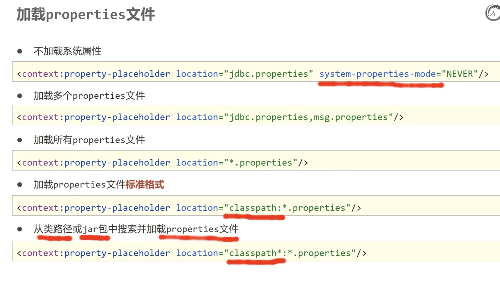

# 1,SSM  
  
```
package com.itheima;

import com.itheima.dao.BookDao;
import org.springframework.context.ApplicationContext;
import org.springframework.context.support.ClassPathXmlApplicationContext;
/**
 *
 * ApplicationContext ctx = new ClassPathXmlApplicationContext("applicationContext.xml");
 *Spring 在背后做的事情，等同于你手动写了这些 Java 代码：
 * // ========== 容器初始化阶段（全部在 new ClassPathXmlApplicationContext 时执行）==========
 *
 * // 方式一：构造方法实例化 bookDao
 * BookDaoImpl bookDao = new BookDaoImpl();
 * // → 打印: book dao constructor is running ....
 *
 * // 方式二：静态工厂实例化 orderDao
 * OrderDao orderDao = OrderDaoFactory.getOrderDao();
 * // → 打印: factory setup....
 *
 * // 方式三：实例工厂实例化 userDao1
 * UserDaoFactory userFactory = new UserDaoFactory();
 * UserDao userDao1 = userFactory.getUserDao();
 *
 * // 方式四：FactoryBean 实例化 userDao
 * UserDaoFactoryBean userDaoFactoryBean = new UserDaoFactoryBean();
 * UserDao userDao = userDaoFactoryBean.getObject();
 *
 * // ========== 然后 Spring 把这些对象全部存到一个 Map 里 ==========
 * // 类似于：
 * Map<String, Object> beanMap = new HashMap<>();
 * beanMap.put("bookDao", bookDao);
 * beanMap.put("orderDao", orderDao);
 * beanMap.put("userFactory", userFactory);
 * beanMap.put("userDao1", userDao1);
 * beanMap.put("userDao", userDao);
 *
 * 之后你调用的：
 * BookDao bookDao = (BookDao) ctx.getBean("bookDao");
 * 等同于：
 * BookDao bookDao = (BookDao) beanMap.get("bookDao");
 * 只是从 Map 中取出之前已经创建好的对象，不会再 new 一次。
 * 所以整个流程可以理解为：
 * 你写的 Spring 代码    等同于的 Java 代码
 * new ClassPathXmlApplicationContext(...)  把 xml 里所有 Bean 都 new 出来，存到 Map
 * ctx.getBean("bookDao")   map.get("bookDao")，直接取出来
 * 这就是为什么 factory setup.... 会出现——不是你 getBean 触发的，而是创建容器那一步就已经把所有对象都造好了。
 *
 * */
public class AppForInstanceBook {
    public static void main(String[] args) {
        //在创建容器的过程中，Spring 会把配置文件里所有的单例 Bean 全部实例化，而不是等你调用 getBean() 的时候才去创建。
        ApplicationContext ctx = new ClassPathXmlApplicationContext("applicationContext.xml");

        BookDao bookDao = (BookDao) ctx.getBean("bookDao");

        bookDao.save();

    }
}


```
  
对应的applicationContext.xml  
```
<?xml version="1.0" encoding="UTF-8"?>
<beans xmlns="http://www.springframework.org/schema/beans"
       xmlns:xsi="http://www.w3.org/2001/XMLSchema-instance"
       xsi:schemaLocation="http://www.springframework.org/schema/beans http://www.springframework.org/schema/beans/spring-beans.xsd">

    <!--方式一：【构造方法】实例化bean-->
    <bean id="bookDao" class="com.itheima.dao.impl.BookDaoImpl"/>


    <!--方式二：使用【静态工厂】实例化bean-->
    <bean id="orderDao" class="com.itheima.factory.OrderDaoFactory" factory-method="getOrderDao"/>

    <!--方式三：使用【实例工厂】实例化bean-->
<!--    创建工厂对象的实例-->
    <bean id="userFactory" class="com.itheima.factory.UserDaoFactory"/>
    <bean id="userDao1" factory-method="getUserDao" factory-bean="userFactory"/>

    <!--方式四：使用【FactoryBean】实例化bean-->
    <bean id="userDao" class="com.itheima.factory.UserDaoFactoryBean"/>

</beans>


```
  
  
bean的生命周期  
// ────────────────────────────────────────────  
// 【第①步】实例化  
// Spring 反射调用构造方法，对象被创建，但属性全是 null  
// ────────────────────────────────────────────  
BookServiceImpl bookService = new BookServiceImpl();  
// 此时：bookService.bookDao == null  ← 还没注入！  
  
// ────────────────────────────────────────────  
// 【第②步】属性注入  
// 上一步对象 bookDao 还是 null，这一步才给它赋值  
// ────────────────────────────────────────────  
bookService.setBookDao(bookDao);  
// 此时：bookService.bookDao != null  ← 可以用了  
  
// ────────────────────────────────────────────  
// 【第③步】Aware 回调  
// 有时候 Bean 自己需要拿到"容器对象"来做某些操作  
// 直接 new 拿不到容器，所以 Spring 主动"塞"给你  
// 不需要就不实现，Spring 自动跳过  
// ────────────────────────────────────────────  
bookService.setBeanName("bookService");          // 拿到自己在容器里的 id  
bookService.setApplicationContext(context);       // 拿到 ApplicationContext 对象  
  
// ────────────────────────────────────────────  
// 【第④步】BeanPostProcessor 前置处理  
// Spring 允许你在"所有Bean初始化之前"统一插入逻辑  
// 你不写这个类，这步就没有（Spring内部/AOP框架会用）  
// ────────────────────────────────────────────  
processor.postProcessBeforeInitialization(bookService, "bookService");  
  
// ────────────────────────────────────────────  
// 【第⑤步】InitializingBean.afterPropertiesSet()  
// 属性注入完了，Bean 需要做"自身的初始化工作"  
// 比如：检查必填属性有没有被注入、初始化内部状态  
// ────────────────────────────────────────────  
bookService.afterPropertiesSet();  
// 如果 bookDao 没被注入，可以在这里抛异常提前发现问题  
  
// ────────────────────────────────────────────  
// 【第⑥步】自定义 init-method  
// 和第⑤步作用一样，只是换了一种不耦合Spring接口的写法  
// 两个都配了的话，⑤先⑥后  
// ────────────────────────────────────────────  
bookService.initMethod(); // XML里 init-method="initMethod" 指定的方法  
  
// ────────────────────────────────────────────  
// 【第⑦步】BeanPostProcessor 后置处理  
// 初始化完成后，Spring 在这里可以把原始对象"偷换"成代理对象  
// AOP 就是在这里把你的对象换成了增强后的代理  
// ────────────────────────────────────────────  
Object proxy = processor.postProcessAfterInitialization(bookService, "bookService");  
// 如果有AOP，proxy 是代理对象；没有AOP，proxy 就是原来的 bookService  
  
// ← 以上全部发生在 new ClassPathXmlApplicationContext() 这一行里！  
  
// ────────────────────────────────────────────  
// 【第⑧步】使用  
// getBean() 拿到的是⑦步返回的对象（可能是代理）  
// ────────────────────────────────────────────  
BookService bean = context.getBean("bookService", BookService.class);  
bean.save();  
  
// ────────────────────────────────────────────  
// 【第⑨步】DisposableBean.destroy()  
// ctx.close() 触发，Spring 调用这个方法  
// 用来释放资源，比如关闭在⑤⑥步打开的连接  
// ────────────────────────────────────────────  
bookService.destroy();  
  
// ────────────────────────────────────────────  
// 【第⑩步】自定义 destroy-method  
// 和第⑨步作用一样，不耦合Spring接口的写法  
// 两个都配了，⑨先⑩后  
// ────────────────────────────────────────────  
bookService.destroyMethod();  
  
  
① new出来（空壳）  
    ↓ 属性是null，必须先注入  
② 注入属性（set赋值）  
    ↓ 属性有了，但Bean可能需要知道"自己在哪个容器里"  
③ Aware回调（把容器信息塞给Bean）  
    ↓ 准备初始化，先统一拦截一次  
④ 前置处理（BeanPostProcessor before）  
    ↓ 真正初始化，两种写法  
⑤⑥ 初始化（接口 or XML，做准备工作）  
    ↓ 初始化完了，再统一拦截一次（AOP在这里换代理）  
⑦ 后置处理（BeanPostProcessor after）  
    ↓ Bean完全就绪  
⑧ 使用  
    ↓ 容器关闭  
⑨⑩ 销毁（接口 or XML，释放资源）  
  
  
**依赖注入方式笔记**  
依赖注入 = Spring 帮你把对象需要的"东西"自动塞进去，你不用自己 new。  
>  
> 注入的内容分两种：  
> - 引用类型：另一个 Bean 对象 → 用 ref  
> - 简单类型：基本类型 + String → 用 value  
一、setter 注入  
原理：Spring 调用你写的 set方法 来赋值。  
引用类型  
<bean id="bookDao" class="com.itheima.dao.impl.BookDaoImpl"/>  
<bean id="userDao" class="com.itheima.dao.impl.UserDaoImpl"/>  
  
<bean id="bookService" class="com.itheima.service.impl.BookServiceImpl">  
    <property name="bookDao" ref="bookDao"/>  <!-- ref = 另一个bean的id -->  
    <property name="userDao" ref="userDao"/>  
</bean>  
  
public class BookServiceImpl {  
    private BookDao bookDao;  
    private UserDao userDao;  
    // ⚠️ 必须有对应的 set 方法，property name="bookDao" 对应 setBookDao()  
    public void setBookDao(BookDao bookDao) { this.bookDao = bookDao; }  
    public void setUserDao(UserDao userDao) { this.userDao = userDao; }  
}  
  
简单类型  
  
<bean id="bookDao" class="com.itheima.dao.impl.BookDaoImpl">  
    <property name="databaseName" value="mysql"/>  <!-- value = 直接的值 -->  
    <property name="connectionNum" value="100"/>  
</bean>  
  
public class BookDaoImpl {  
    private String databaseName;  
    private int connectionNum;  
    // ⚠️ property name="databaseName" 对应 setDatabaseName()  
    public void setDatabaseName(String databaseName) { this.databaseName = databaseName; }  
    public void setConnectionNum(int connectionNum) { this.connectionNum = connectionNum; }  
}  
⚠️ **name** 属性对应的是 set 方法名去掉 **set** 后首字母小写，不是字段名！  
> 比如 setDatabaseName → name="databaseName"  
  
二、构造器注入  
原理：Spring 调用你写的 构造方法 来赋值。  
有三种匹配方式（解决同一个问题的三种方案）：  
方式1：按参数名 **name**（最推荐）  
<bean id="bookDao" class="com.itheima.dao.impl.BookDaoImpl">  
    <constructor-arg name="databaseName" value="mysql"/>  
    <constructor-arg name="connectionNum" value="10"/>  
</bean>  
<bean id="userDao" class="com.itheima.dao.impl.UserDaoImpl"/>  
  
<bean id="bookService" class="com.itheima.service.impl.BookServiceImpl">  
    <constructor-arg name="bookDao" ref="bookDao"/>  <!-- 引用类型用ref -->  
    <constructor-arg name="userDao" ref="userDao"/>  
</bean>  
  
public class BookDaoImpl {  
    private String databaseName;  
    private int connectionNum;  
    // ⚠️ name="databaseName" 对应构造方法参数名  
    public BookDaoImpl(String databaseName, int connectionNum) {  
        this.databaseName = databaseName;  
        this.connectionNum = connectionNum;  
    }  
}  
  
方式2：按类型 **type**（解决参数名耦合）  
  
<bean id="bookDao" class="com.itheima.dao.impl.BookDaoImpl">  
    <constructor-arg type="java.lang.String" value="mysql"/>  <!-- ⚠️ 必须写全类名 -->  
    <constructor-arg type="int" value="10"/>  
</bean>  
❌ 缺点：如果有两个同类型参数（比如两个 String），Spring 不知道该填哪个 → 报错  
方式3：按位置 **index**（解决类型重复）  
<bean id="bookDao" class="com.itheima.dao.impl.BookDaoImpl">  
    <constructor-arg index="0" value="mysql"/>  <!-- 第1个参数，从0开始 -->  
    <constructor-arg index="1" value="100"/>    <!-- 第2个参数 -->  
</bean>  
  
> ❌ 缺点：构造方法参数顺序一旦改变，XML 也要跟着改  
  
三、setter vs 构造器 怎么选  

|             | setter 注入           | 构造器注入             |
| ----------- | ------------------- | ----------------- |
| XML标签       | <property>          | <constructor-arg> |
| Java代码      | 需要 set方法            | 需要 构造方法           |
| ref / value | 引用类型用ref，简单类型用value | 同左，完全一样           |
| 能否不注入       | ✅ 可以不注入（属性为null）    | ❌ 必须注入，少了就报错      |
| 推荐场景        | 日常使用，灵活             | 强依赖，确保对象创建时就完整    |
  
  
实际开发：优先用 setter 注入。  
  
四、注意事项汇总  
  
✅ property name      → 对应 set方法名（去掉set，首字母小写）  
✅ constructor-arg name → 对应构造方法的参数名  
✅ ref                → 值是另一个 bean 的 id  
✅ value              → 值是基本类型或字符串字面量  
✅ type 写全类名       → java.lang.String，不能只写 String  
✅ index 从 0 开始    → 第1个参数是 index="0"  
⚠️ set方法必须是 public，否则注入失败  
⚠️ 构造器注入参数数量必须和XML中一致，少了就报错  
  
一句话总结  
> setter注入用 **<property>**，要有set方法；构造器注入用 **<constructor-arg>**，要有构造方法。引用类型用 **ref**，简单类型用 **value**，就这两条规则。  
  
  
  
  
**自动装配笔记（结合你的项目）**  
##   
**XML 与代码的对应关系**  
##   
```
XML:  <bean class="com.itheima.dao.impl.BookDaoImpl"/>
                                    ↓
      容器里存了一个类型为 BookDao 的 Bean（没有id也没关系）

XML:  <bean id="bookService" class="...BookServiceImpl" autowire="byType"/>
                                    ↓
      Spring 看到 byType，去找 BookServiceImpl 里有哪些属性需要注入
                                    ↓
Java: private BookDao bookDao;  ← 找到这个属性，类型是 BookDao
                                    ↓
      容器里找类型是 BookDao 的 Bean → 找到 BookDaoImpl（因为它实现了BookDao接口）
                                    ↓
Java: public void setBookDao(BookDao bookDao) {...}  ← 调用这个set方法注入

```
##   
**byType 工作流程**  
##   
```
// 1. XML里这个Bean没有id，但类型是 BookDaoImpl（实现了 BookDao 接口）
<bean class="com.itheima.dao.impl.BookDaoImpl"/>

// 2. bookService 开启 byType 自动装配
<bean id="bookService" class="...BookServiceImpl" autowire="byType"/>

// 3. Spring 扫描 BookServiceImpl 的属性：
private BookDao bookDao;   // 类型 BookDao → 容器里找 BookDao 类型的Bean → 找到了 → 注入

// 4. 调用 set 方法完成注入（⚠️ set方法必须存在）
public void setBookDao(BookDao bookDao) { this.bookDao = bookDao; }

```
##   
##   
**byName 工作流程**  
```
// ⚠️ byName 时，Bean 的 id 必须和属性名一致
<bean id="bookDao" class="com.itheima.dao.impl.BookDaoImpl"/>
//        ↑ id必须和下面属性名完全一致

<bean id="bookService" class="...BookServiceImpl" autowire="byName"/>

// Spring 看属性名：
private BookDao bookDao;
//               ↑ 属性名是 bookDao → 找 id="bookDao" 的Bean → 找到了 → 注入

```
##   
##   
**4个核心注意点**  
**① 只能注入引用类型，不能注入简单类型**  
```
<!-- ❌ 无法自动注入 int、String 等简单类型，那些还是要手动 <property value="..."/> -->

```
##   
##   
**② byType 容器中同类型 Bean 必须唯一**  
```
<bean id="bookDao"  class="com.itheima.dao.impl.BookDaoImpl"/>
<bean id="bookDao2" class="com.itheima.dao.impl.BookDaoImpl"/>
<!-- ❌ 两个同类型 Bean → 报错：NoUniqueBeanDefinitionException -->

```
##   
##   
**③ byName 的 Bean id 必须和属性名完全一致**  
```
private BookDao bookDao;     // 属性名 bookDao
// XML 中必须有 id="bookDao"，写成 id="BookDao" 也不行（大小写敏感）

```
##   
**④ 优先级低于手动注入，同时存在手动注入失效**  
```
<!-- ❌ autowire 失效，以 <property> 为准 -->
<bean id="bookService" class="...BookServiceImpl" autowire="byType">
    <property name="bookDao" ref="bookDao"/>
</bean>

```
##   
**一句话总结**  
## > autowire="byType" = Spring 自动按属性类型找 Bean 注入，省去写 <property>。前提：有 set 方法 + 容器中该类型唯一。  
##   
  
# Spring 集合注入 - 小白速记版  
## 一、5种集合对应关系  

| Java类型             | XML标签   | 示例              |
| ------------------ | ------- | --------------- |
| int[], String[]    | <array> | 数组              |
| List<String>       | <list>  | 可重复、有序          |
| Set<String>        | <set>   | 自动去重、无序         |
| Map<String,String> | <map>   | 键值对             |
| Properties         | <props> | 只能String→String |
  
## 二、必须的Java代码  
##   
```
public class BookDaoImpl implements BookDao {
    private int[] array;
    private List<String> list;
    private Set<String> set;
    private Map<String,String> map;
    private Properties properties;
    
    // ⭐ 必须有setter！
    public void setArray(int[] array) { this.array = array; }
    public void setList(List<String> list) { this.list = list; }
    public void setSet(Set<String> set) { this.set = set; }
    public void setMap(Map<String,String> map) { this.map = map; }
    public void setProperties(Properties properties) { this.properties = properties; }

    public void save() {
        System.out.println("book dao save ...");

        System.out.println("遍历数组:" + Arrays.toString(array));

        System.out.println("遍历List" + list);

        System.out.println("遍历Set" + set);

        System.out.println("遍历Map" + map);

        System.out.println("遍历Properties" + properties);
    }
}

```
##   
## 三、核心语法（背下来）  
## 1. 数组/List/Set  
##   
```
<!-- 基本类型：用 value -->
<array>
    <value>100</value>
</array>

<!-- 对象：用 ref -->
<list>
    <ref bean="user1"/>
    <ref bean="user2"/>
</list>

```
## 2. Map  
##   
```
<!-- 基本类型 -->
<map>
    <entry key="name" value="张三"/>
</map>

<!-- 对象 -->
<map>
    <entry key="user" value-ref="userBean"/>
</map>

```
## 3. Properties  
##   
```
<!-- 固定写法 -->
<props>
    <prop key="键">值</prop>
</props>

```
##   
## 四、5个必考点  
## ⚠️ 1. Set会自动去重  
##   
```
<set>
    <value>A</value>
    <value>A</value>  <!-- 重复，只保留1个 -->
</set>
<!-- 结果：[A] -->

```
## ⚠️ 2. value vs ref  
##   
```
<value>100</value>        <!-- 基本类型、String -->
<ref bean="userBean"/>    <!-- 注入对象 -->

```
## ⚠️ 3. Map的两种写法  
##   
```
<!-- 写法1：简洁 -->
<entry key="name" value="张三"/>

<!-- 写法2：注入对象 -->
<entry key="user" value-ref="userBean"/>

```
## ⚠️ 4. Properties ≠ Map  
##   
```
<!-- Properties：只能 String → String -->
<props>
    <prop key="url">jdbc:mysql://...</prop>
</props>

<!-- Map：可以任意类型 -->
<map>
    <entry key="age" value="25"/>
    <entry key="user" value-ref="userBean"/>
</map>

```
## ⚠️ 5. 必须有Setter  
##   
```
// ❌ 没有setter会报错
private List<String> list;

// ✅ 必须写
public void setList(List<String> list) { 
    this.list = list; 
}

```
##   
## 五、运行结果  
##   
```
array: [100, 200, 300]
list: [itcast, itheima, boxuegu, chuanzhihui]
set: [itcast, itheima, boxuegu]  // 去重了
map: {country=china, province=henan, city=kaifeng}
properties: {country=china, province=henan, city=kaifeng}

```
##   
## 六、快速选择  
##   
```
有序+可重复？     → List
去重？           → Set
键值对？         → Map
配置文件？       → Properties
固定大小？       → 数组

```
##   
## 七、常见错误  

| 错误                                   | 原因                                  |
| ------------------------------------ | ----------------------------------- |
| Bean property 'list' is not writable | 忘写setter                            |
| <prop> 标签不识别                         | Properties用错了标签（应该用<prop>不是<entry>） |
| Map注入对象失败                            | 用了value而不是value-ref                 |
  
**核心：记住setter、value/ref、Set去重。**  
  
  
  
  
Spring加载properties配置文件  
  
```


<?xml version="1.0" encoding="UTF-8"?>
<beans xmlns="http://www.springframework.org/schema/beans"
       xmlns:xsi="http://www.w3.org/2001/XMLSchema-instance"
       xmlns:context="http://www.springframework.org/schema/context"
       xsi:schemaLocation="
            http://www.springframework.org/schema/beans
            http://www.springframework.org/schema/beans/spring-beans.xsd
            http://www.springframework.org/schema/context
            http://www.springframework.org/schema/context/spring-context.xsd
            ">
<!--    管理DruidDataSource对象-->
<!--    <bean id="dataSource" class="com.alibaba.druid.pool.DruidDataSource">
        <property name="driverClassName" value="com.mysql.jdbc.Driver"/>
        <property name="url" value="jdbc:mysql://localhost:3306/spring_db"/>
        <property name="username" value="root"/>
        <property name="password" value="root"/>
    </bean>


    <bean id="dataSource" class="com.mchange.v2.c3p0.ComboPooledDataSource">
        <property name="driverClass" value="com.mysql.jdbc.Driver"/>
        <property name="jdbcUrl" value="jdbc:mysql://localhost:3306/spring_db"/>
        <property name="user" value="root"/>
        <property name="password" value="root"/>
        <property name="maxPoolSize" value="1000"/>
    </bean>-->

<!--    1.开启context命名空间-->
<!--    2.使用context空间加载properties文件-->
<!--    <context:property-placeholder location="jdbc.properties" system-properties-mode="NEVER"/>-->
<!--    <context:property-placeholder location="jdbc.properties,jdbc2.properties" system-properties-mode="NEVER"/>-->
<!--    classpath:*.properties  ：   设置加载当前工程类路径中的所有properties文件-->
<!--    system-properties-mode属性：是否加载系统属性-->
    <!--    <context:property-placeholder location="*.properties" system-properties-mode="NEVER"/>-->

    <!--classpath*:*.properties  ：  设置加载当前工程类路径和当前工程所依赖的所有jar包中的所有properties文件-->
    <context:property-placeholder location="classpath*:*.properties" system-properties-mode="NEVER"/>

<!--    3.使用属性占位符${}读取properties文件中的属性-->
<!--    说明：idea自动识别${}加载的属性值，需要手工点击才可以查阅原始书写格式-->
    <bean id="dataSource" class="com.alibaba.druid.pool.DruidDataSource">
        <property name="driverClassName" value="${jdbc.driver}"/>
        <property name="url" value="${jdbc.url}"/>
        <property name="username" value="${jdbc.username}"/>
        <property name="password" value="${jdbc.password}"/>
    </bean>

    <bean id="bookDao" class="com.itheima.dao.impl.BookDaoImpl">
        <property name="name" value="${username}"/>
    </bean>


</beans>


```
  
说明：  
**Spring加载properties配置文件 - 核心速记**  
**一、三步配置**  
**步骤1：引入context命名空间**  
  
<beans xmlns:context="http://www.springframework.org/schema/context"  
       xsi:schemaLocation="  
            http://www.springframework.org/schema/context  
            http://www.springframework.org/schema/context/spring-context.xsd">  
**步骤2：加载properties文件**  
  
<context:property-placeholder location="jdbc.properties"/>  
**步骤3：使用**${}**占位符**  
  
<property name="url" value="${jdbc.url}"/>  
  
**二、location的4种写法**  

| 写法     | 作用                  | 示例                                       |
| ------ | ------------------- | ---------------------------------------- |
| 单个文件   | 加载1个                | location="jdbc.properties"               |
| 多个文件   | 加载多个（逗号分隔）          | location="jdbc.properties,db.properties" |
| 当前工程通配 | 加载当前工程所有.properties | location="*.properties"                  |
| 全局通配 ⭐ | 加载当前+所有jar包         | location="classpath*:*.properties"       |
  
**推荐写法（实际开发）**  
  
<!-- 推荐：加载所有properties文件 -->  
<context:property-placeholder location="classpath*:*.properties"   
                              system-properties-mode="NEVER"/>  
  
**三、核心属性**  
system-properties-mode**（必加）**  
  
system-properties-mode="NEVER"  
**作用：** 禁止加载系统属性（防止冲突）  
**不加会怎样？**  
  
<!-- jdbc.properties -->  
username=root    
  
<!-- ⚠️ 没有设置NEVER -->  
<property name="name" value="${username}"/>  
<!-- 结果：可能读到系统的用户名（如：Administrator），而不是"root"！ -->  
  
**四、properties文件示例**  
  
# jdbc.properties  
jdbc.driver=com.mysql.cj.jdbc.Driver  
jdbc.url=jdbc:mysql://localhost:3306/spring_db  
jdbc.username=root  
jdbc.password=root123  
  
**五、完整配置模板（直接复制）**  
  
<!-- 加载所有properties文件 -->  
<context:property-placeholder location="classpath*:*.properties"   
                              system-properties-mode="NEVER"/>  
  
<!-- 使用占位符 -->  
<bean id="dataSource" class="com.alibaba.druid.pool.DruidDataSource">  
    <property name="driverClassName" value="${jdbc.driver}"/>  
    <property name="url" value="${jdbc.url}"/>  
    <property name="username" value="${jdbc.username}"/>  
    <property name="password" value="${jdbc.password}"/>  
</bean>  
  
**六、5个必考注意事项**  
**⚠️ 1. properties文件必须在类路径下**  
  
src/main/resources/jdbc.properties  ✅  
src/main/java/jdbc.properties       ❌  
**⚠️ 2. **username**等关键字冲突**  
  
# ❌ 容易冲突  
username=root  
  
# ✅ 加前缀  
jdbc.username=root  
**⚠️ 3. classpath vs classpath***  
  
<!-- classpath: 只找当前项目 -->  
<context:property-placeholder location="classpath:*.properties"/>  
  
<!-- classpath*: 找当前+所有jar包 ⭐推荐 -->  
<context:property-placeholder location="classpath*:*.properties"/>  
**⚠️ 4. 多个**<context:property-placeholder>**冲突**  
  
<!-- ❌ 只能有一个 -->  
<context:property-placeholder location="jdbc.properties"/>  
<context:property-placeholder location="redis.properties"/>  
  
<!-- ✅ 合并写 -->  
<context:property-placeholder location="jdbc.properties,redis.properties"/>  
  
<!-- ✅ 或者用通配符 -->  
<context:property-placeholder location="classpath*:*.properties"/>  
**⚠️ 5. 占位符语法**  
  
<!-- ✅ 正确 -->  
<property name="url" value="${jdbc.url}"/>  
  
<!-- ❌ 错误写法 -->  
<property name="url" value="$jdbc.url"/>     <!-- 少了{} -->  
<property name="url" value="{jdbc.url}"/>    <!-- 少了$ -->  
<property name="url" value="#{jdbc.url}"/>   <!-- SpEL语法，不是占位符 -->  
  
**七、常见错误**  

| 错误提示 | 原因 | 解决 |
| ---------------------------------------- | --------------- | ------------------------------- |
| Could not resolve placeholder 'jdbc.url' | properties文件没加载 | 检查location路径 |
| username值是系统用户名 | 系统属性冲突 | 加system-properties-mode="NEVER" |
| 多个property-placeholder冲突 | 配置了多个 | 合并成一个 |
  
**八、实际应用（数据库连接池）**  
**jdbc.properties**  
  
jdbc.driver=com.mysql.cj.jdbc.Driver  
jdbc.url=jdbc:mysql://localhost:3306/mydb?useSSL=false  
jdbc.username=root  
jdbc.password=123456  
**applicationContext.xml**  
  
<!-- 加载配置文件 -->  
<context:property-placeholder location="classpath:jdbc.properties"   
                              system-properties-mode="NEVER"/>  
  
<!-- Druid数据源 -->  
<bean id="dataSource" class="com.alibaba.druid.pool.DruidDataSource">  
    <property name="driverClassName" value="${jdbc.driver}"/>  
    <property name="url" value="${jdbc.url}"/>  
    <property name="username" value="${jdbc.username}"/>  
    <property name="password" value="${jdbc.password}"/>  
</bean>  
  
**九、快速记忆**  
  
1. 引入context命名空间  
2. <context:property-placeholder location="classpath*:*.properties"   
                                 system-properties-mode="NEVER"/>  
3. ${属性名}  
  
⭐ 记住3个关键：  
   - location="classpath*:*.properties"  （加载所有）  
   - system-properties-mode="NEVER"      （禁止系统属性）  
   - 属性名加前缀（如jdbc.username）     （防止冲突）  
  
  
**核心：加载properties用**<context:property-placeholder>**，读取用**${}**，必加**system-properties-mode="NEVER"**。**  
  
  
  
  
创建容器  
  
*// ✅ 常用：从类路径加载（放在 src/main/resources 下直接写文件名）*  
ApplicationContext ctx = new ClassPathXmlApplicationContext("applicationContext.xml");  
  
*// 加载多个配置文件（逗号分隔）*  
ApplicationContext ctx = new ClassPathXmlApplicationContext("bean1.xml", "bean2.xml");  
  
FileSystemXmlApplicationContext 需要写磁盘绝对路径，实际开发不用，忽略。  
  
获取Bean  
  
*// 方式一：按名称，需要强转，不推荐*  
BookDao bookDao = (BookDao) ctx.getBean("bookDao");  
  
*// 方式二：按名称+类型，不用强转 ✅ 推荐*  
BookDao bookDao = ctx.getBean("bookDao", BookDao.class);  
  
*// 方式三：只按类型，该类型Bean必须唯一*  
BookDao bookDao = ctx.getBean(BookDao.class);  
  
  
怎么选  

| 场景              | 用哪个                |
| --------------- | ------------------ |
| 日常使用            | 方式二（名称+类型，安全不报错）   |
| 容器里只有一个该类型的Bean | 方式三（简洁）            |
| 容器里有多个同类型Bean   | 必须用方式一或方式二（指定名称区分） |
  
  
  
  
  
**Spring 容器 & Bean 属性总结**  
##   
**容器相关**  

| 类                               | 特点                 | 用哪个   |
| ------------------------------- | ------------------ | ----- |
| BeanFactory                     | Bean 延迟加载（用到才创建）   | 过时，不用 |
| ApplicationContext              | Bean 立即加载（容器启动就创建） | ✅ 用这个 |
| ClassPathXmlApplicationContext  | 从类路径加载XML          | ✅ 日常用 |
| FileSystemXmlApplicationContext | 从磁盘绝对路径加载XML       | 不推荐   |
  
##   
##   
## <bean> 所有属性  
##   
##   
```
<bean
    id="bookDao"                                  <!-- Bean的唯一标识，getBean("bookDao") 用这个 -->
    name="dao bookDaoImpl daoImpl"                <!-- Bean的别名，多个别名空格/逗号分隔，也可以getBean -->
    class="com.itheima.dao.impl.BookDaoImpl"      <!-- Bean的全类名（必填） -->
    scope="singleton"                             <!-- singleton=单例(默认) | prototype=多例 -->
    init-method="init"                            <!-- 初始化方法名 -->
    destroy-method="destory"                      <!-- 销毁方法名 -->
    autowire="byType"                             <!-- 自动装配：byType | byName -->
    factory-method="getInstance"                  <!-- 工厂方法名（静态工厂或实例工厂用） -->
    factory-bean="com.itheima.factory.BookDao"    <!-- 实例工厂的Bean id -->
    lazy-init="true"                              <!-- true=延迟加载，用到才创建 -->
/>

```
##   
##   
##   
**重点说明**  

| 属性                            | 记住这点                                     |
| ----------------------------- | ---------------------------------------- |
| id vs name                    | id是唯一标识；name是别名，可以多个，用空格或逗号分隔            |
| scope                         | 默认singleton单例；prototype每次getBean都new一个新的 |
| lazy-init                     | 针对单例Bean，默认容器启动就创建；true改为用到时才创建          |
| init-method / destroy-method  | 对应Bean中的方法名，生命周期回调                       |
| autowire                      | 自动注入，byType推荐，省去写<property>              |
| factory-method / factory-bean | 工厂模式创建Bean时用，日常较少                        |
  
  
  
# 依赖注入相关 — 完整配置说明  
  
  
  
```
<bean id="bookService" class="com.itheima.service.impl.BookServiceImpl">

    <!-- ===== 构造器注入 <constructor-arg> ===== -->
    
    <!-- 引用类型：ref 指向另一个 Bean 的 id -->
    <constructor-arg name="bookDao" ref="bookDao"/>
    <constructor-arg name="userDao" ref="userDao"/>
    
    <!-- 简单类型：value 直接写值 -->
    <constructor-arg name="msg" value="WARN"/>
    
    <!-- 按类型+位置匹配（解决参数名耦合/类型重复问题） -->
    <constructor-arg type="java.lang.String" index="3" value="WARN"/>

    <!-- ===== setter注入 <property> ===== -->
    
    <!-- 引用类型：ref 指向另一个 Bean 的 id -->
    <property name="bookDao" ref="bookDao"/>
    <property name="userDao" ref="userDao"/>
    
    <!-- 简单类型：value 直接写值 -->
    <property name="msg" value="WARN"/>
    
    <!-- 集合类型：嵌套标签 -->
    <property name="names">
        <list>
            <value>itcast</value>            <!-- 集合中的简单类型 -->
            <ref bean="dataSource"/>         <!-- 集合中的引用类型 -->
        </list>
    </property>

</bean>

```
  
  
  
  
  
## 核心规则总结  

| 场景                  | 用什么                              |
| ------------------- | -------------------------------- |
| 注入另一个Bean           | ref="bean的id"                    |
| 注入基本类型/String       | value="值"                        |
| 构造器注入               | <constructor-arg>                |
| setter注入            | <property>                       |
| 构造器参数匹配方式           | name（推荐）/ type（全类名）/ index（从0开始） |
| 注入 List/Set/Map 等集合 | <property> 内嵌 <list> <set> <map> |
  
  
  
## 集合类型对照  
##   
##   
```
<!-- List -->
<property name="list">
    <list>
        <value>aaa</value>
        <ref bean="xxx"/>
    </list>
</property>

<!-- Set（写法同list，改成 <set>） -->
<property name="set"><set>...</set></property>

<!-- Map -->
<property name="map">
    <map>
        <entry key="k1" value="v1"/>
        <entry key="k2" value-ref="beanId"/>
    </map>
</property>

<!-- Properties -->
<property name="props">
    <props>
        <prop key="k1">v1</prop>
    </props>
</property>

```
  
   
