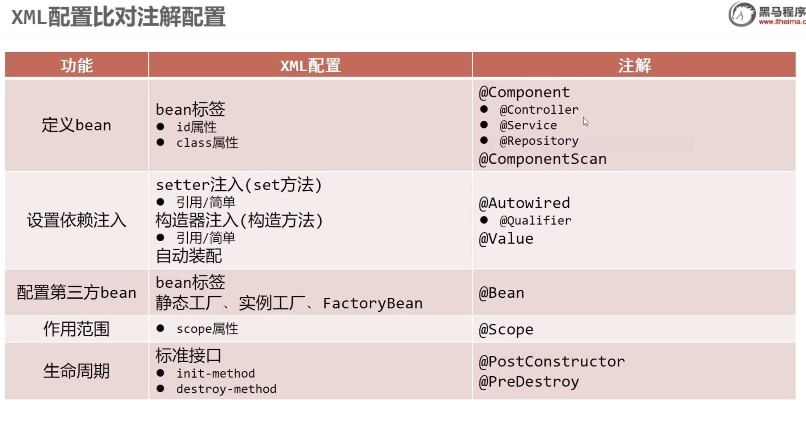
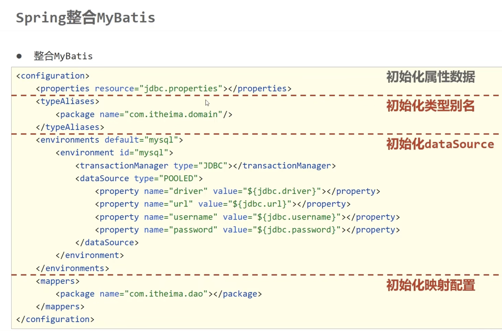

# 2.ssm  
注解  
**核心思想**  
## > 以前：在 XML 里写 <bean> 定义 Bean  
## > 现在：直接在类上加注解，Spring 自动识别  
##   
## 第一步：类上加注解（替代 <bean>）  
##   
```
// DAO 层用 @Repository
@Repository("bookDao")   // 括号里是 bean 的 id，等同于 <bean id="bookDao" .../>，
public class BookDaoImpl implements BookDao {
    public void save() { System.out.println("book dao save ..."); }
}

```
##   
##   
##   
```
// Service 层用 @Service（不写id，默认id = 类名首字母小写 = "bookServiceImpl"）
@Service
public class BookServiceImpl implements BookService {
    @Autowired              // 自动注入，等同于 autowire="byType"，不需要 set 方法， // 替代 <property ref="..."/>
    private BookDao bookDao;

    public void save() {
        System.out.println("book service save ...");
        bookDao.save();
    }
}

```
##   
## 第二步：配置类替代 XML（替代 applicationContext.xml）  
##   
##   
```
@Configuration          // 声明这是 Spring 配置类，替代 applicationContext.xml
@ComponentScan({"com.itheima.service", "com.itheima.dao"})  // 扫描哪些包下的注解 // 替代xml的 <context:component-scan>

public class SpringConfig {
}

```
##   
## > 等同于 XML 中的：<context:component-scan base-package="com.itheima"/>  
##   
XML 方式（以前）：  
**<!-- applicationContext.xml 这整个文件 -->**  
**<?xml version="1.0" encoding="UTF-8"?>**  
**<beans xmlns="http://www.springframework.org/schema/beans" ...>**  
**    **  
**    <!-- 里面的内容由其他注解替代 -->**  
**    **  
**</beans>**  
  
注解方式（现在）：  
@Configuration   // ← 就替代上面那个 applicationContext.xml 文件本身（beans标签）  
public class SpringConfig {  
}  
@Configuration = 告诉 Spring "这个类是配置文件"，替代的是 applicationContext.xml 这个文件的存在本身（即 <beans> 根标签）。  
@ComponentScan({"com.itheima.service", "com.itheima.dao"}) 替代了 * applicationContext.xml中的类似*<context:component-scan base-package="com.itheima"/>  
  
  
  
**第三步：启动容器方式改变**  
##   
##   
```
// 以前（XML方式）
ApplicationContext ctx = new ClassPathXmlApplicationContext("applicationContext.xml");

// 现在（注解方式）✅
ApplicationContext ctx = new AnnotationConfigApplicationContext(SpringConfig.class);

// 获取Bean方式不变
BookDao bookDao = ctx.getBean("bookDao", BookDao.class);
BookService bookService = ctx.getBean(BookService.class);

```
##   
**4个注解对照表**  

| 注解          | 用在哪层             | 说明       |
| ----------- | ---------------- | -------- |
| @Component  | 通用               | 万能，哪层都能用 |
| @Repository | DAO层（数据层）        | 语义更清晰，推荐 |
| @Service    | Service层（业务层）    | 语义更清晰，推荐 |
| @Controller | Controller层（表现层） | 语义更清晰，推荐 |
  
##   
## > ⚠️ 四个注解功能完全一样，只是语义不同，按层选对应的用即可。  
##   
**一句话总结**  
## > 注解开发 = 类上加 @Repository/@Service/@Controller + 配置类加 @ComponentScan 扫包 + @Autowired 自动注入，彻底告别 XML。  

| XML 内容                           | 对应注解                | 写在哪    |
| -------------------------------- | ------------------- | ------ |
| <beans> 根标签（文件本身）                | @Configuration      | 配置类上   |
| <context:component-scan>         | @ComponentScan      | 配置类上   |
| <bean id="bookDao" .../>         | @Repository         | Bean类上 |
| <property ref="..."/>            | @Autowired          | 属性上    |
| <bean scope="prototype"/>        | @Scope("prototype") | Bean类上 |
| <bean init-method="init"/>       | @PostConstruct      | 方法上    |
| <bean destroy-method="destroy"/> | @PreDestroy         | 方法上    |
  
  
Bean 作用范围 & 生命周期注解  
@Repository              // 定义Bean，替代 <bean id="bookDaoImpl" class="..."/>  
@Scope("singleton")      // 作用范围：singleton=单例（默认）| prototype=多例  
public class BookDaoImpl implements BookDao {  
  
    public BookDaoImpl() {  
        System.out.println("book dao constructor ...");  // ① 构造方法  
    }  
  
    @PostConstruct                                       // ③ 初始化方法，替代 init-method  
    public void init() {  
        System.out.println("book init ...");  
    }  
  
    @PreDestroy                                          // ④ 销毁方法，替代 destroy-method  
    public void destroy() {  
        System.out.println("book destory ...");  
    }  
}  
执行顺序  
① 构造方法      → "book dao constructor ..."  
② 依赖注入      → （@Autowired 的属性赋值）  
③ @PostConstruct → "book init ..."  
   ── 使用Bean ──  
④ @PreDestroy   → "book destory ..."  
  

| 注解                  | 替代XML                    | 说明                  |
| ------------------- | ------------------------ | ------------------- |
| @Scope("singleton") | scope="singleton"        | 默认就是单例，可以不写         |
| @Scope("prototype") | scope="prototype"        | 多例，每次getBean都new新对象 |
| @PostConstruct      | init-method="init"       | 加在初始化方法上，构造+注入之后执行  |
| @PreDestroy         | destroy-method="destroy" | 加在销毁方法上，容器关闭时执行     |
  
  
> ⚠️ @PreDestroy 只对单例Bean有效，多例Bean容器不管销毁。  
  
  
****@Autowired**** 注解注入  
**是什么**  
> XML 时代要写 <property ref="..."/> 手动注入。  
> 加了 @Autowired，Spring 自动按类型找 Bean 注入，什么都不用写。  
  
@Service  
public class BookServiceImpl implements BookService {  
  
    @Autowired               // Spring 自动找类型是 BookDao 的Bean注入  
    private BookDao bookDao; // ⚠️ 不需要写 set 方法！直接加在属性上  
  
    public void save() {  
        bookDao.save();  
    }  
}  
  
同类型有多个Bean时用 **@Qualifier**  
*// 容器里有两个 BookDao 类型的Bean：*  
@Repository("bookDaoImpl")  
public class BookDaoImpl implements BookDao {}  
  
@Repository("bookDaoImpl2")  
public class BookDaoImpl2 implements BookDao {}  
  
如果  
*// 不写id时：*  
@Repository          *// 默认 id = "bookDaoImpl"（类名 BookDaoImpl → 首字母小写）*  
public class BookDaoImpl implements BookDao {}  
  
@Repository          *// 默认 id = "bookDaoImpl2"（类名 BookDaoImpl2 → 首字母小写）*  
public class BookDaoImpl2 implements BookDao {}  
  
所以 @Qualifier 不用改，写法完全一样：  
  
@Autowired  
@Qualifier("bookDaoImpl")   // 对应 BookDaoImpl 这个类（默认id就是类名首字母小写）  
private BookDao bookDao;  
  

| 写法                   | Bean 的 id                 |
| -------------------- | ------------------------- |
| @Repository("myDao") | myDao（自定义）                |
| @Repository          | bookDaoImpl（类名首字母小写，自动生成） |
  
  
  
注入简单类型用 **@Value**  
@Repository  
public class BookDaoImpl implements BookDao {  
  
    @Value("mysql")      // 替代 <property name="name" value="mysql"/>  
    private String name;  
  
    @Value("100")  
    private int count;  
}  

| 场景            | 注解                            | 等同XML                  |
| ------------- | ----------------------------- | ---------------------- |
| 注入引用类型（唯一）    | @Autowired                    | <property ref="..."/>  |
| 注入引用类型（多个同类型） | @Autowired + @Qualifier("id") | <property ref="具体id"/> |
| 注入简单类型/字符串    | @Value("值")                   | <property value="...   |
  
  
  
1. @Autowired 默认按【类型】匹配，容器中该类型只能有1个  
2. 有多个同类型Bean → 必须加 @Qualifier 指定id，否则报错  
3. @Autowired 加在属性上，不需要 set 方法  
4. @Qualifier 必须配合 @Autowired 使用，单独用没效果  
5. @Value 不能注入其他Bean对象，只能注入普通值  
  
  
## 是什么  
> 加载 .properties 配置文件，让文件里的键值对可以用 @Value("${key}") 注入到 Bean 中。  
  
## 你的项目完整链路  
**第一步：jdbc.properties 文件里写键值对**  
  
```
name=itheima888

```
  
**第二步：配置类加载这个文件**  
  
```
@PropertySource({"jdbc.properties"})  // 告诉Spring去加载这个文件
public class SpringConfig {}

```
  
**第三步：用 @Value 取出来用**  
  
```
@Value("${name}")       // ${name} = 取 jdbc.properties 里 key=name 的值
private String name;    // → 注入 "itheima888"

```
  
## 注意事项  
  
```
1. 文件放在 src/main/resources 下，直接写文件名即可
   ✅ @PropertySource({"jdbc.properties"})
   ✅ @PropertySource({"classpath:jdbc.properties"})  // 加classpath:也行

2. 多个文件用数组格式
   ✅ @PropertySource({"jdbc.properties", "db.properties"})

3. ❌ 不能用通配符
   ❌ @PropertySource({"*.properties"})  // 报错！

4. ${ } 里的 key 必须和 .properties 文件里的 key 完全一致
   properties: name=itheima888
   代码:       @Value("${name}") ✅
               @Value("${Name}") ❌ 大小写敏感

5. 找不到 key 时，注入的是 ${name} 这个字符串本身（不报错，但值是错的）

```
  
  
## 等同于 XML 写法  
##   
```
<!-- XML 中对应的是 -->
<context:property-placeholder location="jdbc.properties"/>

```
##   
##   
注解 开发第三方bean  
@Configuration      // ① 声明"我是配置类"，替代 applicationContext.xml 文件  
@ComponentScan("com.itheima")  // ② 扫描这个包下所有 @Repository/@Service/@Controller  
@Import({JdbcConfig.class})    // ③ 把 JdbcConfig 这个配置类也加载进来  
public class SpringConfig {}  
  
## 为什么需要 @Import？  
因为 @ComponentScan 只扫描有 ****@Repository/@Service/@Component**** 注解的类。  
JdbcConfig 里的 @Bean 方法，@ComponentScan 扫描不到！  
  
// JdbcConfig 没有加 @Repository/@Service，不会被 @ComponentScan 扫到  
public class JdbcConfig {  
    @Bean  
    public DataSource dataSource() { ... }  // ← 扫不到，Bean 不会注册！  
}  
  
用 @Import 就是直接点名让 Spring 加载它：  
@ComponentScan  →  扫包，捡有注解的类  
@Import         →  点名，直接指定某个类  
  
## @Bean 和其他注解的关系  

| 注解                   | 加在哪 | 作用                |
| -------------------- | --- | ----------------- |
| @Repository/@Service | 类上  | 把这个类注册为 Bean      |
| @Bean                | 方法上 | 把这个方法的返回值注册为 Bean |
  
  
  
```
// @Repository → 整个类交给 Spring
@Repository
public class BookDaoImpl {}

// @Bean → 方法返回的对象交给 Spring
@Bean
public DataSource dataSource() {
    return new DruidDataSource();  // 这个对象交给 Spring
}

```
  
  
什么时候用 ****@Bean****？  
> 当你需要注册的类是第三方的（源码改不了，加不了 @Repository），就用 @Bean 方法包一层。  
  
**一句话总结三者关系**  
  
  
```
@Configuration  →  "我是配置文件"
@ComponentScan  →  "去这个包里捡有注解的类"
@Import         →  "这个配置类也要加载，里面有 @Bean 方法"
@Bean           →  "这个方法的返回值注册为Bean（专门处理第三方类）

```
  
  
## 场景：我要用数据库连接池 DruidDataSource  
##   
**第一步：发现问题**  
## DruidDataSource 是阿里写的，你打开它的源码：  
##   
##   
```
// 这是阿里的源码，你改不了！
public class DruidDataSource extends DruidAbstractDataSource {
    // 没有 @Repository，你也加不上去
}

```
##   
## 所以不能用 @Repository 注册它，怎么办？  
##   
## 第二步：用 @Bean 解决 —— 自己写方法包一层  
## 新建 JdbcConfig.java，自己 new 出来，返回给 Spring：  
##   
##   
```
public class JdbcConfig {

    // 我自己 new DruidDataSource，配好参数，return 给 Spring
    @Bean                              // Spring：哦，这个方法的返回值我来管
    public DataSource dataSource() {
        DruidDataSource ds = new DruidDataSource();
        ds.setDriverClassName("com.mysql.jdbc.Driver");
        ds.setUrl("jdbc:mysql://localhost:3306/spring_db");
        ds.setUsername("root");
        ds.setPassword("root");
        return ds;   // ← 这个对象就是 Bean，id = "dataSource"
    }
}

```
##   
**第三步：发现新问题 —— Spring 不知道 JdbcConfig 的存在**  
## 主配置类：  
##   
```
@Configuration
@ComponentScan("com.itheima")   // 扫 com.itheima 包
public class SpringConfig {}

```
##   
## @ComponentScan 扫包时：  
##   
```
com.itheima.dao.impl.BookDaoImpl    → 有 @Repository ✅ 注册
com.itheima.service.impl.BookServiceImpl → 有 @Service ✅ 注册
com.itheima.config.JdbcConfig       → 没有 @Repository ❌ 跳过！

```
##   
## > JdbcConfig 里的 @Bean 方法被跳过了，DataSource 没有注册到容器！  
##   
## 第四步：用 @Import 点名加载 JdbcConfig  
##   
```
@Configuration
@ComponentScan("com.itheima")
@Import({JdbcConfig.class})     // ← 直接点名：去加载 JdbcConfig，不管它有没有注解
public class SpringConfig {}

```
##   
## 现在 Spring 启动：  
##   
```
1. 加载 SpringConfig（因为启动时传入了它）
2. @ComponentScan → 扫包，注册 BookDaoImpl、BookServiceImpl...
3. @Import → 点名加载 JdbcConfig
4. JdbcConfig 里发现 @Bean → 执行 dataSource() → 注册 DataSource Bean

```
##   
**第五步：使用**  
```
ApplicationContext ctx = new AnnotationConfigApplicationContext(SpringConfig.class);
DataSource ds = ctx.getBean(DataSource.class);  // ✅ 拿到了！

```
##   
**总结：为什么要这样写**  
##   
##   
```
第三方类改不了源码
    ↓ 所以
用 @Bean 方法手动 new 出来交给 Spring
    ↓ 但是
@Bean 方法在 JdbcConfig 里，@ComponentScan 扫不到
    ↓ 所以
用 @Import 点名让 Spring 加载 JdbcConfig

```
##   
## > 规律：自己的类用注解；第三方的类用 @Bean；@Bean 所在的配置类用 @Import 引入。  
  
  
****@Bean**** 方法的依赖注入  
# 简单类型 → 用 @Value 注入到字段  
  
public class JdbcConfig {  
  
    // 简单类型：用 @Value 直接注入字符串/数字  
    @Value("com.mysql.jdbc.Driver")  
    private String driver;  
  
    @Value("jdbc:mysql://localhost:3306/spring_db")  
    private String url;  
  
    @Value("root")  
    private String userName;  
  
    @Value("root")  
    private String password;  
  
    @Bean  
    public DataSource dataSource() {  
        DruidDataSource ds = new DruidDataSource();  
        ds.setDriverClassName(driver);   // 直接用上面注入的字段  
        ds.setUrl(url);  
        ds.setUsername(userName);  
        ds.setPassword(password);  
        return ds;  
    }  
}  
```
@Value 加在字段上，@Bean 方法里直接用字段。

```
# 引用类型 → 直接写在 @Bean 方法的参数里  
**@Bean**  
**public DataSource dataSource(BookDao bookDao) {  // ← 直接加参数！**  
**    System.out.println(bookDao);  // Spring 自动从容器按类型找 BookDao 注入进来**  
**    // ...**  
**    return ds;**  
**}**  
> ✅ @Bean 方法的参数 = Spring 自动按类型从容器注入，不需要加 **@Autowired**。  
  
对比普通 Bean 的注入方式  

|      | 普通 Bean（自己的类）   | @Bean 方法（第三方类）  |
| ---- | --------------- | --------------- |
| 简单类型 | 字段上加 @Value     | 字段上加 @Value（一样） |
| 引用类型 | 字段上加 @Autowired | 直接写方法参数，自动注入    |
  
  
  
注意事项  
  
1. @Value 写死的值（如 @Value("root")）实际开发应改用 properties 文件：  
   @Value("${jdbc.username}")  ← 从配置文件读，方便修改  
  
2. @Bean 方法参数自动按【类型】匹配，和 @Autowired byType 一样  
   → 容器里该类型必须存在，否则报错  
  
3. @Bean 方法参数不能注入简单类型（int/String），简单类型用 @Value 在字段上注入  
  
  
一句话  
> **@Bean** 方法里：简单类型用 **@Value** 注入到字段；引用类型直接写在方法参数里，Spring 自动塞进来。  
  
  
  
  
  
  
Spring整合mybatis  
  
  
  
**Spring 整合 MyBatis 完整学习笔记**  
## 基于项目 spring_15_spring_mybatis 全面讲解  
  
**第一章：项目整体认知**  
**1.1 这个项目是干什么的？**  
这个项目演示如何用 **Spring** 管理 **MyBatis**，实现对数据库 user 表的增删改查（CRUD）。  
**技术栈：**  
* **Spring** —— 对象管理大师（IoC容器），负责创建、管理所有对象  
* **MyBatis** —— SQL执行专家，负责把Java方法和SQL绑定，操作数据库  
* **Druid** —— 数据库连接池，负责高效管理数据库连接  
* **MySQL** —— 真正存数据的地方  
**1.2 项目文件结构总览**  
  
```
spring_15_spring_mybatis/
│
├── pom.xml                              ← Maven依赖配置（引入需要的库）
│
├── src/main/resources/
│   ├── jdbc.properties                  ← 数据库连接参数（账号密码等）
│   └── SqlMapConfig.xml.bak             ← 纯MyBatis的旧写法（对比参考）
│
└── src/main/java/
    ├── App.java                         ← 纯MyBatis方式（旧写法，对比用）
    ├── App2.java                        ← Spring整合MyBatis方式（新写法）
    │
    └── com/itheima/
        ├── config/
        │   ├── SpringConfig.java        ← Spring总配置（程序的大脑）
        │   ├── JdbcConfig.java          ← 数据库配置（创建连接池）
        │   └── MybatisConfig.java       ← MyBatis配置（整合核心）
        │
        ├── domain/
        │   └── Account.java             ← 实体类（数据的格式模板）
        │
        ├── dao/
        │   └── AccountDao.java          ← Mapper接口（定义SQL操作）
        │
        └── service/
            ├── AccountService.java      ← 服务接口（定义业务规范）
            └── impl/
                └── AccountServiceImpl.java ← 服务实现（具体业务逻辑）

```
  
  
  
**1.3 分层架构图（最重要的全局观）**  
  
  
  
```
┌─────────────────────────────────────────────────────────────┐
│                      程序运行流程                              │
│                                                              │
│  App2.java（程序入口，相当于Controller）                        │
│       ↓ 调用                                                  │
│  AccountService（Service层接口）                               │
│       ↓ 实现                                                  │
│  AccountServiceImpl（Service层实现）  ← @Service（Spring管理） │
│       ↓ @Autowired注入                                        │
│  AccountDao（Dao层/Mapper接口）  ← MyBatis生成代理对象          │
│       ↓ 注解SQL                                               │
│  MySQL数据库（user表）                                         │
│                                                              │
│  贯穿所有层的数据容器：Account（实体类）                          │
└─────────────────────────────────────────────────────────────┘

```
  
  
**为什么要分这么多层？**  

| 不分层（混乱）         | 分层（清晰）             |
| --------------- | ------------------ |
| SQL、业务逻辑、界面全写一起 | 各司其职，职责清晰          |
| 改一个地方影响全部       | 改数据库不影响业务逻辑        |
| 代码无法复用          | 同一个Service可被多个地方调用 |
| 测试困难            | 每层可单独测试            |
  
  
  
**第二章：pom.xml —— 依赖管理**  
  
  
```
<dependencies>
  <dependency>spring-context 5.2.10</dependency>   <!-- Spring核心 -->
  <dependency>druid 1.2.21</dependency>             <!-- 连接池 -->
  <dependency>mybatis 3.5.6</dependency>            <!-- MyBatis核心 -->
  <dependency>mysql-connector-j 8.3.0</dependency>  <!-- MySQL驱动 -->
  <dependency>spring-jdbc 5.2.10</dependency>       <!-- Spring JDBC支持 -->
  <dependency>mybatis-spring 1.3.0</dependency>     <!-- 整合桥梁 -->
</dependencies>

```
  
**各依赖详细说明：**  
## spring-context（Spring核心容器）  
* 提供 IoC 容器（ApplicationContext）  
* 支持所有 Spring 注解：@Component、@Service、@Autowired、@Bean 等  
* **没有它，Spring就不能运行**  
## druid（数据库连接池）  
**为什么需要连接池？**  
  
  
```
没有连接池（慢）：
  每次查询 → 建立连接（耗时） → 执行SQL → 关闭连接（耗时）

有连接池（快）：
  程序启动 → 预先建立N个连接放在"池子"里
  每次查询 → 从池子借一个连接 → 执行SQL → 还回池子
  速度快很多，节省资源

```
  
Druid是阿里巴巴开源的连接池，比原生的JDBC性能好，还自带监控功能。  
## mybatis（MyBatis核心）  
* 提供 SqlSession、SqlSessionFactory 等核心类  
* 解析 @Select、@Insert 等注解，生成Mapper代理对象  
* 把SQL查询结果自动映射到Java对象  
## mysql-connector-j（MySQL驱动）  
* Java连接MySQL数据库的"翻译官"  
* 实现了JDBC接口，让Java能和MySQL通信  
* 不同数据库需要不同驱动（PostgreSQL、Oracle各有自己的驱动）  
## spring-jdbc（Spring JDBC支持）  
* mybatis-spring 依赖它才能工作  
* 提供事务管理器 DataSourceTransactionManager（本项目未用到，但整合时常用）  
## mybatis-spring（整合桥梁，最关键）  
* 提供 SqlSessionFactoryBean：让Spring能管理MyBatis工厂  
* 提供 MapperScannerConfigurer：自动扫描Mapper接口，生成代理Bean  
* **没有它，Spring和MyBatis是两个独立系统，无法配合**  
  
**第三章：配置文件层（地基）**  
## 3.1 jdbc.properties —— 数据库连接参数  
  
```
jdbc.driver=com.mysql.cj.jdbc.Driver
jdbc.url=jdbc:mysql://localhost:3306/sky_take_out?serverTimezone=Asia/Shanghai&useSSL=false
jdbc.username=root
jdbc.password=root123456

```
  
**逐行解析：**  
```
jdbc.driver=com.mysql.cj.jdbc.Driver

```
* MySQL驱动类的全限定名（包名+类名），告诉JDBC用哪个驱动  
* com.mysql.cj 是新版MySQL驱动的包名（老版本是 com.mysql.jdbc.Driver）  
* **固定写法**，不需要记，用时查一下即可  
```
jdbc.url=jdbc:mysql://localhost:3306/sky_take_out?...

```
格式拆解：  
  
```
jdbc:mysql://  localhost  :  3306  /  sky_take_out  ?  参数
  ↑协议         ↑主机        ↑端口    ↑数据库名         ↑URL参数

```
  
* serverTimezone=Asia/Shanghai：指定时区为上海（东八区），否则MySQL8.0会报时区错误  
* useSSL=false：不使用SSL加密（本地开发用，生产环境应开启SSL）  
****jdbc.username=root / jdbc.password=root123456****  
* 数据库账号密码  
* **注意：** 实际项目中不要把密码写死在配置文件里提交到Git，要用环境变量  
**为什么要单独放在 .properties 文件？**  
* 配置和代码分离，修改数据库密码不需要重新编译代码  
* 不同环境（开发/测试/生产）只需换配置文件，代码不变  
* 便于维护和管理  
  
## 3.2 SpringConfig.java —— Spring总配置中心  
  
```
@Configuration
@ComponentScan("com.itheima")
@PropertySource("classpath:jdbc.properties")
@Import({JdbcConfig.class, MybatisConfig.class})
public class SpringConfig {
}

```
类体是空的，全靠注解工作。  
**注解详解**  
```
@Configuration
// 告诉Spring：这个类是配置类
// 等同于以前的 applicationContext.xml 文件
// Spring启动时会读取这个类来初始化容器
@Configuration
public class SpringConfig { }

```
  
  
原理：Spring扫描到这个注解后，会对这个类做特殊处理，确保 @Bean 方法只被调用一次（单例保证）。  
```
@ComponentScan("com.itheima")

```
  
```
// 自动扫描 com.itheima 及其所有子包
// 找到带有以下注解的类，自动注册为Spring Bean：
// @Component  通用组件
// @Service    服务层（语义上表示Service）
// @Repository Dao层（语义上表示Dao）
// @Controller 控制层（语义上表示Controller）

```
  
扫描结果：  
  
```
com.itheima.service.impl.AccountServiceImpl → 发现 @Service → 注册为Bean
com.itheima.dao.AccountDao → 是接口，@ComponentScan扫不到（由MapperScannerConfigurer处理）

```
**注意：** com.itheima 是根包，只需写这一个，它的所有子包都会被扫描。  
```
@PropertySource("classpath:jdbc.properties")
// classpath: 表示从项目的资源根目录找文件
// 资源根目录 = src/main/resources/
// 加载后，properties文件里的 key=value 进入Spring环境
// 之后就可以用 @Value("${jdbc.url}") 读取对应的值

```
****classpath: 详解：****  
```
项目编译后的结构：
  target/classes/
    ├── jdbc.properties      ← classpath: 就指这里
    ├── App.class
    └── com/itheima/...

classpath:jdbc.properties = target/classes/jdbc.properties
@Import({JdbcConfig.class, MybatisConfig.class})
// JdbcConfig 和 MybatisConfig 没有 @Configuration 注解
// 所以 @ComponentScan 扫描不到它们
// @Import 手动把它们引入，Spring会处理这两个类里的所有 @Bean 方法

```
  
**问：为什么不给 JdbcConfig 加 @Configuration 让它自动被扫描？**  
答：可以加，加了就不需要 @Import。但用 @Import 的好处是让主配置（SpringConfig）显式知道引入了哪些配置，一目了然，更规范。  
  
## 3.3 JdbcConfig.java —— 创建数据源  
```
public class JdbcConfig {
    @Value("${jdbc.driver}")
    private String driver;
    @Value("${jdbc.url}")
    private String url;
    @Value("${jdbc.username}")
    private String userName;
    @Value("${jdbc.password}")
    private String password;

    @Bean
    public DataSource dataSource(){
        DruidDataSource ds = new DruidDataSource();
        ds.setDriverClassName(driver);
        ds.setUrl(url);
        ds.setUsername(userName);
        ds.setPassword(password);
        return ds;
    }
}

```
## @Value("${...}") 详解  
  
```
@Value("${jdbc.driver}")
private String driver;

```
工作流程：  
  
```
1. SpringConfig 的 @PropertySource 把 jdbc.properties 加载进Spring环境
2. Spring处理 JdbcConfig 时，发现 @Value("${jdbc.driver}")
3. Spring去环境中查找 key 为 "jdbc.driver" 的值
4. 找到：com.mysql.cj.jdbc.Driver
5. 把这个值注入到 driver 字段

```
  
****${} 和 #{} 的区别（常考）：****  

| 符号  | 用在哪               | 作用               |
| --- | ----------------- | ---------------- |
| ${} | Spring的 @Value 注解 | 读取properties文件的值 |
| #{} | MyBatis的SQL注解     | SQL预编译参数占位符      |
  
  
两个是完全不同场景的符号，不要混淆！  
## @Bean 详解  
  
```
@Bean
public DataSource dataSource(){
    DruidDataSource ds = new DruidDataSource();
    // ... 配置 ...
    return ds;
}

```
* @Bean 告诉Spring："执行这个方法，把返回值放进Spring容器管理"  
* Bean的名字默认 = 方法名，这里就是 dataSource  
* Bean的类型 = 返回值类型，这里是 DataSource（接口类型）  
* 容器里其他地方需要 DataSource 类型的Bean时，Spring自动找到并注入  
****DruidDataSource vs DataSource：****  
  
```
DruidDataSource ds = new DruidDataSource();  // 具体实现类（Druid提供）
return ds;  // 返回类型是 DataSource（接口）

```
  
* DataSource 是Java标准接口（javax.sql.DataSource）  
* DruidDataSource 是Druid对这个接口的实现  
* 返回接口类型是**面向接口编程**原则：调用方只关心接口，不关心具体实现  
  
## 3.4 MybatisConfig.java —— 整合核心  
  
```
public class MybatisConfig {

    @Bean
    public SqlSessionFactoryBean sqlSessionFactory(DataSource dataSource) {
        SqlSessionFactoryBean ssfb = new SqlSessionFactoryBean();
        ssfb.setTypeAliasesPackage("com.itheima.domain");
        ssfb.setDataSource(dataSource);
        
        org.apache.ibatis.session.Configuration cfg = new org.apache.ibatis.session.Configuration();
        cfg.setMapUnderscoreToCamelCase(true);
        ssfb.setConfiguration(cfg);
        return ssfb;
    }

    @Bean
    public MapperScannerConfigurer mapperScannerConfigurer(){
        MapperScannerConfigurer msc = new MapperScannerConfigurer();
        msc.setBasePackage("com.itheima.dao");
        return msc;
    }
}

```
  
  
## Bean1：SqlSessionFactoryBean 详解  
**纯MyBatis（旧App.java）的做法：**  
  
  
```
// 手动创建工厂（繁琐）
SqlSessionFactoryBuilder builder = new SqlSessionFactoryBuilder();
InputStream stream = Resources.getResourceAsStream("SqlMapConfig.xml");
SqlSessionFactory factory = builder.build(stream);
SqlSession session = factory.openSession();
AccountDao dao = session.getMapper(AccountDao.class);

```
  
  
**Spring整合后：**  
  
  
```
// Spring自动管理，你只需要：
@Autowired
private AccountDao accountDao;  // 直接用，其余Spring全帮你做

```
  
SqlSessionFactoryBean 就是这个转变的关键。它是 mybatis-spring 提供的，实现了Spring的 FactoryBean<SqlSessionFactory> 接口：  
  
```
你 @Bean 返回 SqlSessionFactoryBean
    ↓
Spring发现它实现了FactoryBean接口
    ↓
Spring自动调用它的 getObject() 方法
    ↓
得到真正的 SqlSessionFactory
    ↓
放进Spring容器

```
  
**方法参数 DataSource dataSource 的自动注入：**  
  
```
public SqlSessionFactoryBean sqlSessionFactory(DataSource dataSource)

```
  
Spring执行这个 @Bean 方法时，发现参数类型是 DataSource，**自动**在容器里找类型匹配的Bean（就是 JdbcConfig.dataSource() 返回的 DruidDataSource），作为参数传入。这就是**依赖注入（DI）**。  
**各配置项说明：**  
  
```
ssfb.setDataSource(dataSource);
// 告诉MyBatis工厂：用这个连接池连接数据库

ssfb.setTypeAliasesPackage("com.itheima.domain");
// 设置类型别名包
// 效果：在XML映射文件或某些配置中，可以用 "Account" 代替 "com.itheima.domain.Account"
// 本项目用注解SQL，基本用不到，但是好习惯

cfg.setMapUnderscoreToCamelCase(true);
// 开启下划线转驼峰映射
// 数据库：id_number → Java：idNumber
// 数据库：create_time → Java：createTime
// 不开启这个，查出来这两个字段的值是null！

```
  
**下划线转驼峰为什么重要：**  
  
```
数据库列名（下划线）  ←→  Java字段名（驼峰）
id_number               idNumber
create_time             createTime

不开启时：MyBatis找不到对应字段，设为null
开启后：自动对应，正常赋值

```
  
## Bean2：MapperScannerConfigurer 详解  
  
```
@Bean
public MapperScannerConfigurer mapperScannerConfigurer(){
    MapperScannerConfigurer msc = new MapperScannerConfigurer();
    msc.setBasePackage("com.itheima.dao");
    return msc;
}

```
  
**这是Spring整合MyBatis最神奇的地方。**  
程序启动时，MapperScannerConfigurer 做了这几件事：  
  
```
第一步：扫描 com.itheima.dao 包
   → 发现：AccountDao（接口）

第二步：为AccountDao生成动态代理对象
   代理对象内部逻辑（伪代码）：
   class AccountDao代理对象 {
       SqlSession session = sqlSessionFactory.openSession();
       
       List<Account> findAll() {
           // 读取@Select注解里的SQL
           return session.selectList("select * from user");
       }
       
       Account findById(Integer id) {
           return session.selectOne("select * from user where id = ?", id);
       }
       // ...其他方法同理
   }

第三步：把代理对象注册进Spring容器（类型：AccountDao）

结果：
   AccountServiceImpl里 @Autowired AccountDao accountDao
   Spring找到容器里的代理对象，注入进去
   调用 accountDao.findAll() 时，代理对象执行SQL，完全透明！

```
  
**动态代理的本质（通俗理解）：**  
  
```
你写的：           MyBatis生成的（在内存里，看不见）：
AccountDao接口   →  AccountDao的代理类（实现了AccountDao接口）
@Select("...")   →  代理类方法里：执行这条SQL

```
  
  
就像你写了一份工作说明书（接口+注解），MyBatis雇了一个工人（代理对象）按说明书工作。  
  
## 第四章：实体类 Account.java —— 数据模板  
  
```
package com.itheima.domain;

import java.io.Serializable;
import java.time.LocalDateTime;

public class Account implements Serializable {
    private Long id;
    private String openid;
    private String name;
    private String phone;
    private String sex;
    private String idNumber;
    private String avatar;
    private LocalDateTime createTime;

    // getter/setter...
    // toString...
}

```
  
  
## 包名 domain  
存放实体类的包，不同项目叫法不一：  
* domain —— 领域对象（本项目）  
* entity —— 实体  
* model —— 模型  
* pojo —— Plain Old Java Object  
本质一样，都是普通Java类，对应数据库表的一行数据。  
**字段与数据库列的对应**  
  
```
Java字段（驼峰）     数据库列（下划线）    类型说明
id              ←→  id                Long，主键，自增
openid          ←→  openid            String，微信唯一标识
name            ←→  name              String，姓名
phone           ←→  phone             String，手机号
sex             ←→  sex               String，性别（"0"女/"1"男）
idNumber        ←→  id_number         String，身份证号（下划线转驼峰）
avatar          ←→  avatar            String，头像URL
createTime      ←→  create_time       LocalDateTime，创建时间（下划线转驼峰）

```
  
  
```
implements Serializable
public class Account implements Serializable {

```
  
* Serializable 是Java标准库接口，让对象可以"序列化"  
* **序列化**：把Java对象转成字节流（可以存文件、网络传输）  
* **反序列化**：字节流还原成Java对象  
* 场景：Session存储、缓存（Redis）、RPC远程调用、消息队列  
* 没有这个接口，对象不能序列化，某些框架会报错  
* **好习惯**：实体类都实现 Serializable  
## Long vs long（包装类 vs 基本类型）  
  
```
private Long id;  // 包装类，可以是null
// vs
private long id;  // 基本类型，不能是null，默认值是0

```
  
* 数据库查询结果可能是 null，所以用 Long（引用类型，可以为null）  
* 如果用 long，null值会报错  
```
LocalDateTime

```
  
```
private LocalDateTime createTime;

```
* 不可变，线程安全  
* MyBatis可以直接映射 datetime 类型的数据库列  
**Getter/Setter**  
  
```
public Long getId() { return id; }
public void setId(Long id) { this.id = id; }

```
**为什么需要Getter/Setter？**  
* 字段是 private，外部不能直接访问  
* MyBatis查询数据时，通过 setXxx() 方法给字段赋值  
* MyBatis插入数据时，通过 getXxx() 方法取字段值  
* **没有Getter/Setter，MyBatis无法读写字段！**  
```
toString()

```
  
  
```
@Override
public String toString() {
    return "Account{id=" + id + ", name='" + name + "', ...}";
}

```
  
* 重写后，System.out.println(account) 会打印有意义的信息  
* 不重写默认打印内存地址，如 com.itheima.domain.Account@1b6d3586  
  
## 第五章：Dao层 AccountDao.java —— SQL接口  
  
```
package com.itheima.dao;

import com.itheima.domain.Account;
import org.apache.ibatis.annotations.*;
import java.util.List;

public interface AccountDao {

    @Insert("insert into user(openid,name,phone,sex,id_number,avatar,create_time) " +
            "values(#{openid},#{name},#{phone},#{sex},#{idNumber},#{avatar},#{createTime})")
    void save(Account account);

    @Delete("delete from user where id = #{id}")
    void delete(Integer id);

    @Update("update user set name=#{name},phone=#{phone},sex=#{sex} where id=#{id}")
    void update(Account account);

    @Select("select * from user")
    List<Account> findAll();

    @Select("select * from user where id = #{id} ")
    Account findById(Integer id);
}

```
  
  
## 为什么是 interface（接口）而不是类？  
* 接口只定义方法签名（做什么），不写实现（怎么做）  
* 实现由 **MyBatis动态代理** 在运行时自动生成  
* 好处：你只需关注"需要哪些数据库操作"，不需要写JDBC代码  
**MyBatis四大SQL注解**  
****@Insert —— 插入数据****  
  
```
@Insert("insert into user(openid,name,phone,sex,id_number,avatar,create_time) " +
        "values(#{openid},#{name},#{phone},#{sex},#{idNumber},#{avatar},#{createTime})")
void save(Account account);

```
  
SQL分析：  
  
```
INSERT INTO user
  (openid, name, phone, sex, id_number, avatar, create_time)
  --  数据库列名（下划线格式）
VALUES
  (#{openid}, #{name}, #{phone}, #{sex}, #{idNumber}, #{avatar}, #{createTime})
  --  Java字段名（驼峰格式，MyBatis通过getter取值）

```
  
**注意：** 列名用数据库格式（id_number），#{} 里用Java字段名（idNumber）。这里不受下划线转驼峰影响，因为你手动写了映射关系。  
****@Delete —— 删除数据****  
  
```
@Delete("delete from user where id = #{id}")
void delete(Integer id);

```
  
* 参数是基本类型 Integer，#{id} 就是直接取这个参数值  
* 当参数只有一个基本类型时，#{} 里可以写任意名字（但写 id 更语义清晰）  
****@Update —— 更新数据****  
  
```
@Update("update user set name=#{name},phone=#{phone},sex=#{sex} where id=#{id}")
void update(Account account);

```
* 参数是 Account 对象，#{name} 取 account.getName()，#{id} 取 account.getId()  
* **注意：** 这里只更新了 name、phone、sex 三个字段，没有更新其他字段（根据业务需求）  
****@Select —— 查询数据****  
  
```
// 查全部，返回集合
@Select("select * from user")
List<Account> findAll();

// 按ID查单条，返回单个对象
@Select("select * from user where id = #{id} ")
Account findById(Integer id);

```
  
查询结果映射规则：  
  
```
数据库一行数据 → 创建一个Account对象 → 用setter方法逐字段赋值
  id列的值    →    account.setId(值)
  name列的值  →    account.setName(值)
  id_number  →    (开启下划线转驼峰后) account.setIdNumber(值)
  ...

```
  
## #{} 预编译参数（重要）  
  
```
@Select("select * from user where id = #{id}")

```
  
**底层执行过程：**  
  
```
// MyBatis内部（你看不见，但实际发生的）：
PreparedStatement ps = connection.prepareStatement(
    "select * from user where id = ?"   // ← #{id} 变成了 ?
);
ps.setInt(1, id);   // 把参数值单独设置进去
ResultSet rs = ps.executeQuery();

```
  
**为什么用 ? 而不是直接拼字符串？**  
  
```
// 危险的字符串拼接（${}或手动拼）：
"select * from user where id = " + userInput
// 如果 userInput = "1 OR 1=1"
// 最终SQL：select * from user where id = 1 OR 1=1
// 1=1 永远为真，查出所有数据！→ SQL注入漏洞

// 安全的预编译（#{}）：
"select * from user where id = ?"  // SQL先编译好
ps.setInt(1, userInput);           // 参数单独传
// MySQL把 "1 OR 1=1" 当成id值，找不到，安全！

```
****#{} vs ${} 总结：****  
  
```
#{}（百分之99用这个）：
  → 预编译，参数单独传
  → 防SQL注入
  → 用于：字段的值（数字、字符串等）

${}（特殊场景才用）：
  → 直接字符串拼接
  → 有SQL注入风险
  → 用于：列名、表名（这些不能用占位符）

例：按某列排序（列名不能用#{}）
@Select("select * from user order by ${columnName} desc")
List<Account> findByOrder(String columnName);

```
  
**方法命名规范**  
  
```
findAll    → 查所有
findById   → 按ID查
save       → 保存（插入）
update     → 修改
delete     → 删除

```
  
这只是命名约定（不是强制），Spring Data JPA等框架会根据方法名自动生成SQL，但MyBatis不会，你要自己写SQL注解。  
  
**第六章：Service层 —— 业务逻辑**  
## 6.1 AccountService.java —— 接口（规范）  
  
  
```
package com.itheima.service;

import com.itheima.domain.Account;
import java.util.List;

public interface AccountService {
    void save(Account account);
    void delete(Integer id);
    void update(Account account);
    List<Account> findAll();
    Account findById(Integer id);
}

```
  
**为什么Service也要先定义接口？**  
  
  
```
调用方（App2）只依赖接口：
   AccountService service = ctx.getBean(AccountService.class);

好处1：解耦
   以后换实现（如AccountServiceV2），App2代码不用改

好处2：可测试
   单元测试时用Mock对象代替真实实现

好处3：Spring AOP（面向切面编程）需要
   Spring的事务管理等AOP功能，基于接口的动态代理实现
   如果没有接口，Spring会用CGLib代理（麻烦），有接口更优雅

```
  
**接口 vs 类：**  
  
  
```
// 接口：只定义方法签名，没有方法体
public interface AccountService {
    List<Account> findAll();  // 只说"要做什么"
}

// 类：实现接口，写具体逻辑
public class AccountServiceImpl implements AccountService {
    public List<Account> findAll() {
        return accountDao.findAll();  // 具体"怎么做"
    }
}

```
  
  
## 6.2 AccountServiceImpl.java —— 实现类（核心）  
  
```
@Service
public class AccountServiceImpl implements AccountService {

    @Autowired
    private AccountDao accountDao;

    public void save(Account account) {
        accountDao.save(account);
    }

    public void update(Account account){
        accountDao.update(account);
    }

    public void delete(Integer id) {
        accountDao.delete(id);
    }

    public Account findById(Integer id) {
        return accountDao.findById(id);
    }

    public List<Account> findAll() {
        return accountDao.findAll();
    }
}

```
  
## @Service 注解  
  
  
```
@Service
public class AccountServiceImpl implements AccountService {

```
  
* 标记这个类是**服务层组件**  
* 被 SpringConfig 的 @ComponentScan("com.itheima") 扫描到  
* Spring自动创建 AccountServiceImpl 对象，放进容器  
* 语义上等同于 @Component，但用 @Service 表明这是Service层（代码可读性更好）  
**Spring四大组件注解（语义区分，功能相同）：**  

| 注解          | 用在哪层                  |
| ----------- | --------------------- |
| @Component  | 通用组件（不确定放哪层时用）        |
| @Repository | Dao层（数据访问层）           |
| @Service    | Service层（业务逻辑层）       |
| @Controller | Controller层（控制层，处理请求） |
  
  
## @Autowired 注解（依赖注入）  
  
  
```
@Autowired
private AccountDao accountDao;

```
  
**这是Spring最核心的功能之一。**  
**没有Spring时，你要这样做：**  
  
  
```
// 手动创建依赖（紧耦合）
private AccountDao accountDao = new AccountDaoImpl();
// 问题：AccountDaoImpl需要数据库连接，你还得手动创建SqlSession...一大堆

```
  
**有了 @Autowired：**  
  
```
@Autowired
private AccountDao accountDao;
// Spring自动：
// 1. 找到容器里类型为 AccountDao 的Bean（MyBatis生成的代理对象）
// 2. 注入到这个字段
// 3. 你直接用，完全透明

```
  
****@Autowired 的查找规则：****  
  
```
第一步：按类型查找（byType）
   找容器里类型为 AccountDao 的Bean
   找到一个 → 注入
   找到多个 → 进入第二步
   找不到   → 报错（NoSuchBeanDefinitionException）

第二步：按名字查找（byName）
   找名字为 "accountDao"（字段名）的Bean
   找到 → 注入
   找不到 → 报错（NoUniqueBeanDefinitionException）

特殊情况：如果有多个同类型Bean，用 @Qualifier("beanName") 指定
implements AccountService

```
  
```
public class AccountServiceImpl implements AccountService {

```
  
* AccountServiceImpl 必须实现 AccountService 接口的所有方法  
* 否则编译报错  
* Spring通过 AccountService 接口类型找到 AccountServiceImpl 注入  
**业务方法分析**  
**为什么Service方法直接调用Dao，没有业务逻辑？**  
这是演示项目，真实项目Service会做更多事：  
  
```
// 真实项目的save示例（有业务逻辑）：
public void save(Account account) {
    // 1. 参数校验
    if (account.getName() == null || account.getName().isEmpty()) {
        throw new IllegalArgumentException("姓名不能为空");
    }
    // 2. 检查是否重复
    Account existing = accountDao.findByPhone(account.getPhone());
    if (existing != null) {
        throw new RuntimeException("手机号已注册");
    }
    // 3. 业务处理
    account.setCreateTime(LocalDateTime.now());
    // 4. 持久化
    accountDao.save(account);
    // 5. 发送短信等后续操作
}

```
  
本项目简化了，Service直接透传给Dao。  
  
**第七章：两种启动方式对比**  
## 7.1 App.java —— 纯MyBatis（旧方式）  
  
```
public class App {
    public static void main(String[] args) throws IOException {
        // 1. 创建Builder
        SqlSessionFactoryBuilder builder = new SqlSessionFactoryBuilder();
        // 2. 加载XML配置文件
        InputStream inputStream = Resources.getResourceAsStream("SqlMapConfig.xml.bak");
        // 3. 创建工厂
        SqlSessionFactory sqlSessionFactory = builder.build(inputStream);
        // 4. 打开Session
        SqlSession sqlSession = sqlSessionFactory.openSession();
        // 5. 获取Mapper代理
        AccountDao accountDao = sqlSession.getMapper(AccountDao.class);

        Account ac = accountDao.findById(2);
        System.out.println(ac);

        // 6. 关闭资源（必须！否则连接泄漏）
        sqlSession.close();
    }
}

```
  
****SqlMapConfig.xml.bak（纯MyBatis的配置文件）：****  
  
```
<configuration>
    <properties resource="jdbc.properties"/>
    <typeAliases>
        <package name="com.itheima.domain"/>
    </typeAliases>
    <environments default="mysql">
        <environment id="mysql">
            <transactionManager type="JDBC"/>
            <dataSource type="POOLED">
                <property name="driver" value="${jdbc.driver}"/>
                <property name="url" value="${jdbc.url}"/>
                <property name="username" value="${jdbc.username}"/>
                <property name="password" value="${jdbc.password}"/>
            </dataSource>
        </environment>
    </environments>
    <mappers>
        <package name="com.itheima.dao"/>
    </mappers>
</configuration>

```
  
  
纯MyBatis的XML就是把 MybatisConfig.java 和 JdbcConfig.java 的功能用XML表达：  

| XML标签 | 对应Java配置 |
| ---------------------------------------- | -------------------------------------------- |
| <properties resource="jdbc.properties"/> | @PropertySource("classpath:jdbc.properties") |
| <typeAliases><package> | ssfb.setTypeAliasesPackage(...) |
| <dataSource> | JdbcConfig.dataSource() |
| <mappers><package> | MapperScannerConfigurer.setBasePackage(...) |
  
  
**纯MyBatis的缺点：**  
* 需要手动管理 SqlSession（打开、关闭）  
* 无法享受Spring的事务管理  
* 对象不在Spring容器里，无法用 @Autowired  
* 需要XML配置文件  
## 7.2 App2.java —— Spring整合MyBatis（新方式）  
  
```
public class App2 {
    public static void main(String[] args) {
        // 1. 启动Spring容器
        ApplicationContext ctx = new AnnotationConfigApplicationContext(SpringConfig.class);
        // 2. 获取Service
        AccountService accountService = ctx.getBean(AccountService.class);

        // 3. 直接用（所有依赖Spring已经注入好了）
        accountService.save(user);
        accountService.findAll();
        ...
    }
}

```
  
```
AnnotationConfigApplicationContext(SpringConfig.class)

```
  
```
创建Spring容器（ApplicationContext）的过程：

1. 读取 SpringConfig 类
2. 处理 @PropertySource → 加载 jdbc.properties
3. 处理 @ComponentScan → 扫描 com.itheima 包
   → 发现 AccountServiceImpl（@Service） → 注册为Bean
4. 处理 @Import → 引入 JdbcConfig、MybatisConfig
5. 处理 JdbcConfig 里的 @Bean dataSource()
   → 读取 @Value 注入参数
   → 创建 DruidDataSource → 注册为Bean（名：dataSource，类型：DataSource）
6. 处理 MybatisConfig 里的 @Bean sqlSessionFactory(DataSource)
   → 参数类型是DataSource，找到step5的Bean注入
   → 创建 SqlSessionFactoryBean → Spring提取出SqlSessionFactory → 注册为Bean
7. 处理 MybatisConfig 里的 @Bean mapperScannerConfigurer()
   → 创建 MapperScannerConfigurer
   → 扫描 com.itheima.dao
   → 为 AccountDao 生成代理对象 → 注册为Bean（类型：AccountDao）
8. 处理 AccountServiceImpl 的 @Autowired accountDao
   → 找到step7的AccountDao代理Bean → 注入到 accountDao 字段

容器就绪！所有Bean都创建好，依赖都注入完毕。

```
  
```
ctx.getBean(AccountService.class)
AccountService accountService = ctx.getBean(AccountService.class);

```
* 从容器里按类型 AccountService 查找Bean  
* 容器里的 AccountServiceImpl 实现了 AccountService 接口，匹配成功  
* 返回的是 AccountServiceImpl 对象（且 accountDao 已注入）  
**App2 的CRUD操作分析**  
  
```
// ===== 插入 =====
Account user = new Account();
user.setOpenid("openid_001");
user.setName("张三");
// ... 设置其他字段
accountService.save(user);
// 调用链：save(user) → accountDao.save(user) → 执行INSERT SQL

// ===== 查全部 =====
List<Account> list = accountService.findAll();
list.forEach(System.out::println);
// System.out::println 是方法引用，等同于 item -> System.out.println(item)
// 打印时调用 Account.toString()

// ===== 按ID查 =====
Account found = accountService.findById(1);
// 返回null表示不存在

// ===== 修改 =====
Account toUpdate = new Account();
toUpdate.setId(1L);       // 1L 表示long类型的1（对应Long字段）
toUpdate.setName("张三（已修改）");
toUpdate.setPhone("19900000099");
toUpdate.setSex("0");
accountService.update(toUpdate);
// 只改了name/phone/sex，其他字段（openid等）不变

// ===== 删除 =====
accountService.delete(2);
Account afterDelete = accountService.findById(2);
// afterDelete 是null（已删除）

```
  
****1L 是什么？****  
  
```
toUpdate.setId(1L);
//           ↑ L表示这是long类型字面量
// 因为setId参数类型是Long，直接写1会被当成int
// 写1L明确指定是long类型，避免自动装箱问题
// 实际上1和1L在这里效果相同（Java会自动装箱），但1L更规范

```
****System.out::println 方法引用：****  
  
```
list.forEach(System.out::println);
// 等同于：
list.forEach(account -> System.out.println(account));
// 又等同于：
for (Account account : list) {
    System.out.println(account);
}

```
  
## 第八章：完整调用链（以 findAll 为例）  
  
```
App2.main() 调用 accountService.findAll()
         ↓
AccountServiceImpl.findAll()
  return accountDao.findAll();
         ↓
AccountDao代理对象.findAll()（MyBatis生成）
  内部读取 @Select("select * from user")
  从SqlSessionFactory获取SqlSession
         ↓
SqlSession
  从DataSource（Druid连接池）借一个数据库连接
         ↓
Druid连接池
  从池子里取出一个已建立的MySQL连接
         ↓
MySQL执行 "select * from user"
  返回多行数据（ResultSet）
         ↓
MyBatis结果映射
  每行数据 → new Account() → 逐字段用setter赋值
  id_number → (下划线转驼峰) → setIdNumber()
  create_time → setCreateTime()
  组成 List<Account>
         ↓
返回到 AccountServiceImpl.findAll()
         ↓
返回到 App2.main()
  list.forEach(System.out::println)
  打印每个Account的toString()

```
  
**第九章：知识点汇总与常见问题**  
**9.1 Spring核心注解速查**  

| 注解               | 位置      | 作用                    |
| ---------------- | ------- | --------------------- |
| @Configuration   | 类       | 声明这是Spring配置类         |
| @ComponentScan   | 类       | 指定组件扫描的包路径            |
| @PropertySource  | 类       | 加载properties配置文件      |
| @Import          | 类       | 手动引入其他配置类             |
| @Bean            | 方法      | 声明方法返回值注册为Spring Bean |
| @Value("${key}") | 字段      | 注入properties文件的值      |
| @Service         | 类       | 声明这是Service层Bean      |
| @Autowired       | 字段/构造方法 | 自动注入依赖Bean            |
| @Component       | 类       | 通用组件Bean              |
| @Repository      | 类       | Dao层Bean              |
| @Controller      | 类       | Controller层Bean       |
  
  
**9.2 MyBatis核心注解速查**  

| 注解             | 作用 |
| -------------- | -- |
| @Select("SQL") | 查询 |
| @Insert("SQL") | 插入 |
| @Update("SQL") | 更新 |
| @Delete("SQL") | 删除 |
  
  
SQL里的参数占位符：  
* #{字段名} —— 预编译，安全，99%场景用这个  
* ${字段名} —— 字符串拼接，列名/表名才用  
**9.3 常见错误与解决**  
**问题1：查询出来 idNumber、createTime 是null**  
  
```
原因：没有开启下划线转驼峰
解决：cfg.setMapUnderscoreToCamelCase(true);

```
  
**问题2：@Autowired 注入失败，报 NoSuchBeanDefinitionException**  
  
```
原因：Spring容器里找不到对应类型的Bean
可能原因：
  - @ComponentScan包路径不对，没扫描到
  - MapperScannerConfigurer包路径不对
  - 相关配置类没有被@Import引入
解决：检查包路径是否正确

```
  
**问题3：数据库连接失败**  
  
```
原因：jdbc.properties里的配置错误
检查：
  - url里的数据库名是否存在
  - 端口是否正确（MySQL默认3306）
  - 用户名密码是否正确
  - serverTimezone是否设置（MySQL8需要）

```
  
**问题4：时间字段插入后为null或乱码**  
  
```
原因：LocalDateTime和数据库datetime类型的映射问题
解决：确认数据库列类型是datetime，且setCreateTime有传值

```
  
**9.4 项目中的设计原则**  
**面向接口编程**  
```
AccountService（接口）→ AccountServiceImpl（实现）
AccountDao（接口）   → MyBatis代理对象（实现）

好处：解耦，可替换实现，可测试

```
  
**单一职责原则**  
  
```
Account：只管装数据
AccountDao：只管操作数据库
AccountService：只管业务逻辑
SpringConfig：只管Spring整体配置
JdbcConfig：只管数据库连接配置
MybatisConfig：只管MyBatis配置

```
  
**依赖倒置原则**  
  
```
高层（Service）不直接依赖低层（Dao的实现），
而是依赖抽象（Dao的接口）。
具体实现由Spring注入，高层不关心。

```
  
**第十章：一图记住整个项目**  
  
```
pom.xml（引入所有工具）
    ↓
jdbc.properties（数据库账号密码）
    ↓ @PropertySource读取
SpringConfig（Spring总指挥）
    ├── @ComponentScan → 扫描并注册 AccountServiceImpl
    └── @Import
         ├── JdbcConfig
         │    └── @Bean dataSource() → DruidDataSource（连接池）
         │                               ↓ 被MybatisConfig注入
         └── MybatisConfig
              ├── @Bean sqlSessionFactory(DataSource)
              │    → SqlSessionFactoryBean → SqlSessionFactory（MyBatis工厂）
              └── @Bean mapperScannerConfigurer()
                   → 扫描 com.itheima.dao
                   → 为 AccountDao 生成代理对象
                   → 代理对象进入Spring容器

Spring容器就绪后：
AccountServiceImpl 的 @Autowired accountDao
   ← Spring注入 AccountDao代理对象

App2调用：
ctx.getBean(AccountService.class) → AccountServiceImpl
accountService.findAll()
  → accountDao.findAll()（代理对象）
  → @Select("select * from user")
  → Druid连接池借连接
  → 执行SQL → MySQL返回数据
  → MyBatis映射为 List<Account>
  → 返回给App2

```
  
这就是整个 Spring 整合 MyBatis 的全貌。掌握了这个项目，你就理解了实际企业项目（Spring Boot项目）的底层原理，因为 Spring Boot 只是把这些配置自动化了，原理是完全一样的。  
  
关于调用链  
**完整调用链全程讲解：起点 → 过程 → 终点**  
  
**先理解：程序分两个阶段**  
  
```
阶段一：程序启动阶段（准备工作）
   → Spring容器初始化，把所有东西准备好

阶段二：程序运行阶段（干活）
   → 真正执行业务，操作数据库

```
  
这两个阶段要分开理解，否则会搞混。  
  
**阶段一：程序启动阶段（准备工作）**  
## 起点：App2.java 第12行  
  
```
ApplicationContext ctx = new AnnotationConfigApplicationContext(SpringConfig.class);

```
  
**这一行代码，触发了整个Spring容器的启动。**  
就像按下了一个"总开关"，接下来Spring自动做了一系列事情：  
  
## 第1步：Spring读取 SpringConfig，发现4个注解  
  
  
```
@Configuration           // "我是配置类"
@ComponentScan("com.itheima")     // "去扫描这个包"
@PropertySource("classpath:jdbc.properties")  // "加载这个文件"
@Import({JdbcConfig.class, MybatisConfig.class})  // "引入这两个配置类"

```
  
Spring按顺序处理这些注解↓  
  
## 第2步：@PropertySource → 加载 jdbc.properties  
  
```
Spring打开文件：src/main/resources/jdbc.properties
读取内容：
  jdbc.driver   = com.mysql.cj.jdbc.Driver
  jdbc.url      = jdbc:mysql://localhost:3306/sky_take_out?...
  jdbc.username = root
  jdbc.password = root123456

把这4个 key=value 存进Spring的"环境变量仓库"
以后 @Value("${jdbc.url}") 就能从这里取值

```
## 第3步：@Import → 处理 JdbcConfig  
Spring进入 JdbcConfig.java：  
  
```
// 发现4个 @Value 字段，去"环境变量仓库"取值注入
@Value("${jdbc.driver}")   → driver   = "com.mysql.cj.jdbc.Driver"
@Value("${jdbc.url}")      → url      = "jdbc:mysql://localhost:3306/sky_take_out?..."
@Value("${jdbc.username}") → userName = "root"
@Value("${jdbc.password}") → password = "root123456"

// 发现 @Bean 方法，执行它：
public DataSource dataSource() {
    DruidDataSource ds = new DruidDataSource();
    ds.setDriverClassName("com.mysql.cj.jdbc.Driver");
    ds.setUrl("jdbc:mysql://...");
    ds.setUsername("root");
    ds.setPassword("root123456");
    return ds;  // ← Druid连接池对象创建完毕
}

```
  
**结果：** Spring容器里多了一个Bean：  
  
```
容器 {
    "dataSource" → DruidDataSource对象（连接池，里面有数据库连接）
}

```
  
## 第4步：@Import → 处理 MybatisConfig 的第一个 @Bean  
  
```
@Bean
public SqlSessionFactoryBean sqlSessionFactory(DataSource dataSource) {
//                                              ↑ 参数需要DataSource
//  Spring：容器里有DataSource！（第3步刚放进去的）→ 自动注入

```
  
Spring执行这个方法：  
  
```
SqlSessionFactoryBean ssfb = new SqlSessionFactoryBean();
ssfb.setDataSource(druidDataSource对象);  // 告诉MyBatis用这个连接池
ssfb.setTypeAliasesPackage("com.itheima.domain");
cfg.setMapUnderscoreToCamelCase(true);    // 开启下划线转驼峰
ssfb.setConfiguration(cfg);
return ssfb;

```
  
Spring发现返回的是 SqlSessionFactoryBean（特殊：实现了 FactoryBean 接口），于是调用它的 getObject() 方法，得到真正的 SqlSessionFactory：  
**结果：** 容器里又多了一个Bean：  
  
```
容器 {
    "dataSource"          → DruidDataSource对象
    "sqlSessionFactory"   → SqlSessionFactory对象（MyBatis的核心工厂）
}

```
  
## 第5步：@Import → 处理 MybatisConfig 的第二个 @Bean  
  
```
@Bean
public MapperScannerConfigurer mapperScannerConfigurer() {
    MapperScannerConfigurer msc = new MapperScannerConfigurer();
    msc.setBasePackage("com.itheima.dao");  // 去这个包找接口
    return msc;
}

```
MapperScannerConfigurer 拿到任务后，立即开始工作：  
  
```
扫描 com.itheima.dao 包
  → 发现：AccountDao.java（这是个接口）
  → 读取接口里每个方法上的注解：
      findAll()   → @Select("select * from user")
      findById()  → @Select("select * from user where id = #{id}")
      save()      → @Insert("insert into user...")
      update()    → @Update("update user set...")
      delete()    → @Delete("delete from user where id = #{id}")
  
  → 在内存里动态生成 AccountDao 的代理实现类（你看不见这个类）
  → 创建代理对象
  → 把代理对象放进Spring容器

```
  
**结果：**  
  
```
容器 {
    "dataSource"          → DruidDataSource对象
    "sqlSessionFactory"   → SqlSessionFactory对象
    "accountDao"          → AccountDao代理对象（MyBatis生成）
}

```
  
## 第6步：@ComponentScan → 扫描并处理 AccountServiceImpl  
Spring扫描 com.itheima 包，发现：  
  
```
@Service   // ← 发现这个注解！
public class AccountServiceImpl implements AccountService {
    @Autowired          // ← 发现这个注解！
    private AccountDao accountDao;
    ...
}

```
Spring的处理过程：  
  
```
1. 发现 @Service → 创建 AccountServiceImpl 对象，放进容器

2. 发现 @Autowired AccountDao accountDao
   → 去容器里找类型是 AccountDao 的Bean
   → 找到了！第5步放进去的 AccountDao代理对象
   → 把代理对象注入到 accountDao 字段

```
  
**结果：**  
  
  
```
容器 {
    "dataSource"          → DruidDataSource对象
    "sqlSessionFactory"   → SqlSessionFactory对象
    "accountDao"          → AccountDao代理对象
    "accountServiceImpl"  → AccountServiceImpl对象
                              └── accountDao字段 = AccountDao代理对象（已注入）
}

```
**第1阶段终点：容器就绪**  
  
```
new AnnotationConfigApplicationContext(SpringConfig.class) 这行代码执行完毕

```
此时Spring容器里的一切都准备好了，所有依赖都注入完毕。就像工厂开工前，所有设备都安装调试好了，等待下命令干活。  
  
**阶段二：程序运行阶段（干活）**  
## 起点：App2.java 第13行  
  
```
AccountService accountService = ctx.getBean(AccountService.class);

```
* 从容器里取出类型为 AccountService 的Bean  
* 容器里的 AccountServiceImpl 实现了 AccountService 接口 → 匹配  
* 返回 AccountServiceImpl 对象（其中 accountDao 已经注入好）  
  
## 以 findAll() 为例，逐步追踪完整调用链  
**第1步：App2 发起调用**  
  
```
List<Account> list = accountService.findAll();
//                   ↑ 调用的是 AccountServiceImpl.findAll()

```
## 第2步：进入 AccountServiceImpl.findAll()  
  
```
public List<Account> findAll() {
    return accountDao.findAll();  // ← 转手调用 accountDao
}

```
accountDao 字段里装的是 MyBatis 生成的代理对象，不是你写的类。  
  
## 第3步：进入 AccountDao 代理对象的 findAll()  
代理对象内部（MyBatis生成，你看不见，但逻辑是这样的）：  
  
```
// 代理对象内部逻辑（伪代码）：
public List<Account> findAll() {
    // 1. 读取接口方法上的注解
    String sql = "@Select注解里的值" = "select * from user";
    
    // 2. 从SqlSessionFactory获取SqlSession（执行SQL的会话）
    SqlSession session = sqlSessionFactory.openSession();
    
    // 3. 执行查询
    List<Account> result = session.selectList(sql);
    
    // 4. 关闭session（Spring整合后自动管理，不用手动close）
    session.close();
    
    return result;
}

```
  
## 第4步：SqlSession 向 Druid 借数据库连接  
  
```
SqlSession需要执行SQL，它要一个数据库连接
  → 找到 DataSource（DruidDataSource连接池）
  → 向连接池借一个连接

Druid连接池内部：
  连接1（空闲）← 借走这个
  连接2（空闲）
  连接3（空闲）
  ...

```
非常快（微秒级），比每次新建连接（毫秒级）快很多。  
  
**第5步：通过数据库连接，发送SQL到MySQL**  
  
```
Java程序 ──发送──→ "SELECT * FROM user" ──→ MySQL服务器
           数据库连接（TCP网络/本地socket）

```
MySQL执行这条SQL，查询 user 表的所有行。  
  
**第6步：MySQL返回结果，MyBatis做"结果映射"**  
MySQL返回的是原始数据（类似表格）：  
  
```
id | openid     | name | phone       | sex | id_number          | create_time
1  | openid_001 | 张三 | 13800000001 | 1   | 110101199001011001 | 2026-03-01 10:00:00
2  | openid_002 | 李四 | 13800000002 | 0   | 110101199001011002 | 2026-03-01 10:00:01
...

```
  
MyBatis把每一行映射成一个 Account 对象：  
  
  
  
```
第1行 → new Account()
  account.setId(1L)
  account.setOpenid("openid_001")
  account.setName("张三")
  account.setPhone("13800000001")
  account.setSex("1")
  account.setIdNumber("110101199001011001")  ← id_number → idNumber（下划线转驼峰）
  account.setCreateTime(LocalDateTime.of(2026,3,1,10,0,0))  ← create_time → createTime

第2行 → new Account()
  account.setId(2L)
  ...

组成 List<Account> = [account1, account2, ...]

```
  
**第7步：Druid连接归还，结果逐层返回**  
  
  
```
MyBatis把连接还给Druid连接池（连接不关闭，下次还能用）

List<Account> 返回路径：
  代理对象.findAll() 返回值
    → AccountServiceImpl.findAll() 返回值
      → App2 的 list 变量

```
  
**第8步：App2 打印结果（终点）**  
  
  
```
list.forEach(System.out::println);

```
  
对每个 Account 对象调用 toString()，打印：  
  
  
```
Account{id=1, openid='openid_001', name='张三', phone='13800000001', sex='1', idNumber='110101199001011001', createTime=2026-03-01T10:00:00}
Account{id=2, openid='openid_002', name='李四', ...}
...

```
  
**完整流程总图（从起点到终点）**  
  
```
━━━━━━━━━━━━━━ 阶段一：启动准备（new AnnotationConfigApplicationContext） ━━━━━━━━━━━━━━

 起点：App2第12行
    │
    ▼
 SpringConfig 读取 jdbc.properties
    │ 获得数据库连接参数
    ▼
 JdbcConfig.dataSource()
    │ 创建 DruidDataSource 连接池 → 放入Spring容器
    ▼
 MybatisConfig.sqlSessionFactory(DruidDataSource)
    │ 创建 SqlSessionFactory（MyBatis工厂）→ 放入Spring容器
    ▼
 MybatisConfig.mapperScannerConfigurer()
    │ 扫描 AccountDao 接口
    │ 生成 AccountDao 代理对象 → 放入Spring容器
    ▼
 @ComponentScan 扫描到 AccountServiceImpl
    │ 创建 AccountServiceImpl 对象
    │ @Autowired：从容器找到AccountDao代理对象，注入进去
    ▼
 容器就绪！

━━━━━━━━━━━━━━ 阶段二：运行干活（accountService.findAll()） ━━━━━━━━━━━━━━

 起点：App2第13-14行
    │ ctx.getBean(AccountService.class)
    │ 拿到 AccountServiceImpl（accountDao已注入）
    │
    ▼
 accountService.findAll()
    │
    ▼
 AccountServiceImpl.findAll()
    │ return accountDao.findAll()
    │
    ▼
 AccountDao代理对象.findAll()
    │ 读取 @Select("select * from user")
    │
    ▼
 SqlSessionFactory.openSession()
    │ 创建 SqlSession（执行SQL的会话）
    │
    ▼
 DruidDataSource（连接池）
    │ 借出一个已建立好的数据库连接
    │
    ▼
 MySQL执行 "SELECT * FROM user"
    │ 返回所有行的原始数据
    │
    ▼
 MyBatis 结果映射
    │ 每行数据 → new Account() → setter赋值（含下划线转驼峰）
    │ 组成 List<Account>
    │
    ▼
 连接归还给 Druid 连接池
    │
    ▼
 List<Account> 逐层返回
    AccountDao代理 → AccountServiceImpl → App2
    │
    ▼
 终点：App2 打印结果
    list.forEach(System.out::println)

```
  
  
**用一句话记住每个角色**  

| 谁                  | 干什么                      |
| ------------------ | ------------------------ |
| App2               | 程序入口，发出指令                |
| SpringConfig       | 总调度，指挥所有人就位              |
| JdbcConfig         | 建数据库连接池（水管工）             |
| MybatisConfig      | 建MyBatis工厂，生成Dao代理对象（中介） |
| AccountServiceImpl | 接到指令，转发给Dao（传话员）         |
| AccountDao         | 执行SQL（实际干活的，但本体是代理对象）    |
| Druid              | 提供数据库连接（出租车公司，不用自己买车）    |
| MySQL              | 真正存数据的地方（仓库）             |
| Account            | 数据的格式（快递箱子）              |
  
