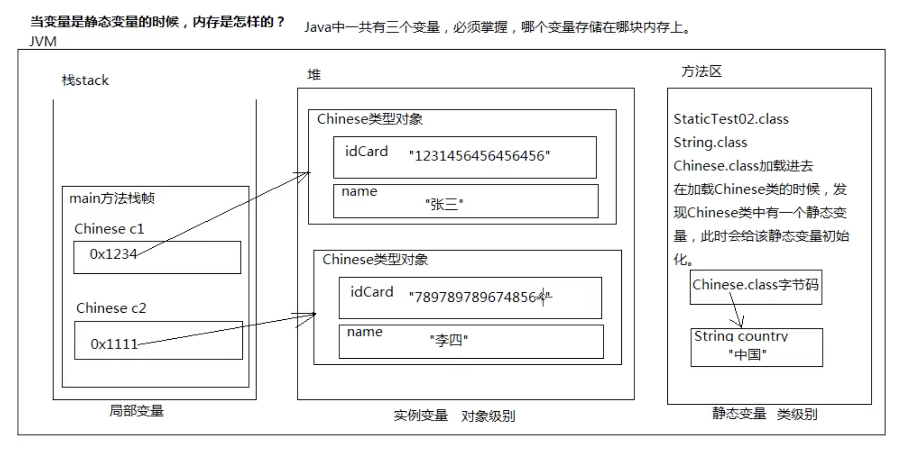
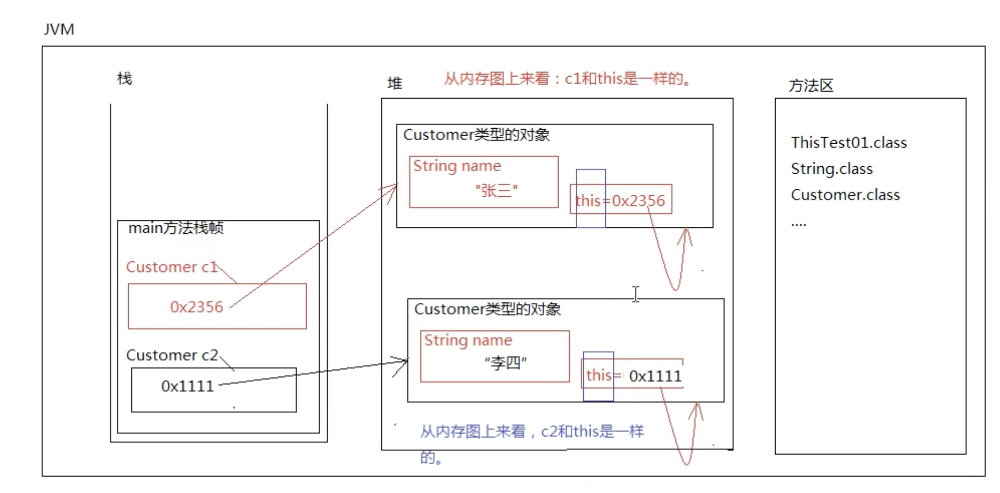
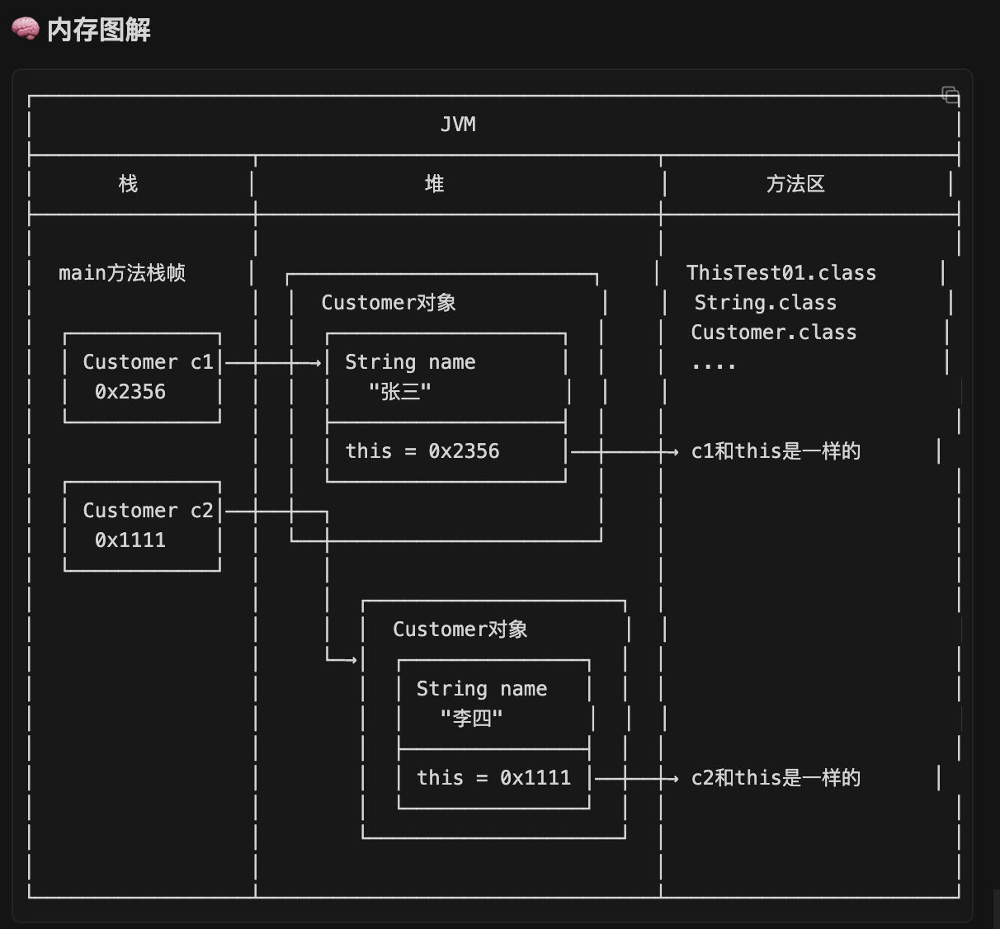
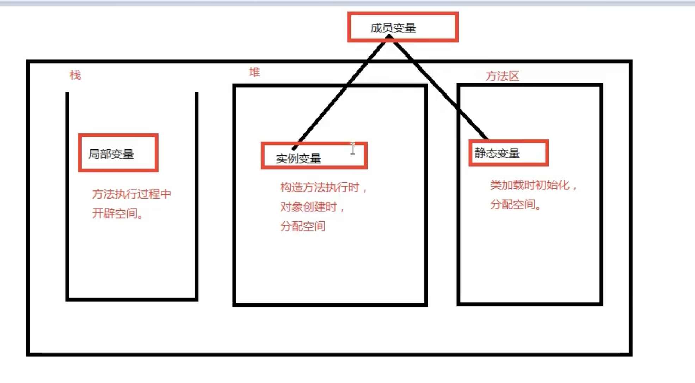

# 2.静态变量  
  
1.  
/*  
    什么时候变量声明为实例的，什么时候声明为静态的？  
        如果这个类型的所有对象的某个属性值都是一样的，  
        不建议定义为实例变量，浪费内存空间。建议定义  
        为类级别特征，定义为静态变量，在方法区中只保留  
        一份，节省内存开销。  
  
    一个对象一份的是实例变量。  
    所有对象一份的是静态变量。  
  
*  *实例变量（*Instance Variable*）：  
*    - *没有*static*修饰  
*    - *存储在堆内存的对象中  
*    - *每个对象都有独立的一份  
*    - *必须先创建对象，通过*"*引用*."*访问  
*    - *在构造方法执行时初始化  
*    *  
*    *静态变量（*Static Variable / Class Variable*）：  
*    - *使用*static*修饰  
*    - *存储在方法区（*JDK8*之后叫元空间*MetaSpace*）  
*    - *所有对象共享同一份  
*    - *可以通过*"*类名*."*访问（推荐），也可以通过*"*引用*."*访问  
*    - *在类加载时初始化，只初始化一次  
  
 */  
public class StaticTest02 {  
    public static void main(String[] args) {  
        // 访问中国人的国籍  
        // 静态变量应该使用类名.的方式访问  
        System.out.println(Chinese.country);  
  
        Chinese c1 = new Chinese("1231456456456456", "张三");  
        System.out.println(c1.idCard);  
        System.out.println(c1.name);  
  
        Chinese c2 = new Chinese("7897897896748564", "李四");  
        System.out.println(c2.idCard);  
        System.out.println(c2.name);  
  
        // idCard是实例变量，必须先new对象，通过“引用.”访问  
        // 错误：无法从静态上下文中引用非静态 变量 idCard,静态上下文（类）无法直接访问非静态成员（实例变量）。  
        // System.out.println(Chinese.idCard);   
    }  
}  
  
// 定义一个类：中国人  
class Chinese {  
  
    // 身份证号  
    // 每一个人的身份证号不同，所以身份证号应该是实例变量，一个对象一份。  
    String idCard;  
  
    // 姓名  
    // 姓名也是一个人一个姓名，姓名也应该是实例变量。  
    String name;  
  
    // 国籍  
    // 重点重点五颗星：加static的变量叫做静态变量  
    // 静态变量在类加载时初始化，不需要new对象，静态变量的空间就开出来了。  
    // 静态变量存储在方法区。  
    static String country = "中国";  
  
    // 无参数构造方法  
    public Chinese() {  
    }  
  
    // 有参数构造方法 (截图中虽然没显示全这个方法的定义，但main方法里用到了，必须加上才能运行)  
    public Chinese(String idCard, String name) {  
        this.idCard = idCard;  
        this.name = name;  
    }  
}  
  
2.  

| 变量类型 | 访问方式       | 空引用访问 | 结果                   |
| ---- | ---------- | ----- | -------------------- |
| 静态变量 | 类名.变量 (推荐) | ✅ 不报错 | 编译器转为 类名.变量          |
| 实例变量 | 引用.变量      | ❌ 报错  | NullPointerException |
  
  
/*  
    实例的：一定需要使用"引用."来访问。  
  
    静态的：  
        建议使用"类名."来访问，但使用"引用."也行（不建议使用"引用."）。  
        静态的如果使用"引用."来访问会让程序员产生困惑：程序员以为是实例的呢。  
  
    结论：  
        空指针异常只有在什么情况下才会发生呢？  
            只有在"空引用"访问"实例"相关的，都会出现空指针异常。  
  
空指针异常 (NullPointerException) 只在以下情况发生：  
    → 空引用 访问 实例变量/实例方法  
  
静态变量/静态方法：  
    → 即使引用为null，也不会报错  
    → 因为静态成员属于类，不属于对象  
  
c1 = null;  
  
c1.country;  // ✅ 不报错 → 实际执行 Chinese.country  
c1.name;     // ❌ 报错 → NullPointerException  
*/  
  
public class StaticTest03 {  
    public static void main(String[] args) {  
        // 通过"类名."的方式访问静态变量  
        System.out.println(Chinese.country);  
          
        // 创建对象  
        Chinese c1 = new Chinese("1111111", "张三");  
        System.out.println(c1.idCard);   // 1111111  
        System.out.println(c1.name);     // 张三  
        System.out.println(c1.country);  // 中国  
  
        // c1是空引用  
        c1 = null;  
          
        // 分析这里会不会出现空指针异常？  
        // 不会出现空指针异常。  
        // 因为静态变量不需要对象的存在。  
        // 实际上以下的代码在运行的时候，还是：System.out.println(Chinese.country);  
        System.out.println(c1.country);  
  
        // 这个会出现空指针异常，因为name是实例变量。  
        //System.out.println(c1.name);  
    }  
}  
  
class Chinese {  
    // 实例变量  
    String idCard;  
    String name;  
  
    // 静态变量  
    static String country = "中国";  
  
    // 构造方法  
    public Chinese(String x, String y) {  
        idCard = x;  
        name = y;  
    }  
}  
  
  
  
  
3.  
public class StaticTest04 {  
    public static void main(String[] args) {  
          
        // ========== 静态方法调用 ==========  
        // 正规方式：类名.方法名()  
        StaticTest04.doSome();  
          
        // 对象方式调用静态方法（不推荐）  
        StaticTest04 st = new StaticTest04();  
        st.doSome();  
          
        // 空引用调用静态方法  
        st = null;  
        st.doSome();  // ✅ 不报错！实际执行 StaticTest04.doSome()  
          
        // ========== 实例方法调用 ==========  
        // 错误：无法从静态上下文中引用非静态方法  
        // StaticTest04.doOther();  // ❌ 编译错误  
          
        // 正确方式：先new对象，再调用  
        StaticTest04 st2 = new StaticTest04();  
        st2.doOther();  
          
        // 空引用调用实例方法  
        st2 = null;  
        // st2.doOther();  // ❌ NullPointerException  
    }  
      
    // 静态方法（不需要new对象，用"类名."访问）  
    public static void doSome() {  
        System.out.println("静态方法doSome()执行了！");  
    }  
      
    // 实例方法（需要new对象，用"引用."访问）  
    public void doOther() {  
        System.out.println("实例方法doOther()执行了！");  
    }  
}  
类 {  
    // 实例相关（需要new对象，通过"引用."访问）  
    实例变量;  
    实例方法;  
      
    // 静态相关（用"类名."访问，也可用"引用."但不建议）  
    静态变量;  
    静态方法;  
}  
静态 = 属于类 → 类名.访问 → 空引用也能用  
实例 = 属于对象 → 引用.访问 → 空引用报错  

| 类型   | 关键字    | 调用方式      | 需要对象  | 空引用调用   |
| ---- | ------ | --------- | ----- | ------- |
| 静态方法 | static | 类名.方法() ✅ | ❌ 不需要 | ✅ 不报错   |
| 实例方法 | 无      | 引用.方法()   | ✅ 需要  | ❌ 空指针异常 |
  
  
4.  
/*  
    类 = 属性 + 方法  
        属性描述的是：状态  
        方法描述的是：行为动作  
      
    一个方法代表了一个动作。  
*/  
public class StaticTest05 {  
    public static void main(String[] args) {  
        StaticTest05.getId();  // ❌ 编译错误！  
    }  
}  
  
class User {  
    // 实例变量，需要对象  
    private int id;  
      
    public static void setId(int i) {  
        id = i;  // ❌ 编译错误！  
    }  
      
    public static int getId() {  
        return 某个对象的id;  // ❓ 哪个对象的id？  
    }  
}  
静态方法没有"this"，不知道操作哪个对象的实例变量，所以不能访问。  
✅ 静态方法 可以访问 静态变量/静态方法  
✅ 实例方法 可以访问 静态变量/静态方法/实例变量/实例方法  
❌ 静态方法 不能访问 实例变量/实例方法  
****一句话：静态不能访问实例，实例可以访问一切。****  
  
5./*  
    关于方法来说，什么时候定义为实例方法？什么时候定义为静态方法？  
    有没有参考标准。  
  
    此方法一般都是描述了一个行为，如果说该行为必须由对象去触发。  
    那么该方法定义为实例方法。  
  
    参考标准：  
        当这个方法体当中，直接访问了实例变量，这个方法一定是实例方法。  
  
    我们以后开发中，大部分情况下，如果是工具类的话，工具类当中的方法  
    一般都是静态的。(静态方法有一个优点，是不需要new对象，直接采用类名  
    调用，极其方便。工具类就是为了方便，所以工具类中的方法一般都是static的。)  
  
    什么是工具类？？？？？  
        以后讲。（工具类就是为了方便编程而开发的一些类。）  
  
    类 = 属性 + 方法  
        属性描述的是：状态  
        方法描述的是：行为动作  
  
    一个方法代表了一个动作。  
  
    什么时候方法定义为实例方法？  
        张三考试，得分90  
        李四考试，得分100  
        不同的对象参加考试的结果不同。  
        我们可以认定"考试"这个行为是与对象相关的行为。  
        建议将"考试"这个方法定义为实例方法。  
*/  
public class StaticTest05 {  
    public static void main(String[] args) {  
        User u = new User();  
        System.out.println(u.getId());  // 0  
          
        // User.getId();  // ❌ 不能用类名调用实例方法  
          
        User.printName2();  // ❌ 编译错误！静态方法访问实例变量  
          
        User x = new User();  
        x.printName1();  // ✅ 正确  
    }  
}  
  
class User {  
    // 实例变量，需要对象  
    private int id;  
      
    // 实例变量（对象级别的，一个对象一份）  
    private String name;  
      
    // ========== 实例方法（正确）==========  
    // 打印用户的名字这样的一个方法  
    public void printName1() {  
        System.out.println(name);  // ✅ 访问实例变量，必须是实例方法  
    }  
      
    // ========== 静态方法（错误）==========  
    public static void printName2() {  
        // 输出的是一个对象的name  
        // System.out.println(name);  // ❌ 编译错误！  
    }  
      
    public void setId(int i) {  
        id = i;  
    }  
      
    public int getId() {  
        return id;  
    }  
      
    /*  
    // ❌ 错误：静态方法不能访问实例变量  
    public static int getId() {  
        return id;  
    }  
    */  
}  
  
  
6.静态代码块 = 类加载时自动执行的代码，只执行一次，先于main()  
/*  
    1、使用static关键字可以定义：静态代码块  
      
    2、什么是静态代码块，语法是什么？  
        static {  
            java语句;  
            java语句;  
        }  
      
    3、static静态代码块在什么时候执行呢？  
        类加载时执行。并且只执行一次。  
        静态代码块有这样的特征/特点。  
      
    4、注意：静态代码块在类加载时执行，并且在main方法执行之前执行。  
      
    5、静态代码块一般是按照自上而下的顺序执行。  
      
    6、静态代码块有啥作用，有什么用？  
        第一：静态代码块不是那么常用。（不是每一个类当中都要写的东西。）  
        第二：静态代码块这种语法机制实际上是SUN公司给我们java程序员的一个特殊的时刻/  
              这个时机叫做：类加载时机。  
  
        具体的业务：  
            项目经理说了：大家注意了，所有我们编写的程序中，只要是类加载了，请记录一下  
            类加载的日志信息（在哪年哪月哪日几时几分几秒，哪个类加载到JVM当中了）。  
            思考：这些记录日志的代码写到哪里呢？  
                写到静态代码块当中。  
*/  
public class StaticTest06 {  
  
    // 静态代码块  
    static {  
        System.out.println("A");  
    }  
  
    // 一个类当中可以编写多个静态代码块  
    static {  
        System.out.println("B");  
    }  
  
    // 入口  
    public static void main(String[] args) {  
        System.out.println("Hello World!");  
    }  
  
    // 编写一个静态代码块  
    static {  
        System.out.println("C");  
    }  
}  
  
/*  
输出结果：  
A  
B  
C  
Hello World!  
*/  
  
7.**静态的东西，类加载时按代码顺序从上到下执行，在main()之前完成。**  
/*  
    栈：方法只要执行，会压栈。（局部变量）  
    堆：new出来的对象都在堆中。垃圾回收器主要针对。（实例变量）  
    方法区：类的信息，字节码信息，代码片段。（静态变量）  
  
    方法的代码片段放在方法区，但是方法执行过程当中需要的内存在栈中。  
*/  
public class StaticTest07 {  
  
    // 静态变量在什么时候初始化？类加载时初始化。  
    // 静态变量存储在哪里？方法区  
    static int i = 100;  
  
    // 静态代码块什么时候执行？类加载时执行。  
    static {  
        // 这里可以访问i吗？  
        System.out.println("i = " + i);  // ✅ 可以，i在前面已定义  
    }  
  
    // 实例变量  
    int k = 111;  // k变量是实例变量，在构造方法执行时内存空间才会开辟。  
  
    static {  
        // k变量可以访问吗？  
        // static静态代码块在类加载时执行，并且只执行一次。  
        // 类加载时，k变量空间还没有开辟出来呢。  
        // 错误：无法从静态上下文中引用非静态 变量 k  
        // System.out.println("k = " + k);  // ❌ 编译错误！  
  
        // 这里可以访问name吗？  
        // 错误：非法前向引用  
        // 静态代码块和静态变量都在类加载的时候执行，时间相同，只能靠代码的顺序来决定  
        // System.out.println("name = " + name);  // ❌ 编译错误！  
    }  
  
    // 静态变量在静态代码块下面。  
    static String name = "zhangsan";  
  
    // 入口(main方法执行之前实际上执行了很多代码)  
    public static void main(String[] args) {  
        System.out.println("main begin");  
        System.out.println("main over");  
    }  
}  
  
/*  
输出结果：  
i = 100  
main begin  
main over  
*/  
  
/*  
总结：  
    到目前为止，你遇到的所有java程序，有顺序要求的是哪些？  
        第一：对于一个方法来说，方法体中的代码是有顺序的，遵循自上而下的顺序执行。  
        第二：静态代码块1和静态代码块2是有先后顺序的。  
        第三：静态代码块和静态变量是有先后顺序的。  
*/  
  
  
8.**实例语句块 (Instance Block)实例语句块 = 构造方法的"前置代码"，每次new都执行，用于公共初始化**  
/*  
    1、除了静态代码块之外，还有一种语句块叫做：实例语句块  
    2、实例语句在类加载是并没有执行。  
    3、实例语句语法？  
        {  
            java语句;  
            java语句;  
            java语句;  
        }  
    4、实例语句块在什么时候执行？  
        只要是构造方法执行，必然在构造方法执行之前，自动执行"实例语句块"中的代码。  
        实际上这也是SUN公司为java程序员准备一个特殊的时机，叫做对象构建时机。  
*/  
public class InstanceCode {  
  
    // 入口  
    public static void main(String[] args) {  
        System.out.println("main begin");  
        new InstanceCode();  
        new InstanceCode();  
          
        new InstanceCode("abc");  
        new InstanceCode("xyz");  
    }  
  
    // 实例语句块  
    {  
        System.out.println("实例语句块执行！");  
    }  
  
    // Constructor（无参构造方法）  
    public InstanceCode() {  
        System.out.println("无参数构造方法");  
    }  
  
    // Constructor（有参构造方法）  
    public InstanceCode(String name) {  
        System.out.println("有参的构造方法");  
    }  
}  
main begin  
实例语句块执行！  
无参数构造方法  
实例语句块执行！  
无参数构造方法  
实例语句块执行！  
有参的构造方法  
实例语句块执行！  
有参的构造方法  
new InstanceCode() 执行流程：  
  
    ┌──────────────────────────┐  
    │  1. 实例语句块执行         │  → "实例语句块执行！"  
    └────────────┬─────────────┘  
                 ↓  
    ┌──────────────────────────┐  
    │  2. 构造方法执行           │  → "无参数构造方法"  
    └──────────────────────────┘  
  
每次 new 对象都会执行：实例语句块 → 构造方法  
  

| 特性   | 静态代码块 static {} | 实例语句块 {} |
| ---- | --------------- | -------- |
| 执行时机 | 类加载时            | new对象时   |
| 执行次数 | 只执行1次           | 每次new都执行 |
| 执行顺序 | 在main()之前       | 在构造方法之前  |
| 关键字  | 需要 static       | 不需要      |
  
  
  
  
//判断以下程序的执行顺序  
public class CodeOrder {  
  
    // 静态代码块  
    static {  
        System.out.println("A");  
    }  
  
    // 入口  
    // A X Y C B Z  
    public static void main(String[] args) {  
        System.out.println("Y");  
        new CodeOrder();  
        System.out.println("Z");  
    }  
  
    // 构造方法  
    public CodeOrder() {  
        System.out.println("B");  
    }  
  
    // 实例语句块  
    {  
        System.out.println("C");  
    }  
  
    // 静态代码块  
    static {  
        System.out.println("X");  
    }  
}  
****总结顺序：**** 静态代码块 → main → 实例语句块 → 构造方法  
  
  
  
  
==关于this==  
  
1.  
/*  
    this:  
        1、this是一个关键字，全部小写。  
  
        2、this是什么，在内存方面是怎样的？  
            一个对象一个this。  
            this是一个变量，是一个引用。this保存当前对象的内存地址，指向自身。  
            所以，严格意义上来说，this代表的就是"当前对象"  
            this存储在堆内存当中对象的内部。  
  
        3、this只能使用在实例方法中。谁调用这个实例方法，this就是谁。  
            所以this代表的是：当前对象。  
	  this = 当前对象自己的引用  
  
c1.shopping() → this是c1  
c2.shopping() → this是c2  
*/  
public class ThisTest01 {  
    public static void main(String[] args) {  
  
        Customer c1 = new Customer("张三");  
        c1.shopping();  
  
        Customer c2 = new Customer("李四");  
        c2.shopping();  
    }  
}  
  
// 顾客类  
class Customer {  
  
    // 属性  
    // 实例变量（必须采用"引用."的方式访问）  
    String name;  
  
    // 构造方法  
    public Customer() {  
  
    }  
  
    public Customer(String s) {  
        name = s;  
    }  
  
    // 顾客购物的方法  
    // 实例方法  
    public void shopping() {  
           *// *这里的*this*是谁？*this*是当前对象。  
    *// c1*调用*shopping(), this*是*c1*  
    *// c2*调用*shopping(), this*是*c2*  
      
    *// *写法*1*：显式使用*this*  
    *// System.out.println(this.name + "*正在购物*!");*  
      
    *// *写法*2*：省略*this*（效果一样）  
    *// this. *是可以省略的。  
    *// this. *省略的话，还是默认访问*"*当前对象*"*的*name*。  
    System.out.println(name + "正在购物!");  
  
    }  
  
  
2.  
*// *静态方法  
//直接访问实例变量 → 必须是实例方法  
//静态方法要访问实例变量 → 必须先new对象  
public static void doSome() {  
    *// this*代表的是当前对象，而静态方法的调用不需要对象。矛盾了。  
    *// *错误：无法从静态上下文中引用非静态* *变量* this*  
//静态方法属于类，不属于对象，没有"当前对象"，所以不能用this  
    *// System.out.println(this);  // *❌* *编译错误！  
}  
  
  
    *// *静态方法  
    public static void m1() {  
        *// System.out.println(name);       // *❌* *编译错误！  
          
        *// this*代表的是当前对象。  
        *// System.out.println(this.name);  // *❌* *编译错误！  
          
        *// *除非你这样  
        Student s = new Student();  
        System.out.println(s.name);        *// *✅* *正确！  
    }  
  
}  
  
注意！！  
public Customer(String name) {  
    *// *参数*name*和实例变量*name*同名  
    *// *必须用*this*区分！  
    this.name = name;  *// this.name*是实例变量，*name*是参数  
      
    *// *如果写成：*name = name; *  
    *// *就是参数自己赋值给自己，实例变量没变！  
}  
this.可以省略，但遇到同名变量时必须写！  
  
  
静态属于类，实例属于对象  
静态先加载，main后执行  
实例块先行，构造后跟上  
this是自己，静态无此身  
方法区放静态，堆放new的  
栈放局部的，记住不会错  
  
****静态不能访问实例，实例可以访问一切****  

| 从↓能访问→ | 静态 | 实例 | this |
| ------ | -- | -- | ---- |
| 静态方法   | ✅  | ❌  | ❌    |
| 实例方法   | ✅  | ✅  | ✅    |
  
  

| 调用者   | 静态变量 | 实例变量 | 静态方法 | 实例方法 | this |
| ----- | ---- | ---- | ---- | ---- | ---- |
| 静态方法  | ✅    | ❌    | ✅    | ❌    | ❌    |
| 实例方法  | ✅    | ✅    | ✅    | ✅    | ✅    |
| 静态代码块 | ✅    | ❌    | ✅    | ❌    | ❌    |
  
  
  
  
3.  
  
/*  
    1、this可以使用在实例方法中，不能使用在静态方法中。  
    2、this关键字大部分情况下可以省略，什么时候不能省略呢？  
       在实例方法中，或者构造方法中，为了区分局部变量和实例变量，  
       这种情况下：this. 是不能省略的。  
*/  
public class ThisTest03 {  
    public static void main(String[] args) {  
  
        Student s = new Student();  
        s.setNo(111);  
        s.setName("张三");  
        System.out.println("学号：" + s.getNo());  
        System.out.println("姓名：" + s.getName());  
  
        Student s2 = new Student(2222, "李四");  
        System.out.println("学号：" + s2.getNo());  
        System.out.println("姓名：" + s2.getName());  
    }  
}  
  
// 分析一下：以下代码哪里写的不好！  
// 学生类  
class Student {  
    // 学号  
    private int no;  
  
    // 姓名  
    private String name;  
  
    // 构造方法无参  
    public Student() {  
    }  
  
    /*  
    // 旧写法（参数名和属性名不同）  
    public Student(int i, String s) {  
        no = i;  
        name = s;  
    }  
    */  
  
    // 上面的构造方法也增强以下可读性  
    public Student(int no, String name) {  
        this.no = no;      // this.no是实例变量，no是参数  
        this.name = name;  // this.name是实例变量，name是参数  
    }  
  
    // setter and getter方法  
  
    /*  
    // 旧写法（参数名和属性名不同）  
    public void setNo(int i) {  
        no = i;  // 可以省略this  
    }  
    */  
  
    /*  
    // 错误写法！  
    public void setNo(int no) {  // 就近原则。  
        no = no;  // 这两个no都是局部变量no，和实例变量no没关系。  
    }  
    */  
  
    // 正确写法  
    public void setNo(int no) {  
        // no是局部变量  
        // this.no 是指的实例变量。  
        this.no = no;  // this. 的作用是：区分局部变量和实例变量。  
    }  
  
    public int getNo() {  
        return no;  
        // return this.no;  // 效果一样，this可省略  
    }  
  
    public void setName(String name) {  
        this.name = name;  
    }  
  
    public String getName() {  
        return name;  
    }  
}  
  
  
* 	  
prozelle  
  
ariba/ond/Buyer/test-guidedbuy/test/ariba/guidedbuy/api/GBRequisitionUtilTest.java  

| 规则         | 说明                |
| ---------- | ----------------- |
| 只能在构造方法中使用 | 普通方法不能用this()     |
| 必须是第一行     | this()必须写在构造方法第一行 |
| 只能调用本类构造方法 | 不能调用父类或其他类        |
| 不能递归调用     | A调B，B不能再调A        |
  
4.  
/*  
    1、this除了可以使用在实例方法中，还可以用在构造方法中。  
    2、新语法：通过当前的构造方法去调用另一个本类的构造方法，可以使用以下语法格式：  
        this(实际参数列表);  
        通过一个构造方法1去调用构造方法2，可以做到代码复用。  
        但需要注意的是："构造方法1"和"构造方法2" 都是在同一个类当中。  
    3、this() 这个语法作用是什么？  
        代码复用。  
*/  
public class ThisTest04 {  
    public static void main(String[] args) {  
        // 调用无参数构造方法  
        Date d1 = new Date();  
        d1.detail();  
  
        // 调用有参数构造方法  
        Date d2 = new Date(2008, 8, 8);  
        d2.detail();  
    }  
}  
  
5.  
/*  
需求：  
    1、定义一个日期类，可以表示年月日信息。  
    2、需求中要求：  
        如果调用无参数构造方法，默认创建的日期为：1970年1月1日。  
        当然，除了调用无参数构造方法之外，也可以调用有参数的构造方法来创建日期对象。  
*/  
class Date {  // 以后写代码都要封装，属性私有化，对外提供setter and getter  
    // 年  
    private int year;  
    // 月  
    private int month;  
    // 日  
    private int day;  
  
    // 无参构造方法  
    public Date() {  
        // 需求：默认1970年1月1日  
        // 方法1：直接赋值（代码重复）  
        // this.year = 1970;  
        // this.month = 1;  
        // this.day = 1;  
  
        // 方法2：调用有参构造方法（代码复用）✅  
        this(1970, 1, 1);  
    }  
  
    // 有参构造方法  
    public Date(int year, int month, int day) {  
        this.year = year;  
        this.month = month;  
        this.day = day;  
    }  
  
    // 打印日期详情  
    public void detail() {  
        System.out.println(year + "年" + month + "月" + day + "日");  
    }  
  
    // getter and setter...  
}  
  
总结  
  
1、this  
  
    1.1、this是一个关键字，是一个引用，保存内存地址指向自身。  
  
    1.2、this可以使用在实例方法中，也可以使用在构造方法中。  
  
    1.3、this出现在实例方法中其实代表的是当前对象。  
  
    1.4、this不能使用在静态方法中。  
  
    1.5、this. 大部分情况下可以省略，但是用来区分局部变量和实例变量的时候不能省略。  
  
    1.6、this() 这种语法只能出现在构造方法第一行，表示当前构造方法调用本类其他的  
         构造方法，目的是代码复用。  
class Student {  
    private String name;  
      
    // 1.6 this() 调用其他构造方法，必须第一行  
    public Student() {  
        this("默认姓名");  // 调用有参构造  
    }  
      
    public Student(String name) {  
        // 1.5 this.不能省略（区分同名变量）  
        this.name = name;  
    }  
      
    // 1.2 & 1.3 实例方法中的this代表当前对象  
    public void show() {  
        System.out.println(this.name);  // this.可省略  
    }  
      
    // 1.4 静态方法不能用this  
    public static void test() {  
        // System.out.println(this);  // ❌ 编译错误  
    }  
}  
  
  
一个例子总结  
/*  
    程序再怎么变化，万变不离其宗，有一个固定的规律：  
        所有的实例相关的都是先创建对象，通过"引用."来访问。  
        所有的静态相关的都是直接采用"类名."来访问。  
  
    你有没有发现一些问题呀？  
        总有一些是需要记忆的，在这些记忆的基础之上进行分析。  
  
    大结论：  
        只要负责调用的方法a和被调用的方法b在同一个类当中：  
            this. 可以省略  
            类名. 可以省略  
*/  
public class Review02{  
  
    int i = 100;  
    static int j = 1000;  
  
    public void m1(){  
  
        // 访问其他类的静态方法  
        T.t1();  
  
        // 访问其他类的实例方法  
        T t = new T();  
        t.t2();  
    }  
  
    public void m2(){}  
  
    // 实例方法  
    public void x(){ // 这个方法是实例方法，执行这个方法的过程中，当当前对象是存在的。  
        m1();  
        m2();  
  
        m3();  
        m4();  
  
        System.out.println(i); // System.out.println(this.i);  
        System.out.println(j); // System.out.println(Review02.i);  
    }  
  
    public static void m3(){}  
  
    public static void m4(){}  
  
    // 问？你怎么分析这个程序？  
    /*  
        第一步：  
            main方法是静态的，JVM调用main方法的时候直接采用的是"类名."的方式。  
            所以main方法中没有this。  
  
        第二步：  
            m1() 和 m2() 方法是实例方法，按照java语法规则来说，实例方法必须先  
                new对象，通过"引用."的方式访问。  
    */  
    public static void main(String[] args){  
        // 编译报错。  
        // m1();  
        // m2();  
  
        m3(); // 编译器会自动识别m3()静态方法，结果是：Review02.m3();  
        m4(); // Review02.m4();  
  
        // System.out.println(i); // 报错  
        System.out.println(j); // 可以  
  
        // 想访问m1() m2() 还有i，你在static方法中只能自己new  
        Review02 r = new Review02();  
        System.out.println(r.i);  
        r.m1();  
        r.m2();  
  
        // 局部变量，局部变量访问的时候是不需要"xxx."的  
        int k = 10000;  
        System.out.println(k);  
    }  
}  
  
// 辅助类 T  
class T{  
    public static void t1(){  
    }  
  
    public void t2(){  
    }  
}  
说明要点：  
* i 是实例变量，每个对象一份；j 是静态变量，全类共享，类加载时初始化。  
* 实例方法（如 m1、x）调用时对象已存在，可直接用 this.（可省略）访问实例成员，也能访问静态成员。  
* 静态方法（如 main、m3、m4）没有 this，只能直接用类名/省略访问静态成员；要用实例成员必须先 new 对象。  
* 访问其他类的静态成员用 类名.（如 T.t1()）；访问其他类的实例成员需先创建对象（如 new T().t2()）。  
* 局部变量访问不需要前缀。  
  
  
  
