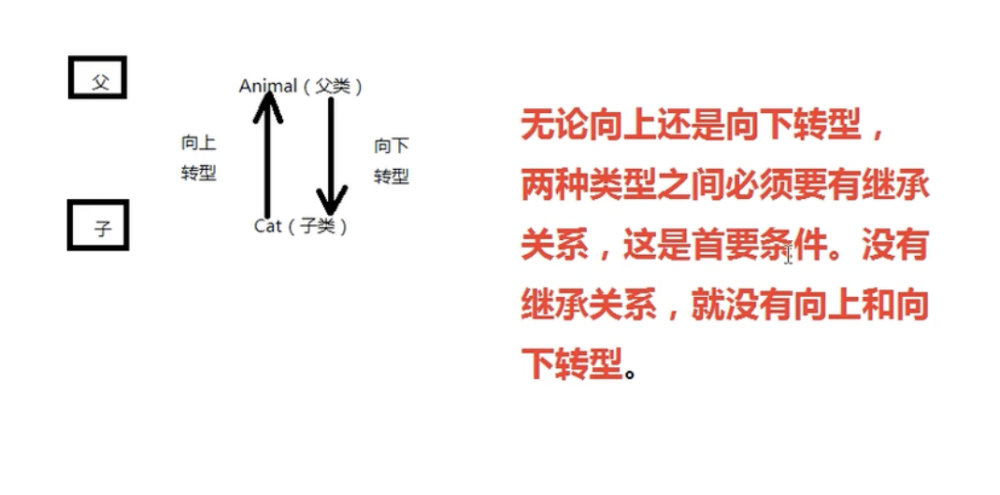
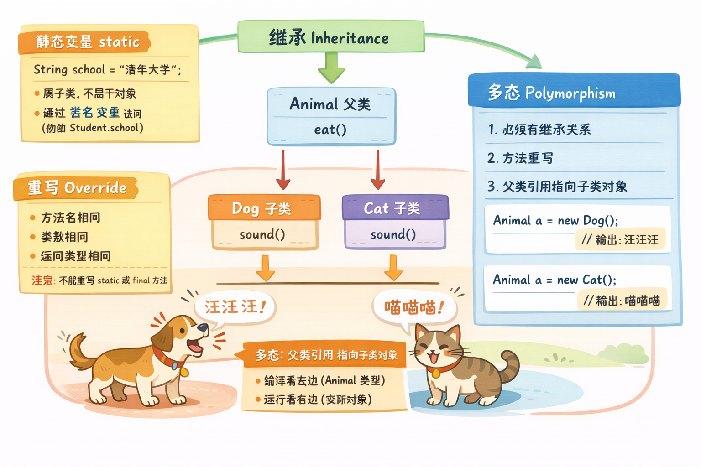
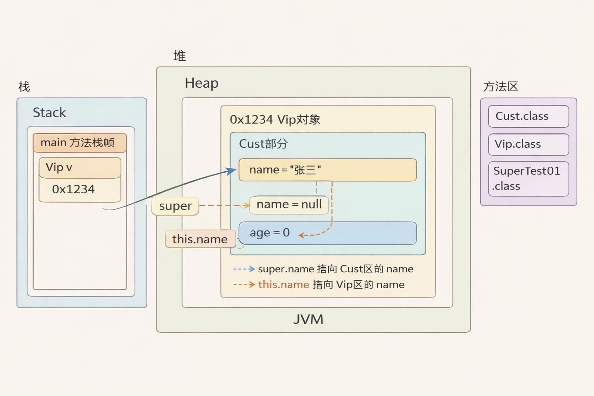
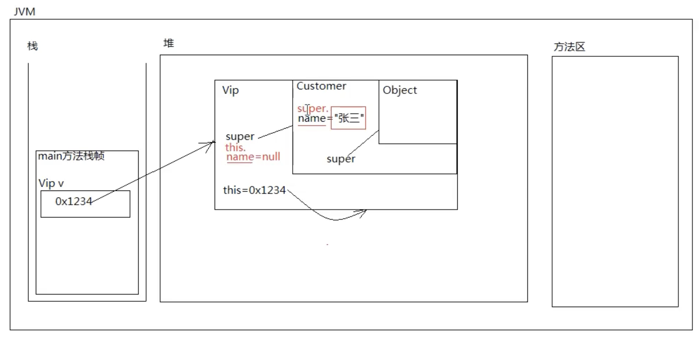
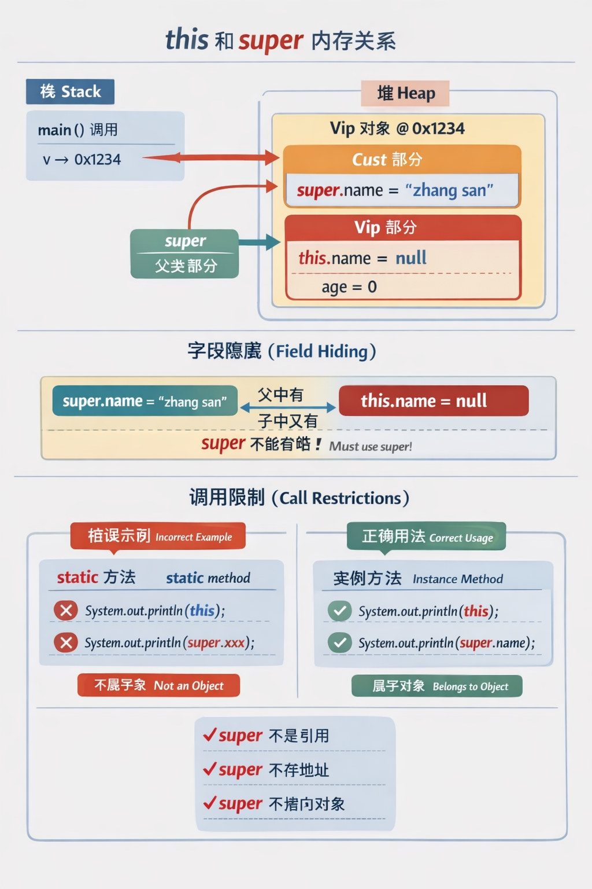

# 3.==继承==  
3、继承 extends  
  
3.1、什么是继承，有什么用？  
    继承：在现实世界当中也是存在的，例如：父亲很有钱，儿子不用努力也很有钱。  
    继承的作用：  
        基本作用：子类继承父类，代码可以得到复用。（这个不是重要的作用，是基本作用。）  
        主要（重要）作用：因为有了继承关系，才有了后期的方法覆盖和多态机制。  
        这两个作用我们在后续的课程中会详细讲解。目前先理解  
        继承可以做到代码复用的效果。  
  
12.2.3 继承的相关特性（掌握）  
    那么，对于 Java 的继承有哪些特性需要大家理解和记忆呢？我来罗列一下：  
  
    ① B 类继承 A 类，则称 A 类为超类（superclass）、父类、基类，  
      B 类则称为子类（subclass）、派生类、扩展类。  
      class A(){}  
      class B extends A(){}  
      我们平时聊下说的比较多的是：父类和子类。  
      superclass 父类  
      subclass  子类  
  
    ② java 中的继承只支持单继承，不支持多继承，C++ 中支持多继承，  
      这也是 java 体现简单性的一点，换句话说，java 中不允许这样写代码：  
      class B extends A, C{}  这是错误的。  
  
    ③ 虽然 java 中不支持多继承，但有的时候会产生间接继承的效果，  
      例如：class C extends B，class B extends A，也就是说，C 直接继承 B，  
      其实 C 还间接继承 A。  
  
    ④ java 中规定，子类继承父类，除构造方法不能继承之外，剩下都可以继承。  
      但是私有的属性无法在子类中直接访问。（父类中用 private 修饰的不能在子类中直接访问。可以通过间接的手段来访问。）  
  
    ⑤ java 中的类没有显式的继承任何类，则默认继承 Object 类，Object 类是  
      java 语言提供的根类（老祖宗类），也就是说，一个对象与生俱来就有  
      Object 类型中所有的特征。  
  
    ⑥ 继承也存在一些缺点，例如：CreditAccount 类继承 Account 类会导致它们之间的耦合度非常高，Account 类发生改变之后会马上影响到 CreditAccount 类。  
  
  
  
  
/*  
    测试：子类继承父类之后，能使用子类对象调用父类方法吗  
    实际上以上的这个问题问的有点蹩脚！！！  
    哪里蹩脚？能使用子类对象调用父类方法？  
    本质上，子类继承父类之后，是将父类继承过来的方法归为自己所有。  
    实际上调用的也不是父类的方法，是它子类自己的方法（因为已经继承过来了就属于自己了）。  
*/  
  
public class ExtendsTest04{  
    public static void main(String[] args){  
        // 创建子类对象  
        Cat c = new Cat();  
        // 调用方法  
        c.move();  
        // 通过子类对象访问 name 可以吗？  
        System.out.println(c.name);  
    }  
}  
  
// 父类  
// class Animal extends Object {  
class Animal{  
    // 名字（先不封装）  
    String name = "XiaoHua"; // 默认值不是 null，给一个 XiaoHua  
    // 提供一个动物移动的方法  
    public void move(){  
        System.out.println(name + "正在移动！");  
    }  
}  
  
// Cat 子类  
// Cat 继承 Animal，会将 Animal 中所有的全部继承过来。  
class Cat extends Animal{  
}  
  
细节  
  
1、继承 extends  
  
1.1、测试：子类继承父类之后，能使用子类对象调用父类方法吗？  
  
1.2、在实际开发中，满足什么条件的时候，我可以使用继承呢？  
     凡是采用“is a/是”能描述的，都可以继承。  
     例如：  
        Cat is a Animal：猫是一个动物  
        Dog is a Animal：狗是一个动物  
        CreditAccount is a Account：信用卡账户是一个银行账户  
        ....  
  
假设以后的开发中有一个A类，有一个B类，A类和B类确实也有重复的代码，  
那么他们两个之间就可以继承吗？不一定，还是要看一看它们之间是否能够  
使用 is a 来描述。  
  
    class Customer{  
        String name; // 名字  
        // setter and getter  
    }  
  
    class Product{  
        String name; // 名字  
        // setter and getter  
    }  
  
    class Product extends Customer{  
  
    }  
  
以上的继承就属于很失败的。因为：Product is a Customer，是有逻辑问题的。  
  
1.3、任何一个类，没有显式继承任何类，默认继承 Object，那么 Object 类当中有哪些方法呢？老祖宗为我们提供了哪些方法？  
  
以后慢慢的大家一定要适应看 JDK 的源代码（多看看牛人写的程序自己才会变成牛人。）先模仿后超越。  
java 为什么比较好学呢？  
是因为 Java 内置了一套庞大的类库，程序员不需要从 0 开始写代码，程序员可以基于这套庞大的类库进行“二次”开发。（开发速度较快，因为 JDK 内置的这套库实现了很多基础的功能。）  
例如：string 是 SUN 编写的字符串类，System 是 SUN 编写的系统类。  
这些类都可以拿来直接使用。  
  
JDK 源代码在什么位置？  
C:\Program Files\Java\jdk-13.0.2\lib\src.zip  
  
* 何一个类（没有显式继承）默认继承 Object。  
* Java 内置了一套庞大的类库（如 String、System 等），可以直接使用。  
* JDK 源码位置示例：C:\Program Files\Java\jdk-13.0.2\lib\src.zip。  
* 代码 System.out.println("Hello World!"); 的理解：  
* System 是类名；  
* out 后没有括号，说明 out 是变量；  
* 直接用类名 System.out，说明 out 是一个静态变量。  
  
  
  
// editPlus中蓝色是关键字  
// 黑色是标识符  
// System.out.println("Hello World!");  
// 以上代码中：System、out、println 都是标识符。  
// 在 editplus 中的红色字体，表示这个类是 SUN 的 JDK 写好的一个类。  
public class Test{  
  
    // 静态变量  
    static Student stu = new Student();  
  
    // 入口  
    public static void main(String[] args){  
        Test.stu.exam();  
        System.out.println("Hello World!");  
    }  
}  
  
// 学生类  
class Student{  
  
    // 实例方法  
    public void exam(){  
        System.out.println("考试。。。。");  
    }  
}  
  
  
> ## ==toString方法==  

// 2f92e0f4 可以等同“看做对象在堆内存当中的内存地址。  
// 实际上是内存地址经过哈希算法得到的十六进制结果。  
System.out.println(retValue); // ExtendsTest05@2f92e0f4  
  
// 创建对象  
Product pro = new Product();  
  
String retValue2 = pro.toString();  
System.out.println(retValue2); // Product@5305068a  
  
// 以上两行代码能否合并为一行！！！ 可以  
System.out.println(pro.toString()); // Product@5305068a  
  
// 如果直接输出“引用”呢？？？？？  
System.out.println(pro); // Product@5305068a  
  
System.out.println(100);  
System.out.println(true);  
// Product@5305068a  
System.out.println(pro); // println方法会自动调用pro的toString()方法。  
  
class Product{  
    /*  
    public String toString() {  
        return getClass().getName() + "@" + Integer.toHexString(hashCode());  
    }  
    */  
}  
1) println(obj) 会自动调用 obj.toString()，所以直接打印引用对象会输出类似 类名@哈希值 的字符串（默认继承自 Object.toString()）。  
2) Object.toString() 的默认实现：类全名 + "@" + 对象的hashCode十六进制。  
3) 你可以重写 toString()，返回更友好的内容（例如对象字段信息），打印引用时就会显示自定义的字符串。  
4) 上面的两行：  
* String retValue2 = pro.toString();  
* System.out.println(retValue2);  
可以合并为一行 System.out.println(pro.toString()); 效果一样。  
5) 打印基础类型或 true/false 时，println 直接输出对应值；打印对象时调用 toString()。  
  
  
  
### ==重写==  
  
  
  
/*  
*什么时候考虑“方法覆盖/重写/override”？*  
*    子类继承父类后，继承来的方法不能满足子类业务需求时，子类有权重新编写。*  
  
*方法覆盖又叫：方法重写、override、overwrite（常用：覆盖/重写/override）*  
  
*重要结论：*  
*    子类对父类方法做了覆盖后，子类对象调用该方法时，一定执行覆盖后的实现。*  
  
*回顾方法重载 overload（同类中，同名但参数列表不同）：*  
*    何时用？功能相似时同名更美观、易用。*  
*    成立条件：①同一类中 ②方法名相同 ③参数列表不同（个数/顺序/类型）*  
  
*当代码层面如何判定是“方法覆盖”？*  
*条件一：两类必须有继承关系*  
*条件二：新方法与旧方法具有*  
*        - 相同的返回值类型*  
*        - 相同的方法名*  
*        - 相同的形参列表*  
条件三：子类重写时，访问权限不能比父类更低（可以更高）。父类是 public，子类至少 public；不能降到 protected/默认/private。  
条件四：子类重写时，不能比父类声明抛出更多（更宽）的受检异常；可以更少或不声明。若父类未声明受检异常，子类重写时不能新增受检异常（自定义 throws Exception 会报错）。运行时异常不受此限制。  
注意  
1: 方法覆盖只是针对于方法，和属性无关  
2:私有方法无法覆盖  
3.构造方法不能被继承，所以构造方法不能被覆盖  
4.方法覆盖知识针对于实例方法，静态方法覆盖没有意义  
  
  
  
回顾一下方法重载！！！  
什么时候考虑使用方法重载 overload？  
    当在一个类当中，如果功能相似的话，建议将名字定义的一样，这样  
    代码美观，并且方便编程。  
  
什么条件满足之后能够构成方法重载 overload？  
    条件一：在同一个类当中  
    条件二：方法名相同  
    条件三：同一个类里，方法名相同，参数列表不同（个数/类型/顺序不同）；返回值、修饰符不限。  
  
*/  
  
// 示例代码  
public class OverrideTest02 {  
    public static void main(String[] args) {  
        Bird b = new Bird();  
        b.move();       // 鸟儿在飞翔！！！  
        b.sing(1000);   // 调用的是 Animal 的 sing(int i)（因 Bird 未重写该签名）  
  
        Cat c = new Cat();  
        c.move();       // 猫在走猫步！！！  
    }  
}  
  
// 父类  
class Animal {  
    public void move() {  
        System.out.println("动物在移动！");  
    }  
  
    // 带参 sing，用于演示“未被重写时仍调用父类实现”  
    public void sing(int i) {  
        System.out.println("Animal sing....");  
    }  
}  
  
// 子类 Bird  
class Bird extends Animal {  
  *// ✔ 合法：public → public，且无新增受检异常*  
    @Override  
    public void move() { System.out.println("鸟儿在飞翔！！！"); }  
  
    *// 与 sing(int i) 参数列表不同*  
    public void sing() { System.out.println("Bird sing....."); }  
  
    */* ❌ 违反条件三示例：访问权限变低*  
*    protected void move() { ... }  // 父类是 public，降级会报错*  
*    */*  
  
    */* ❌ 违反条件四示例：父类未声明受检异常，子类新增了*  
*    public void move() throws Exception { ... }  // 会报错*  
*    */*  
  
}  
  
// 子类 Cat  
class Cat extends Animal {  
    @Override  
    public void move() {  
        System.out.println("猫在走猫步！！！");  
    }  
}  
关于 @Override：  
* 不是必须写，但强烈建议写。  
* 作用：让编译器帮你校验“确实在重写父类同签名方法”。若方法名/参数写错，本想重写却变成新方法，编译会直接报错，避免隐蔽 bug。  
* 如果不写：代码仍可运行，但一旦签名拼写错误，编译器不会提醒，实际不会发生重写，导致多态调用不到你期望的实现。  
  
* 覆盖/重写：父子类之间，同名同参同返回值，子类替换父类实现；调用取决于真实对象。  
* 重载：同一类内，同名但参数列表不同（个数/类型/顺序），与继承无关。  
* 访问控制：重写时子类的可见性不能低于父类（可更高）。若签名或返回类型不匹配，就不是覆盖，可能是重载或全新方法。  
  
  
  
  
  
  
 # Java继承机制核心知识点  
  
## 1. 代码结构问题与解决  
```java  
// ❌ 原问题：静态方法中无法访问非静态内部类  
public class Test {  
    public static void main(String[] args) {  
        Inner obj = new Inner(); // 编译错误  
    }  
    class Inner {} // 非静态内部类  
}  
  
// ✅ 解决方案：使用独立类  
class People {}  
class ChinesePeople extends People {}  
public class Test {  
    public static void main(String[] args) {  
        ChinesePeople obj = new ChinesePeople(); // 正确  
    }  
}  
```  
  
## 2. 继承的本质机制  
- **继承内容**：子类获得父类所有非private成员  
- **访问规则**：private字段继承但不可直接访问，必须通过public方法  
- **构造器链**：子类构造器必须调用父类构造器(`super()`)  
  
## 3. this引用原理  
```java  
class ChinesePeople extends People {  
    public void speak() {  
        this.getName(); // this指向完整的子类对象  
        getName();      // 等价写法，编译器自动添加this  
    }  
}  
```  
  
**内存结构**：  
```  
ChinesePeople对象  
├── 父类部分: name字段 + getName()方法  
└── 子类部分: 重写的speak()方法  
    ↑  
   this指向整个对象  
```  
  
## 4. 方法调用解析  
**查找顺序**：当前类 → 父类 → 祖父类 → ... → Object  
```java  
this.getName() 执行流程：  
1. 在ChinesePeople中找getName() → 没有  
2. 在People中找getName() → 找到  
3. 执行People.getName()，返回this.name  
```  
  
## 5. 访问权限继承表  
| 修饰符 | 子类继承 | 子类访问 | 说明 |  
|---------|----------|----------|------|  
| private | ✅ | ❌ | 继承但不可直接访问 |  
| default | ✅ | ✅(同包) | 包级访问 |  
| protected | ✅ | ✅ | 子类完全可访问 |  
| public | ✅ | ✅ | 完全公开 |  
  
## 6. 多态机制  
```java  
People p1 = new ChinesePeople("张三");  // 编译时类型vs运行时类型  
p1.speak(); // 运行时动态绑定到ChinesePeople.speak()  
```  
  
## 7. 封装原则体现  
```java  
class People {  
    private String name;           // 数据隐藏  
    public String getName() {      // 接口提供  
        return name;  
    }  
}  
  
class ChinesePeople extends People {  
    public void speak() {  
        // System.out.println(name);     // ❌ 直接访问private  
        System.out.println(getName());   // ✅ 通过公共接口  
    }  
}  
```  
  
## 8. 关键要点总结  
- **静态上下文限制**：static方法中只能直接创建独立类或静态内部类  
- **继承链查找**：方法调用沿继承链向上查找实现  
- **this的作用域**：指向当前完整对象，包含父类所有内容  
- **封装vs继承**：private成员继承但不可访问，体现数据保护  
- **多态实现**：方法重写+动态绑定=运行时多态  
  
**核心原理**：子类对象 = 父类内容 + 子类扩展，`this`指向完整对象，方法调用通过继承链解析。  
  
  
  
```
/*
    关于Object类中的toString()方法
    1、toString()方法的作用是什么？
    作用：将"java对象"转换成"字符串的形式"。
    2、Object类中toString()方法的默认实现是什么？
    public String toString() {
        return getClass().getName() + "@" + Integer.toHexString(hashCode());
    }
    toString: 方法名的意思是转换成string
    含义：调用一个java对象的toString()方法就可以将该java对象转换成字符串的表示
    3、那么toString()方法给的默认实现够用吗？
*/
public class OverrideTest01 {
    public static void main(String[] args) {
        //创建一个日期对象
        MyDate date1 = new MyDate();
        System.out.println(date1.toString());
        System.out.println(date1);


        MyDate date2 = new MyDate(2023, 5, 10);
        System.out.println(date2);

    }
}


//创建个日期类包括年、月、日
class MyDate{
    private int year;
    private int month;
    private int day;

    public MyDate(){
        this(2000, 1, 1);
    }
    public MyDate(int year, int month, int day){
        this.year = year;
        this.month = month;
        this.day = day;
    }

    public int getYear() {
        return year;
    }

    public void setYear(int year) {
        this.year = year;
    }

    public int getMonth() {
        return month;
    }

    public void setMonth(int month) {
        this.month = month;
    }

    public int getDay() {
        return day;
    }

    public void setDay(int day) {
        this.day = day;
    }
//    从 Object 类中继承过来的那个 toString() 方法已经无法满足我业务需求了。
//    我在子类 MyDate 中有必要对父类的 toString() 方法进行覆盖/重写。
//    我的业务要求是：调用 toString() 方法进行字符串转换的时候，
//    希望转换的结果是：xxxx年xx月xx日，这种格式。
//何时可以省略 this
//可以省略的情况：
//在没有同名局部变量的情况下，可以直接使用实例变量名。
//在构造函数中，当参数名与实例变量名相同时，通常需要使用 this 来区分。
//不可以省略的情况：
//当存在同名局部变量时，必须使用 this 来明确引用实例变量。
//在静态上下文中，不能使用 this，因为静态方法不依赖于对象实例。
    public String toString(){
        return year + "年" + month + "月" + day + "日";
    }
}

```
  
2、方法覆盖  
  
2.1、什么时候考虑使用方法覆盖？  
父类中的方法无法满足子类的业务需求，子类有必要对继承过来的方法进行覆盖。  
  
2.2、什么条件满足的时候构成方法覆盖？  
第一：有继承关系的两个类  
第二：具有相同方法名、返回值类型、形式参数列表  
第三：访问权限不能更低。private < default(包级) < protected < public  
第四：抛出异常不能更多。  
  
2.3、关于Object类中toString()方法的覆盖？  
toString()方法存在的作用就是：将java对象转换成字符串形式。  
大多数的java类toString()方法都是需要覆盖的。因为Object类中提供的toString()方法输出的是一个java对象的内存地址。  
  
至于toString()方法具体怎么进行覆盖？  
格式可以自己定义，或者听项目要求的。（听项目要求的。）  
  
2.4、方法重载和方法覆盖有什么区别？  
  
方法重载发生在同一个类当中。  
  
方法覆盖是发生在具有继承关系的父子类之间。  
  
方法重载是一个类中，方法名相同，参数列表不同。  
  
方法覆盖是具有继承关系的父子类，并且重写之后的方法必须和之前的方法一致：  
方法名一致、参数列表一致、返回值类型一致。  
  
  
  
==多态==  
多态的基础语法：  
  
1、学习多态基础语法之前，我们需要普及两个概念：  
第一个：向上转型  
      子——> 父（自动类型转换）  
第二个：向下转型  
      父——> 子（强制类型转换，需要加强制类型转换）  
  
  
注意：  
java中允许向上转型，也允许向下转型。  
无论是向上转型，还是向下转型，两种类型之间必须有继承关系。没有继承关系编译器会报错。  
2.多态是：  
父类型引用指向子类型对象  
包括编译阶段和运行阶段。  
编译阶段：绑定父类的方法。  
运行阶段：动态绑定子类型对象的方法。  
  
  
/*  
多态的基础语法：  
  
1、学习多态基础语法之前，我们需要普及两个概念：  
    第一个：向上转型  
          子——> 父（自动类型转换）  
    第二个：向下转型  
          父——> 子（强制类型转换，需要加强制类型转换）  
    注意：  
    java中允许向上转型，也允许向下转型。  
    无论是向上转型，还是向下转型，两种类型之间必须有继承关系。没有继承关系编译器会报错。  
2.多态是：  
    父类型引用指向子类型对象  
    包括编译阶段和运行阶段。  
    编译阶段：绑定父类的方法。  
    运行阶段：动态绑定子类型对象的方法。  
3.java中只有 类型 或者 引用才能去"。"  
    类名.  
    引用.  
    只要你想".",这个"。"前面要么是一个类名，要么是一个引用。  
4.什么时候必须使用"向下转型"?  
    不要随便做强制类型转换。  
    当你需要访问的是子类对象中"特有"的方法。此时必须进行向下转型。f  
*/  
  
public class PolymorphismTest {  
  
    public static void main(String[] args) {  
        System.*out*.println("多态的基础语法");  
        Animal a1 = new Animal();  
        a1.move(); // 动物在移动！！！  
  
        Cat c1 = new Cat();  
        c1.move(); // cat走猫步！  
  
        Bird b1 = new Bird();  
        b1.move(); // 鸟儿在飞翔！！！  
  
        // 代码可以这样写吗？  
  
        /*  
         1、Animal和Cat之间有继承关系吗？有的。  
         2、Animal是父类，Cat是子类。  
         3、Cat is a Animal，这句话能不能说通？能。  
         4、经过测试得知java中支持这样的一个语法：  
            父类型的引用允许指向子类型的对象。  
            Animal a2 = new Cat();  
            a2就是父类型的引用。  
            new Cat()是一个子类型的对象。  
            允许a2这个父类型引用指向子类型的对象。  
        */  
         // 步骤分解：  
        // 1. 编译时：检查Animal类有没有move()方法 ✅  
        // 2. 运行时：实际执行Cat对象的move()方法  
        // 3. 输出：cat走猫步！  
        Animal a2 = new Cat();  
        //  ↑        ↑  
        // 编译看这里  运行看这里  
        Animal a3 = new Bird();  
  
        // 没有继承关系的两个类型之间存在转型吗？  
        // 错误：不兼容的类型：Dog无法转换为Animal  
        // Animal a4 = new Dog();  
  
        // 调用a2的move()方法  
  
        /*  
         什么是多态？  
         多种形态，多种状态。  
  
         分析：a2.move();  
         java程序分为编译阶段和运行阶段。  
         先来分析编译阶段：  
         对于编译器来说，编译器只知道a2的类型是Animal，  
         所以编译器在检查语法的时候，会去Animal.class  
         字节码文件中找move()方法，找到了，绑定上move()  
         方法，编译通过，静态绑定成功。（编译阶段属于静态绑定。）  
  
         再来分析运行阶段：  
         运行阶段的时候，实际上在堆内存中创建的java对象是  
         Cat对象，所以move的时候，真正参与move的对象是一只猫，  
         所以运行阶段会动态执行Cat对象的move()方法。这个过程  
         属于运行阶段绑定。（运行阶段绑定属于动态绑定。）  
  
         多态表示多种形态：  
         编译的时候一种形态。  
         运行的时候另一种形态。  
         */  
  
        a2.move(); // cat走猫步！  
  
        // 调用a3的move()方法  
        a3.move(); // 鸟儿在飞翔！！！  
  
        Animal a5 = new Cat();  
        // 分析这个程序能否编译和运行呢？  
        // 分析程序一定要分析编译阶段的静态绑定和运行阶段的动态绑定。  
        // 只有编译通过的代码才能运行。没有编译，根本轮不到运行。  
        // 错误：找不到符号  
        // why??? 因为编译器只知道a5的类型是Animal，去Animal.class文件中找catchMouse()方  
        // 结果没有找到，所以静态绑定失败，编译报错。无法运行。（语法不合法。）  
        // a5.catchMouse();  
  
        // 假设代码写到了这里，我非要调用catchMouse()方法怎么办？  
        // 这个时候就必须使用"向下转型"了。（强制类型转换）  
        // 以下这行代码为啥没报错？？？？  
        // 因为a5是Animal类型，转成Cat，Animal和Cat之间存在继承关系。所以没报错。  
        Cat x = (Cat) a5;  
        x.catchMouse(); // 猫咪在抓老鼠！！！！  
        //向下转型有风险吗？  
        Animal a6 = new Bird(); //表面上a6是Animal,运行的时候实际是一只鸟儿  
  
      /*  
        编译器检测到a6这个引用是Animal类型,  
        而Animal和Cat之间存在即成关系，所以可以向下转型。  
        编译没毛病。  
  
        运行阶段，堆内存实际创建的对象是：Bird对象。  
        在实际运行过程中，拿着Bird对象转换成Cat对象就不行了，Bird和Cat之间没有继承关系。  
  
        运行时会出现异常，java.lang.ClassCastException（类型转换异常）；  
        java.lang.NullPointerException 也很重要。  
  
        如何避免 ClassCastException？  
        新运算符：instanceof（运行阶段动态判断）。  
        作用：运行时判断“引用指向的对象”是否为某类型。语法：引用 instanceof 类型，结果为 true/false。  
        例：c instanceof Cat 为 true 表示 c 指向的堆中对象是 Cat；为 false 则不是。  
        建议习惯：任何时候、任何地点，对类型向下转型前都用 instanceof 判断（Java 规范推荐），可避免 ClassCastException。  
        */  
         //Cat y =(Cat)a6;  
         //y.catchMouse();;  
  
        System.*out*.println(a6 instanceof Cat); // false  
//        a6 实际指向的是 Bird，与 Cat 无继承关系，直接 (Cat) a6 会抛 ClassCastException。  
//        用 instanceof 先判断；返回 false 时不转型，避免异常。  
        if (a6 instanceof Cat) {    // 若 a6 真的是 Cat  
            Cat y = (Cat) a6;       // 再强制类型转换  
            y.catchMouse();  
        }  
    }  
}  
  
// Animal父类  
class Animal {  
    public void move() {  
        System.*out*.println("动物在移动！！！");  
    }  
}  
  
// Cat子类  
class Cat extends Animal {  
    @Override  
    public void move() {  
        System.*out*.println("cat走猫步！");  
    }  
  
    // 这个行为是子类型对象特有的方法  
    public void catchMouse() {  
        System.*out*.println("猫咪在抓老鼠！！！");  
    }  
}  
  
// Bird子类  
class Bird extends Animal {  
    @Override  
    public void move() {  
        System.*out*.println("鸟儿在飞翔！！！");  
    }  
  
    public void sing(){  
        System.*out*.println("鸟儿在歌唱！！！");  
    }  
}  
  
  
  
  
3、多态的基础语法  
3.1、向上转型和向下转型的概念。  
向上转型：子 → 父（upcasting）  
又被称为自动类型转换：Animal a = new Cat();  
向下转型：父 → 子（downcasting）  
又被称为强制类型转换：Cat c = (Cat) a; 需要添加强制类型转换符。  
什么时候需要向下转型？  
需要调用子类对象中所特有的方法。  
必须进行向下转型，才可以调用。  
向下转型有风险吗？  
容易出现 ClassCastException（类型转换异常）。  
怎么避免这个风险？  
instanceof 运算符，可以在程序运行阶段动态地判断某个引用指向的对象是否为某一种类型。  
养成好习惯，向下转型之前一定要使用 instanceof 运算符进行判断。  
不管是向上转型还是向下转型，首先他们之间必须有继承关系，这样编译器就不会报错  
  
* 3.2、什么是多态  
多种形态、多种状态，编译和运行有两个不同的状态。  
编译期叫静态绑定；运行期叫动态绑定。  
  Animal a = new Cat();  
  // 编译时编译器发现 a 的类型是 Animal，所以到 Animal 类中找 move() 方法，找到，绑定，编译通过。  
  // 但运行时会根据堆中实际对象调用对应方法。a.move(); 实际调 Cat 的实现。  
多态的典型代码：父类型的引用指向子类型的对象。（Java 中允许这样写代码！！！）  
* 3.3、什么时候必须进行向下转型？  
调用子类对象上特有的方法时。有当你要用子类独有的方法/属性时才需要；常规公共行为用多态就够了。  
  
* 多态 = “父类引用，指向子类对象”，编译看左边（父类能否调用该方法），运行看右边（真实对象是谁就调用谁的实现）。  
  
  
==案例==  
// 说明：先用一个父类 Pet，把“吃”这一共性抽象出来；  
// 子类各自覆盖 eat() 完成差异化；Master 只写一个 feed(Pet pet) 即可喂所有宠物。  
  
// 父类：抽象出共性方法 eat()  
abstract class Pet {  
    abstract void eat(); // 子类必须实现自己的吃法  
}  
  
// 具体宠物  
class Dog extends Pet {  
    @Override  
    void eat() { System.out.println("Dog 吃骨头"); }  
}  
  
class Cat extends Pet {  
    @Override  
    void eat() { System.out.println("Cat 吃鱼"); }  
}  
  
class YingWu extends Pet {  
    @Override  
    void eat() { System.out.println("鹦鹉 吃坚果"); }  
}  
  
// 主人类：只保留一个 feed(Pet pet)，参数用父类型，靠多态分派到各子类的 eat()  
class Master {  
  
    /*  
     * 错误/低扩展性写法（示例注释掉）：  
     * public void feed(Dog d) { d.eat(); }  
     * public void feed(Cat c) { c.eat(); }  
     * 问题：每加一种宠物就得改 Master 类，违背开闭原则（对扩展开放，对修改关闭）。  
     */  
  
    // 正确/可扩展写法：一个父类型入参，依赖多态  
    public void feed(Pet pet) {  
        // 编译期：只要 Pet 有 eat()，就能通过  
        // 运行期：实际对象是谁，就调用谁的 eat()（动态绑定）  
        pet.eat();  
    }  
}  
  
// 测试  
public class Demo {  
    public static void main(String[] args) {  
        Master m = new Master();  
  
        Pet dog = new Dog();  
        Pet cat = new Cat();  
        Pet bird = new YingWu();  
  
        m.feed(dog);  // Dog 吃骨头  
        m.feed(cat);  // Cat 吃鱼  
        m.feed(bird); // 鹦鹉 吃坚果  
  
        // 如果以后新增 Pet 子类，只需新增类并实现 eat()，Master 不用改，符合开闭原则  
    }  
}  
知识点与设计原则说明：  
1. 多态（父类引用指向子类对象）：Pet pet = new Cat(); 编译看左边（Pet 是否声明 eat），运行看右边（真实子类的实现）。  
2. 开闭原则 OCP：对扩展开放、对修改关闭。上面通过父类 Pet 抽象 + 子类覆盖 eat() + Master.feed(Pet)，实现“新增宠物只加类，不改 Master”。  
3. 为什么不用 instanceof：因为共性行为已抽象到父类（或接口）。只要是 Pet，就能调用 eat，不必判型。只有当要用“子类特有方法”时才考虑向下转型/instanceof。  
4. 避免重复重载：若为每种宠物写 feed(Dog)、feed(Cat)，扩展性差，违背 OCP；统一用 feed(Pet) 即可。  
  
  
案例  
public class PolymorphismTest02 {  
  
/*  
    Animal x = new Bird();、  
    Animal y = new Cat();  
    说明编译期类型是 Animal，运行期真实对象分别是 Bird 和 Cat。  
  
    instanceof 在运行期检查 “这个引用当前指向的真实对象是不是某类型”。结果只可能是 true/false。  
    先 instanceof 再强转，是为避免把一个真实是 Bird 的对象，错误地转成 Cat 而抛 ClassCastException。  
  
    为什么还要判断？  
    编译期：Animal x 只能视为 Animal，不能直接调用子类特有方法。  
    运行期：引用里装的可能是 Bird、Cat 或其他子类，写业务时通常不知道具体是哪种；直接强转有风险。  
    所以先 instanceof 确认真实类型，再强转并调用子类特有方法。  
    编译器只看静态类型 Animal，不允许直接调用 sing() 或 catchMouse()（这些是子类特有方法），必须先强制类型转换。  
    强转有风险，需用 instanceof 确认真实类型后再转，防止类型转换异常。  
    示例里 x 和 y 的真实类型已知，但在真实业务中，引用往往来自工厂/容器/集合等，运行期才知道具体子类，因此用 instanceof 是防御性写法。  
    总结：  
    instanceof = 运行期安全检查，配合向下转型使用。  
    先判型，后强转，再调用子类特有方法；能避免 ClassCastException。  
 */  
    public static void main(String[] args) {  
        Animal x = new Bird();  
        Animal y = new Cat();  
  
        if(x instanceof Bird){  
            Bird b = (Bird)x;  
            b.sing();  
        } else if(x instanceof Cat){  
            Cat c = (Cat)x;  
            c.catchMouse();  
        }  
  
        if(y instanceof Bird) {  
            Bird b = (Bird)y;  
            b.sing();  
        }else if(y instanceof Cat){  
            Cat c = (Cat)y;  
            c.catchMouse();  
        }  
    }  
}  
  
  
  
  
1. 多态在开发中有什么作用？  
非常重要：五颗星……（多态你会用天天用，到处用！！！）  
作用：降低程序的耦合度，提高程序的扩展力。  
// 耦合高：Master 依赖具体子类  
public class Master{  
    public void feed(Dog d){}  
    public void feed(Cat c){}  
}  
// Master 与 Dog/Cat 绑定紧密，扩展力差  
  
// 耦合低：Master 依赖父类型 Pet，多态分派  
public class Master{  
    public void feed(Pet pet){  
        pet.eat();  
    }  
}  
// Master 与 Dog/Cat 脱离，关注 Pet 类，耦合度降低，扩展性提升  
  
1. 面向对象三大特征：封装、继承、多态（环环相扣）。  
* 有了封装，才有“整体”概念；对象和对象之间产生继承；有了继承之后，才有方法的覆盖和多态。  
1. 提到的软件开发原则：OCP 开闭原则（对扩展开放，对修改关闭），目的：降低耦合度、提升扩展力。面向抽象编程，不建议面向具体编程。  
  
  
  
* 私有方法无法覆盖。  
public class PolymorphismTestForProtected {  
    public static void main(String[] args) {  
         PolymorphismTestForProtected p = new B();  
         p.show();//private  打印出来A，如果是protected 打印出来B  
    }  
  
    private void show(){  
        System.*out*.println("A");  
    }  
  
  
}  
  
  
class B extends PolymorphismTestForProtected{  
    public void show(){  
        System.*out*.println("B");  
    }  
}  
  
  
* 私有方法无法覆盖。  
* 方法覆盖只针对“实例方法”，“静态方法覆盖”没有意义。  
说明：  
* 私有方法对子类不可见，不参与继承，子类同名同参的方法是全新方法，不构成覆盖。  
* 静态方法属于类级别，不走运行期多态；子类同名静态方法只是隐藏/遮蔽，不是覆盖。因此谈“静态方法覆盖”无意义。  
* 覆盖的前提是实例方法 + 继承关系 + 运行期多态动态分派。  
  
在方法覆盖中，关于方法的返回值类型。  
什么条件满足之后，会构成方法的覆盖呢？  
1、发生具有继承关系的两个类之间。  
2、父类中的方法和子类重写之后的方法：  
具有相同的方法名、相同的形式参数列表、相同的返回值类型。  
  
学习了多态机制之后：  
“相同的返回值类型”可以修改一下吗？  
对于返回值类型是基本数据类型来说，必须一致。  
对于返回值类型是引用数据类型来说，重写之后返回值类型可以变得更小（但意义不大）。  
  
==关于super==  
/*  
1、super是一个关键字，全部小写。  
2、super和this对比着学习。  
   this:  
       this能出现在实例方法和构造方法中。  
       this的语法是：“this.”、“this()”  
       this不能使用在静态方法中。  
       this. 大部分情况下是可以省略的。  
       this.什么时候不能省略呢？在区分局部变量和实例变量的时候不能省略。  
       public void setName(String name){  
           this.name = name;  
       }  
       this() 只能出现在构造方法第一行，通过当前的构造方法去调用“本类”中其它的构造方法，目的是：代码复用。  
   super:  
       super能出现在实例方法和构造方法中。  
       super的语法是：“super.”、“super()”  
       super不能使用在静态方法中。  
       super. 大部分情况下是可以省略的。  
       super.什么时候不能省略呢？？？？？？  
       super() 只能出现在构造方法第一行，通过当前的构造方法去调用“父类”中的构造方法，目的是：创建子类对象的时候，先初始化父类型特征。  
*/  
  
  
/*  
    1. this.和super.大部分都可以省略的  
    2. this.什么时候不能省略？举例下  
    public void setName(String name){  
        this.name = name;  
    }  
    3. super.什么时候不能省略？  
    父中有，子中又有，如果想在子中访问父的特征，super.不能省略。  
*/  
public class SuperTest01 {  
    public static void main(String[] args) {  
        Vip v = new Vip("zhang san");  
        v.shopping();  
    }  
}  
  
class Cust {  
    String name;  
    public Cust(){}  
    public Cust(String name) {  
        super();  
        this.name = name;  
    }  
}  
  
class Vip extends Cust {  
    //子类中也有一个同名属性  
   String name;  
   int age;  
   public Vip(){  
  
   }  
  
   public Vip(String name){  
       super(name);  
       //this.name = null;  
   }  
   public void shopping(){  
      /* java怎么区分子类和父类的同名属性的？  
       this.name:当前对象的name属性  
        super.name:当前对象的父类的name属性*/  
       System.*out*.println(this.name+" shopping");  
       System.*out*.println(super.name+"shopping");  
       System.*out*.println(name+"shopping");  
   }  
}  
  
  
  
  
  
  
  
  
新的例子  
  
/*  
    通过这个测试得出的结论：  
    super 不是引用。super也不保存内存地址，super也不指向任何对象。  
    super 只是代表当前对象内部的那一块父类型的特征。  
*/  
public class SuperTest06 {  
  
    // 实例方法  
    public void doSome(){  
        // SuperTest06@2f92e0f4  
        System.out.println(this);  
  
        // 输出“引用”的时候，会自动调用引用的toString()方法。  
        // System.out.println(this.toString());  
  
        // 编译错误：需要 '.'  
        // System.out.println(super);  
    }  
  
    // this和super不能使用在static静态方法中。  
    public static void doOther(){  
        System.out.println(this);  
        System.out.println(super.xxx);  
    }  
  
    // 静态方法，主方法  
    public static void main(String[] args){  
        SuperTest06 st = new SuperTest06();  
        st.doSome();  
    }  
}  
  
  
  
  
class Animal {  
    public void move() {  
        System.out.println("Animal move!");  
    }  
}  
  
class Cat extends Animal {  
    // 重写move方法  
    public void move() {  
        System.out.println("Cat move!");  
    }  
  
    // 单独编写一个子类特有的方法  
    public void yiDong() {  
        this.move();  // 调用当前类的move方法  
        move();       // 也是调用当前类的move方法  
        super.move(); // 调用父类的move方法  
    }  
}  
  
public class Test {  
    public static void main(String[] args) {  
        Cat c = new Cat();  
        c.yiDong();  // 调用子类方法yiDong  
    }  
}  
  
  
