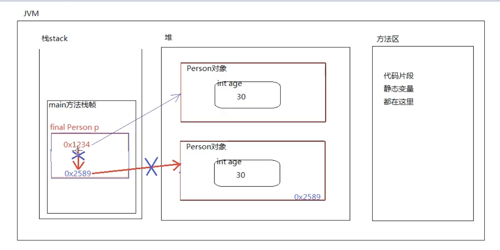

# 4.  
final  
/*  
    final  
  
    1、final是java语言中的一个关键字。  
    2、final表示最终的，不可变的。  
    3、final可以修饰变量以及方法，还有类等。  
    4、final修饰的变量？  
       final修饰的局部变量，一旦赋值不能重新赋值。  
       final修饰的变量，只能赋  
    5、final修饰的方法？  
       final修饰的方法,无法被覆盖，无法被重写  
    6、final修饰的类？  
       final修饰的类无法继承。  
    7.final控制不了能不能调用的问题,  
    final修饰的表示最后的，不能变的，不能改的final 关键字控制的是变更的能力，而不是能否调用。  
    你依然可以调用一个 final 方法或实例，但你不能改变其行为（通过继承或者修改值）。  
*/  
  
public class FinalTest01 {  
    public static void main(String[] args) {  
        //局部变量  
        int i =100;  
        i =200;  
  
        final int k =100;  
       // k =300;  
        final int m;  
        m = 200;  
    }  
}  
  
final class A {   // A没有子孙  
}  
  
// B类继承A类，相当于对A类的功能进行扩展。  
// 如果你不希望别人对A类型进行扩展。  
// 你可以给A类加final关键字，这样的话A类就无法继承了。  
// 错误：无法从最终A进行继承  
  
//class B extends A {  
//}  
  
  
// 错误：无法从最终String进行继承  
/*  
class MyString extends String {  
}  
*/  
  
  
class C{  
    public final void doSome(){  
  
    }  
    public void doOther(){  
        System.*out*.println(" C doOther()");  
    }  
}  
  
  
  
class D extends C{  
 /*   public void doSome(){  
  
    }*/  
    public void doOther(){  
        System.*out*.println(" D doOther()");  
    }  
    public static void main(String[] args) {  
        C c = new D();  
        //解释下。∂∂  
        c.doOther();  
  
        //调用子类中特有的方法时，需要向下转型  
        if(c instanceof D){  
            D d1 = (D)c;  
            d1.doOther();  
        }  
  
    }  
}  
  
  
  
  
  
/*  
final修饰的变量，如果这个变量是一个引用“会怎样？？？  
《重点》final修饰的变量只能赋一次值（万变不离其宗）  
引用”是不是一个变量呢？？？ 是。  
  
final修饰的引用：  
该引用只能指向1个对象，并且它只能永远指向该对象，无法再指向其它对象。  
并且在该方法执行过程中，该引用指向该对象之后，该对象不会被垃圾回收器回收。  
*/  
public class FinalTest02 {  
  
    public static void main(String[] args) {  
        Person p1 = new Person(20);  
        System.out.println(p1.age);  
  
        // ------------------------------------------------------------  
        // 代码不管怎么变化，p也是一个变量。（只不过这里它有一个特殊的名字：引用）  
        final Person p = new Person(30);  
  
        // 错误：无法为最终变量p分配值  
        // p = new Person(30);  
  
        // 可以给p一个null吗？  
        // 错误：无法为最终变量p分配值  
        // p = null;  
  
        /*  
        final int i = 10;  
        // 不允许的  
        i = 20;  
        */  
    }  
}  
  
  
  
  
  
  
/*  
final修饰的实例变量呢？  
《重点：万变不离其宗》：final修饰的变量只能赋值一次。（这句话到哪里都好使。）  
  
你是否还记得：实例变量如果没有手动赋值的话，系统会赋默认值。  
  
java程序设计：不背锅！！！！ 用锅用的很好！！！！  
  
实例变量在什么时候赋值（初始化）？  
构造方法执行的过程中赋值。（new的时候赋值）  
  
终极结论：  
final修饰的实例变量，系统不负责赋默认值，要求程序员必须手动赋值。  
这个手动赋值，在变量后面赋值可以，在构造方法中赋值也可以。  
**手动赋值有哪两种合法方式？（记住）**  
**✅ 方式一：声明时赋值**  
  
final double height = 1.8;  
**✅ 方式二：构造方法中赋值**  
  
final double weight;  
  
public User(){  
    this.weight = 80;  
}  
❌ **除此以外的任何地方赋值，都是非法的**  
  
*/  
  
public class FinalTest03{  
    public static void main(String[] args){  
    }  
}  
  
class User{  
  
    // 实例变量  
    // 编译器报错  
    // final int age;  
  
    // 实例变量  
    // 可以，因为程序员手动赋值了。  
    final double height = 1.8;  
}  
  
```
  // 以下这一堆代码全部联合起来，weight变量也是赋值了1次。
    // 实例变量
    final double weight;

    // 构造方法
    public User(){
        System.out.println("Hello World!");
        this.weight = 80; // 只要我赶在系统赋默认值之前赋值就行。
        // this.weight = 81; // 这个可以吗？不行。
    }
}

```
  
final常量  
/*  
上一个例子的结论：  
    final修饰的实例变量，必须手动赋值。  
    《重点》final修饰的变量，只能赋一次值。  
  
final修饰的实例变量一般添加static修饰。  
  
终极结论：  
    static final联合修饰的变量称为“常量”。  
    常量名建议全部大写，每个单词之间采用下划线衔接。  
  
常量：实际上常量和静态变量一样，区别在于：  
    常量的值不能变。  
  
常量和静态变量，都是存储在方法区，并且都是在类加载时初始化。  
*/  
  
public class FinalTest04{  
    public static void main(String[] args){  
        System.out.println(Chinese.COUNTRY);  
        // 错误：无法为最终变量COUNTRY分配值  
        // Chinese.COUNTRY = "美国"; // 常量是无法重新赋值的。  
    }  
}  
  
class Chinese{  
    // 身份证号，每个人都不一样，对象级别的  
    String idCard;  
  
    // 姓名，对象不同姓名不一样。  
    String name;  
  
    // 国家的值是一个固定值："中国"  
    // 实例变量在堆中，一个对象一份。100个对象100份。  
    // 实例变量虽然使用final修饰了，说明该实例变量值不会随着对象的变化而变化。  
    // 该实例变量前面应该添加：static关键字，变为静态的，存储在方法区。  
    // static final String country = "中国";  
  
    public static final String COUNTRY = "中国";  
  
    // i永远都是10，创建100个对象，i也是10。  
    // i是10是永远不会发生改变的，既然这样，没必要声明为实例变量，最好是静态的，节省内存。  
    static final int i = 10;  
}  
  
class MyMath{  
    // 数学中的π是永远不会变的。  
    public static final double PI = 3.1415926;  
}  
```
1、final关键字
    1.1、final修饰的类无法继承。
    1.2、final修饰的方法无法覆盖。
    1.3、final修饰的变量只能赋一次值。
    1.4、final修饰的引用，一旦指向某个对象，则不能再重新指向其它对象，
         但该引用指向的对象内部的数据是可以修改的。
    1.5、final修饰的实例变量必须手动初始化，不能采用系统默认值。
    1.6、final修饰的实例变量一般和static联合使用，称为常量。
         public static final double PI = 3.1415926;

```
  
  
抽象类  
/*	1	[GB-33045](https://product-jira.ariba.com/browse/GB-33045). Total cost incorrectly calculated for inventory reservations in Guided Buying  
  
	  
	类到对象是实例化。对象到类是抽象。  
  
	抽象类：  
		1、什么是抽象类？  
			类和类之间具有共同特征，将这些共同特征提取出来，形成的就是抽象类。  
			类本身是不存在的，所以抽象类无法创建对象《无法实例化》。  
  
		2、抽象类属于什么类型？  
			抽象类也属于引用数据类型。  
  
		3、抽象类怎么定义？《能把基础语法先学会》  
			语法：  
				[修饰符列表] abstract class 类名{  
					类体;  
				}  
		  
		4、抽象类是无法实例化的，无法创建对象的，所以抽象类是用来被子类继承的。  
  
		5、final和abstract不能联合使用，这两个关键字是对立的。  
  
		6、抽象类的子类可以是抽象类。也可以是非抽象类。  
  
		7、抽象类虽然无法实例化，但是抽象类有构造方法，这个构造方法是供子类使用的。  
  
		8、抽象类关联到一个概念：抽象方法。什么是抽象方法呢？  
			抽象方法表示没有实现的方法，没有方法体的方法。例如：  
				public abstract void doSome();  
				抽象方法特点是：  
					特点1：没有方法体，以分号结尾。  
					特点2：前面修饰符列表中有abstract关键字。  
		  
		9、抽象类中不一定有抽象方法，抽象方法必须出现在抽象类中。 如果有抽象方法，这个类必须是抽象类  
*/  
public class AbstractTest01{   
	public static void main(String[] args){  
		// 错误: Account是抽象的; 无法实例化  
		//Account act = new Account();  
	}  
}  
  
// 银行账户类  
//错误: 非法的修饰符组合: abstract和final  
/*  
final abstract class Account{  
  
}  
*/  
  
abstract class Account{  
	/*  
	public Account(){  
	  
	}  
      //**父类一旦定义了有参构造方法，就不会再有默认无参构造。但父类没有无参构造，子类的**super()** 无法匹配，编译直接报错。**  
	public Account(String s){  
	  
	}  
	*/  
	// 非抽象方法  
	public void doOther(){  
	  
	}  
  
	// 抽象方法  
	public abstract void withdraw();  
}  
  
// 子类继承抽象类，子类可以实例化对象  
/*  
class CreditAccount extends Account{  
	public CreditAccount(){  
**//父类一旦定义了有参构造方法，就不会再有默认无参构造。**  
//子类若未显式写构造方法，编译器会自动生成无参构造并隐式调用 super()；  
**//但父类没有无参构造，**super()** 无法匹配，编译直接报错。**  
		super();  
	}  
}  
*/  
  
// 抽象类的子类可以是抽象类吗？可以  
/*  
abstract class CreditAccount extends Account{  
  
}  
*/  
  
1)  
> **父类只有有参构造 ⇒ 没有默认无参构造。**
**子类不写构造 ⇒ 编译器自动生成无参构造并调用 **super()**。**
**父类没有 **Account()** ⇒ **super()** 找不到 ⇒ 编译报错。**  
> 
> **例子：**  
>   
> abstract class Account {  
> 
>     public Account(String s) {  
> 
>     }  
> 
> }  
>   
> class CreditAccount extends Account {  
> 
>     // 编译器等价生成：  
> 
>     // public CreditAccount() {  
> 
>     //     super(); // ❌ Account() 不存在  
> 
>     // }  
> 
> }  
> 
> **结论一句话：**  
> 
> **子类默认调 **super()**，父类没无参构造就会编译失败。**  
  
  
例子  
  
/*  
	抽象类：  
  
		1、抽象类中不一定有抽象方法，抽象方法必须出现在抽象类中。  
  
		2、重要结论：重要结论五颗星*****（必须记住）  
			一个非抽象的类继承抽象类，必须将抽象类中的抽象方法实现了。  
			这是java语法上强行规定的，必须的，不然编译器就报错了。  
  
			这里的覆盖或者说重写，也可以叫做实现。（对抽象的实现。）  
  
*/  
public class AbstractTest01 {  
    public static void main(String[] args) {  
        AnimalTest a = new BirdTest();// 向上转型。（自动类型转换）  
        // 这就是面向抽象编程。  
        // 以后你都是调用的a.XXXX  
        // a的类型是Animal，Animal是抽象的  
        // 面向抽象编程，不要面向具体编程，降低程序的耦合度，提高程序的扩展力。  
        // 这种编程思想符合OCP原则。  
        /*  
			分析以下：  
				编译的时候这个move()方法是谁的？  
				运行的时候这个move()方法又是谁的？  
		*/  
       /*  
         父 p = new 子();  
        // ←左    →右  
        🔧 方法: 编译看左边，运行看右边  
        📦 变量: 编译看左边，运行也看左边   
        */  
        a.move(); //鸟儿会飞  
        System.*out*.println(a.name);//animal  
    }  
}  
  
  
abstract class AnimalTest {  
    public String name= "animal";  
    abstract void move();  
}  
  
//子类（非抽象）  
  
class BirdTest extends AnimalTest{  
    public String name= "bird";  
    // 需要将从父类中继承过来的抽象方法进行覆盖/重写，或者也可以叫做“实现”。  
    // 把抽象的方法实现了。  
    public void move(){  
        System.*out*.println("鸟儿在飞翔！");  
    }  
}  
  
  
// 如果Bird是抽象类的话，那么这个Animal中继承过来的抽象方法也可以不去重写/覆盖/实现。  
/*  
abstract class Bird extends Animal{  
}  
*/  
  
  
抽象类  
		第一：抽象类怎么定义？在class前添加abstract关键字就行了。  
		第二：抽象类是无法实例化的，无法创建对象的，所以抽象类是用来被子类继承的。  
		第三：final和abstract不能联合使用，这两个关键字是对立的。  
		第四：抽象类的子类可以是抽象类。也可以是非抽象类。  
		第五：抽象类虽然无法实例化，但是抽象类有构造方法，这个构造方法是供子类使用的。  
		第六：抽象类中不一定有抽象方法，抽象方法必须出现在抽象类中。  
		第七：抽象方法怎么定义？  
			public abstract void doSome();  
		第八（*****五颗星）：一个非抽象的类，继承抽象类，必须将抽象类中的抽象方法进行覆盖/重写/实现。  
  
abstract class Animal {  
    String name;              // ✅ 可以有普通属性  
      
    public Animal() {}        // ✅ 可以有构造方法  
      
    public void eat() {}      // ✅ 可以有普通方法  
      
    abstract void move();     // ✅ 可以有抽象方法（没有方法体）  
}  
  

| 规则        | 说明              | 口诀         |
| --------- | --------------- | ---------- |
| 1️⃣ 不能new   | new Animal() ❌  | 抽象不能实例化    |
| 2️⃣ 子类必实现   | 非抽象子类必须重写所有抽象方法 | 不实现=编译错    |
| 3️⃣ 可以没抽象方法 | 抽象类可以0个抽象方法     | 但抽象方法必在抽象类 |
| 4️⃣ 有构造方法   | 给子类调用super()    | 自己不能new    |
| 5️⃣ 可以有普通方法 | 和普通类一样          | 什么都能有      |
| 6️⃣ 单继承     | extends只能一个     | 和普通类一样     |
  
  
接口  
接口的基础语法。  
		1、接口是一种“引用数据类型”。  
		2、接口是完全抽象的。  
		3、接口怎么定义：[修饰符列表] interface 接口名{}  
		4、接口支持多继承。  
		5、接口中只有常量+抽象方法。  
		6、接口中所有的元素都是public修饰的  
		7、接口中抽象方法的public abstract可以省略。  
		8、接口中常量的public static final可以省略。  
		9、接口中方法不能有方法体。  
```
/*
	接口：
		1、接口也是一种“引用数据类型”。编译之后也是一个class字节码文件。
		2、接口是完全抽象的。（抽象类是半抽象。）或者也可以说接口是特殊的抽象类。
		3、接口怎么定义，语法是什么？
			[修饰符列表] interface 接口名{}
		4、接口支持多继承，一个接口可以继承多个接口。
		     类型	            继承/实现	          是否多继承
        接口 继承 接口	 interface A extends B, C	  支持多继承
        类 实现 接口	     class A implements B, C	  支持多实现
        类 继承 抽象类	 class A extends B	          只能单继承
        抽象类 继承 抽象类	 abstract class A extends B	  只能单继承
        interface B extends I1, I2 {}
        → 只合并规范，不写代码（制定者）
        class A implements I1, I2 {}
        → 必须写所有代码（执行者）
		5、接口中只包含两部分内容，一部分是：常量。一部分是：抽象方法。接口中没有其它内容了。只有以上两部分。
		6、接口中所有的元素都是public修饰的。（都是公开的。）
		7、接口中的抽象方法定义时：public abstract修饰符可以省略。
		8、接口中的方法都是抽象方法，所以接口中的方法不能有方法体。
		9、接口中的常量的public static final可以省略。
*/
public class InterfaceTest01 {
}


// 定义接口
interface A{

}

// 接口支持继承
interface B extends A{

}

// 一个接口可以继承多个接口（支持多继承）
interface C extends A, B{
}


// 我的数学接口
interface MyMath{

    // 常量
    //public static final double PI = 3.1415926;

    // public static final可以省略
    double PI = 3.1415926;

    // k是不是常量？？？？是。
    // 接口中随便写一个变量就是常量。
    // 常量：值不能发生改变的变量。
    int k = 100;

    // 抽象方法
    //public abstract int sum(int a, int b);

    // 接口当中既然都是抽象方法，那么在编写代码的时候，public abstract可以省略
    int sum(int a, int b);

    // 接口中的方法可以有方法体吗？
    // 错误: 接口抽象方法不能带有主体
	/*
	void doSome(){

	}
	*/

    // 相减的抽象方法
    int sub(int a, int b);

}

```
  
需要说明：  
/*  
知识点总结：  
1. 接口是引用数据类型  
2. JDK 7接口完全抽象，JDK 8+可有default/static方法(有方法体)  
3. 定义格式：[修饰符] interface 接口名 {}  
4. 接口支持多继承(extends)，类支持多实现(implements)  
5. JDK 7：只有常量+抽象方法；JDK 8+：可有default/static方法  
6. 所有成员默认public  
7. 抽象方法的public abstract可省略  
8. 常量的public static final可省略  
9. JDK 7抽象方法无方法体；JDK 8+ default/static有方法体  
10. 接口不能实例化，无构造方法  
*/  
interface Ani { void eat(String food); }  
interface Living { boolean isAlive(); }  
  
interface Flyable extends Ani, Living {  // 多继承  
  
    int *MAX *= 1000;                    // 常量(public static final)  
  
    void fly(int height);              // 抽象方法(public abstract)  
  
    default void rest(int min) {       // 默认方法(JDK 8+)  
        log("休息", min + "分钟");  
        System.*out*.println("休息" + min + "分钟");  
    }  
  
    static void check(String city) {   // 静态方法(JDK 8+)  
        System.*out*.println("检查" + city + "天气");  
    }  
  
    private void log(String a, String b) {  // 私有方法(JDK 9+)  
        System.*out*.println("[LOG] " + a + ": " + b);  
    }  
}  
  
interface Swimmable { void swim(); }  
  
// 实现类(多实现)  
class BirdFly implements Flyable, Swimmable {  
    public void fly(int height) { System.*out*.println("飞" + height + "米"); }  
    public void eat(String food) { System.*out*.println("吃" + food); }  
    public boolean isAlive() { return true; }  
    public void swim() { System.*out*.println("游泳"); }  
}  
  
// 使用  
class Test {  
    public static void main(String[] args) {  
        BirdFly b = new BirdFly();  
        b.fly(500);              // 抽象方法  
        b.rest(10);              // 默认方法  
        Flyable.*check*("北京");    // 静态方法(接口名调用)  
        System.*out*.println(Flyable.*MAX*);  // 常量  
  
        Flyable f = new BirdFly();  // 多态 ✅  
        // new Flyable();        // 不能实例化 ❌  
    }  
}  
  
  
  
例子  
```
/*
*  接口的基础语法：
*  1. 类和类之间叫做继承，类和接口之间叫做实现。
*     继承使用extends关键字完成。
*     实现使用implements关键字完成.
* 2.当一个非抽象的类实现接口的话，必须将接口中所有的抽象方法全部实现（覆盖，重写）
*
* */
//特殊的抽象类，完全抽象的,叫做接口
interface MyMathTest {
    double PI = 3.14;
    int sum(int a, int b);
    int sub(int a, int b);

}

//这样写可以吗？为什么？

abstract class MyMathImpl implements MyMathTest {
}

class MyMathImpl1 implements MyMathTest {
    @Override
    public int sum(int a, int b) {
        return a + b;
    }
    @Override
    public int sub(int a, int b) {
        return a - b;
    }
}


 class InterfaceTest03 {
    public static void main(String[] args) {
        MyMathImpl1 m = new MyMathImpl1();
        System.out.println(m.PI);
        System.out.println(m.sum(10, 20));
        System.out.println(m.sub(10, 20));
    }

}


```

| 特性    | 抽象类            | 接口（JDK7）        | 接口（JDK8+）       |
| ----- | -------------- | --------------- | --------------- |
| 关键字   | abstract class | interface       | interface       |
| 继承/实现 | extends（单继承）   | implements（多实现） | implements（多实现） |
| 构造方法  | ✅ 有            | ❌ 没有            | ❌ 没有            |
| 成员变量  | ✅ 任意访问修饰符      | ❌ 只能是常量         | ❌ 只能是常量         |
| 抽象方法  | ✅ 可以有          | ✅ 只能有抽象方法       | ✅ 可以有           |
| 普通方法  | ✅ 可以有          | ❌ 不能有           | ✅ 可以有默认方法       |
| 静态方法  | ✅ 可以有          | ❌ 不能有           | ✅ 可以有           |
| 设计理念  | 提取公共代码         | 定义行为规范          | 定义行为规范          |
  
例子  
```
package interfacepkg;


// ① 定义Animal抽象类
abstract class Animal {
    String name;
    int age;
    
    public Animal(String name, int age) {
        this.name = name;
        this.age = age;
    }
    
    // display()方法有具体实现，显示动物基本信息
    void display() {
        System.out.println("Animal: " + name + ", age: " + age);
    }
    
    // eat()方法定义为抽象方法，由子类实现
    public abstract void eat();
}

// ② 定义FlyableInterface接口
interface FlyableInterface {
    void fly();
}

// ③ 定义Speakable接口
interface Speakable {
    void speak();
}

// ④ 实现各个动物类
class XiaoYanZi extends Animal implements FlyableInterface {
    public XiaoYanZi(String name, int age) {
        super(name, age);
    }
    
    @Override
    public void eat() {
        System.out.println(name + " 吃虫子");
    }
    
    @Override
    public void fly() {
        System.out.println(name + " 会飞，正在飞翔...");
    }
}

class Dog extends Animal {
    public Dog(String name, int age) {
        super(name, age);
    }
    
    @Override
    public void eat() {
        System.out.println(name + " 吃骨头");
    }
    
    // Dog不会飞，所以不实现FlyableInterface
}

class YingWu extends Animal implements FlyableInterface, Speakable {
    public YingWu(String name, int age) {
        super(name, age);
    }
    
    @Override
    public void eat() {
        System.out.println(name + " 吃谷物");
    }
    
    @Override
    public void fly() {
        System.out.println(name + " 会飞，正在展翅高飞...");
    }
    
    @Override
    public void speak() {
        System.out.println(name + " 会说话，正在学人说话...");
    }
}

// ⑤ 测试程序
public class InterfaceAnimalTest {
    public static void main(String[] args) {
        System.out.println("=== 动物行为测试程序 ===");
        
        // 创建动物对象
        Animal xiaoYanZi = new XiaoYanZi("小燕子", 1);
        Animal dog = new Dog("旺财", 2);
        Animal yingWu = new YingWu("鹦鹉", 3);
        
        // 调用display()方法
        System.out.println("\n--- 调用display()方法 ---");
        xiaoYanZi.display();
        dog.display();
        yingWu.display();
        
        // 调用eat()方法
        System.out.println("\n--- 调用eat()方法 ---");
        xiaoYanZi.eat();
        dog.eat();
        yingWu.eat();
        
        // 能飞的动物调用fly()方法
        System.out.println("\n--- 能飞的动物调用fly()方法 ---");
        if (xiaoYanZi instanceof FlyableInterface) {
            //向下转型，类可以转换成接口
            //类和接口之间不需要有继承关系，编译器也不会报错

            FlyableInterface f =  (FlyableInterface) xiaoYanZi;
            f.fly();
        }
        if (yingWu instanceof FlyableInterface) {
            ((FlyableInterface) yingWu).fly();
        }
        
        // 会说话的动物调用speak()方法
        System.out.println("\n--- 会说话的动物调用speak()方法 ---");
        if (yingWu instanceof Speakable) {
            ((Speakable) yingWu).speak();
        }
        
        // 演示多态性
        System.out.println("\n=== 多态性演示 ===");
        Animal[] animals = {xiaoYanZi, dog, yingWu};
        for (Animal animal : animals) {
            animal.display();
            animal.eat();
            
            // 使用instanceof检查类型并调用特定方法
            if (animal instanceof FlyableInterface) {
                ((FlyableInterface) animal).fly();
            }
            if (animal instanceof Speakable) {
                ((Speakable) animal).speak();
            }
            System.out.println("---");
        }
    }
}


/*
向下转型
一、核心口诀
    编译时看左边（引用类型）
    运行时看右边（实际对象）
    转型成功看右边！
二、一句话理解
    Animal animal = new Bird();
    //  ↑编译看     ↑运行看
    转型时检查的是：右边的 Bird，不是左边的 Animal！

三、转型规则
    ✅ 规则：看实际对象能不能转
    Animal animal = new Bird();
    // ✅ 问：Bird 是子类吗？
    Bird bird = (Bird) animal;  // 是！可以转！
    // ✅ 问：Bird 实现了 Flyable 吗？
    Flyable flyable = (Flyable) animal;  // 实现了！可以转！
四、图解
    编译时：
    Animal animal = new Bird();
      ↑
    编译器只看这个类型
    允许转换（不确定，所以放行）

    运行时：
    Animal animal = new Bird();
                        ↑
                    转型时检查这个
                    实际对象是 Bird
                    Bird 实现了 Flyable
                             ✅ 转型成功！
五、三步理解法
第1步：看等号右边（实际对象）
    Animal animal = new Bird();
    //                  ↑
    //              这才是真正的对象
第2步：判断转型目标
    // 问1：Bird 是 Bird 吗？
    Bird bird = (Bird) animal;  // ✅ 是！
    // 问2：Bird 是 Flyable 吗？
    Flyable flyable = (Flyable) animal;  // ✅ 实现了！
第3步：记住核心
    转型检查的永远是：
    实际对象（右边的 new Bird()）
    不是引用类型（左边的 Animal）

总结：
Animal animal = new Bird();
编译时：看左边（Animal）
        - 编译器：Animal 可能转为 Flyable 吗？
        - 答：可能！因为子类可能实现接口
- ✅ 编译通过

运行时：看右边（Bird）
        - JVM：实际对象 Bird 实现了 Flyable 吗？
        - 答：实现了！
        - ✅ 转型成功

关键：转型检查的是右边的实际对象！
*/


```
  
