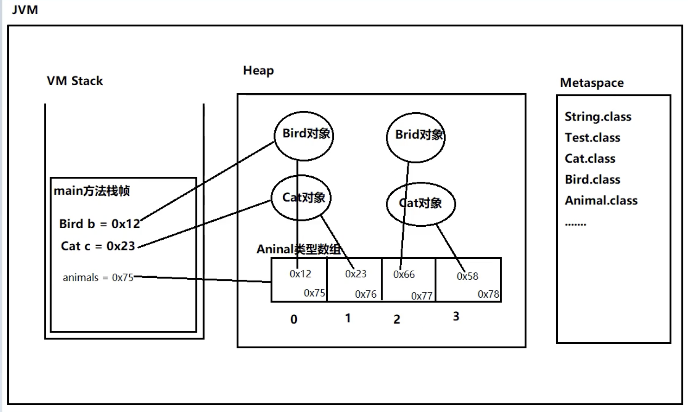

**5.**  
**核心对比**  
  

| 类型   | ==    | equals()  |
| ---- | ----- | --------- |
| 本质   | 运算符   | 方法        |
| 基本类型 | ✅ 比较值 | ❌ 不能用     |
| 引用类型 | 比较地址  | 比较内容（需重写） |
  
  
**一、基本规则**  
## == 运算符  
* 基本类型：比较值是否相等  
* 引用类型：比较地址（是否同一对象）  
## equals() 方法  
* 只能用于对象  
* 重写了：比较内容  
* 未重写：等同于 ==，比较地址  
  
**二、数据类型分类**  
  
  
```
基本类型（8种）     → 只能用 ==
├─ 数值型：byte, short, int, long, float, double
├─ 字符型：char
└─ 布尔型：boolean

引用类型（对象）     → 推荐用 equals()
├─ String          → 已重写，比较内容
├─ 包装类          → 已重写，比较值
├─ 数组            → 用 Arrays.equals()
├─ 枚举            → 推荐用 ==
└─ 自定义类        → 需手动重写


```
  
  
**三、使用场景**  

| 场景        | 用法               | 示例                      |
| --------- | ---------------- | ----------------------- |
| 基本类型      | ==               | int a = 1; a == 1       |
| String 内容 | equals()         | str1.equals(str2)       |
| 包装类值      | equals()         | i1.equals(i2)           |
| 判断 null   | ==               | obj == null             |
| 枚举        | ==               | status == Status.ACTIVE |
| 同一对象      | ==               | obj1 == obj2            |
| 可能 null   | Objects.equals() | Objects.equals(a, b)    |
  
  
  
**四、常见陷阱**  
**⚠️ String 比较**  
##   
##   
```
String s1 = new String("hello");
String s2 = new String("hello");
s1 == s2        // false - 不同对象
s1.equals(s2)   // true  - 内容相同 ✅

```
##   
##   
**⚠️ Integer 缓存**  
##   
##   
```
Integer a = 100, b = 100;  // true  (-128~127缓存)
Integer c = 200, d = 200;  // false (超出缓存)
// 统一用 equals()

```
##   
**⚠️ 自定义类**  
##   
##   
```
// 不重写 equals()
Person p1 = new Person("张三", 20);
Person p2 = new Person("张三", 20);
p1.equals(p2)   // false - 比较地址

// 重写后
p1.equals(p2)   // true - 比较内容 ✅

```
  
**五、equals() 重写模板**  
  
  
  
```
@Override
public boolean equals(Object obj) {
    if (this == obj) return true;
    if (obj == null || getClass() != obj.getClass()) return false;
    Person p = (Person) obj;
    return age == p.age && Objects.equals(name, p.name);
}

@Override
public int hashCode() {
    return Objects.hash(name, age);
}

```
  
重要：重写 equals() 必须重写 hashCode()  
  
**六、记忆口诀**  
  
  
```
基本类型 ==，引用 equals
== 比地址，equals 比内容
String 必须 equals
包装类也用 equals
自定义类要重写
判断 null 用 ==

```
  
  
  
**七、面试标准答案**  
Q: ****==**** 和 ****equals()**** 的区别？  
  
```
1. == 是运算符，equals() 是方法

2. 基本类型只能用 ==，比较值

3. 引用类型：
   - == 比较地址（是否同一对象）
   - equals() 比较内容（需类重写）

4. String、Integer 等已重写 equals()
   自定义类不重写则 equals() 等同于 ==

5. 重写 equals() 必须重写 hashCode()

```
  
  
  
**八、快速查表**  
  
  
```
比较值     → ==
比较内容   → equals()
比较地址   → ==
判断 null  → ==
String     → equals()
Integer    → equals()
枚举       → ==
自定义类   → equals()（需重写）

```
  
**✅ 一句话总结**  
== 比地址，equals() 比内容；基本类型用 ==，对象比较用 equals()；重写 equals() 必须重写 hashCode()  
  
  
  
内部类  
1.静态内部类  
```
package innerClassTest;

/**
 *  静态内部类：可以吧静态内部类当作静态变量来看
 *  在静态内部类中，不能访问外部类的实例变量和实例方法。
 */

public class OuterClass {
    //静态变量
    private static int i = 100;
    //实例变量
    private int j = 200;
    //静态方法
    public static void m1(){
        System.out.println("外部类的m1静态方法执行了");
    }
    public void m2(){
        System.out.println("外部类的m2实例方法执行了");
    }
      /* 对于静态内部类，访问控制权限修饰符在这里都可以使用
        静态内部类能访问什么？
       访问外部类的静态变量和外部类的静态方法
       不能直接访问外部类的实例变量和实例方法，必须先 new 外部类对象()，再通过对象访问
       */
    static class InnerClass{
         public void m3(){
             System.out.println(i);     // ✅ 能访问外部类静态变量
             OuterClass.m1();             // ✅ 能访问外部类静态方法

             // System.out.println(j);  // ❌ 不能访问实例变量
             // m2();                   // ❌ 不能访问实例方法
         }

         public static void m4(){
             System.out.println(i);     // ✅ 能访问外部类静态变量
             OuterClass.m1();             // ✅ 能访问外部类静态方法

             // ⚠️ 如果非要访问实例成员，必须先创建外部类对象
             OuterClass outer = new OuterClass();
             System.out.println(outer.j);  // ✅ 通过对象访问
             outer.m2();                   // ✅ 通过对象访问
         }
    }

    public static void main(String[] args) {
       OuterClass.InnerClass innerClass = new OuterClass.InnerClass();
       innerClass.m3();
       OuterClass.InnerClass.m4();

       InnerClass innerClass2 = new InnerClass();
       innerClass2.m3();
       innerClass.m4();

    }
}

```
  
package innerClassTest;  
  
*/***  
* * 测试类：演示静态内部类的使用*  
* */*  
public class OuterClassTest {  
*/***  
* *  静态内部类：可以吧静态内部类当作静态变量来看*  
* *  在静态内部类中，不能访问外部类的实例变量和实例方法。*  
* */*  
*    *public static void main(String[] args) {  
        // 创建静态内部类实例  
        OuterClass.InnerClass innerClass = new OuterClass.InnerClass();  
          
        // 调用方法  
        innerClass.m3();  
        OuterClass.InnerClass.*m4*();  
    }  
}  
  
  
  
2.实例内部类  
package InstanceInnerClassTest;  
/*  
* 实例内部类，等同可以看作实例变量  
* 可以直接访问外部类的实例变量和实例方法  
* */  
public class OuterClass {  
    private int i = 100;  
    private static int *j *= 200;  
    public void m1(){  
        System.*out*.println("外部类的实例方法m1执行了");  
  
    }  
    public static void m2(){  
        System.*out*.println("外部类的静态方法m2执行了");  
    }  
  
    //实例内部类  
    public class InnerClass{  
        public void x(){  
//            System.out.println(i);  
//            System.out.println(j);  
//            m1();  
//            m2();  
            System.*out*.println(OuterClass.this.i);   // 显式访问外部类实例变量  
            System.*out*.println(OuterClass.*j*);        // 显式访问外部类静态变量  
            OuterClass.this.m1();                    // 显式调用外部类实例方法  
            OuterClass.*m2*();                         // 显式调用外部类静态方法  
  
  
        }  
    }  
}  
  
  
  
package InstanceInnerClassTest;  
  
public class OutClassTest {  
    public static void main(String[] args) {  
        OuterClass outerClass = new OuterClass();  
        OuterClass.InnerClass innerClass = outerClass.new InnerClass();  
        innerClass.x();  
    }  
  
}  
  
*3.局部内部类*  
  
package localInnerClassTest;  
/*  
* 局部内部类，等同于局部变量  
* 局部内部类能不能访问外部类的实例变量和方法，取决于局部内部类所在的方法  
*  如果这个方法是静态的：只能访问外部类中静态的  
*  如果这个方式是实例的，可以都访问  
*  
* 局部内部类不能使用访问权限修饰符修饰。  
*  
* 局部内部类在访问外部的局部变量时，这个局部变量必须时final的  
* 只不过从JDK8开始，这个fginal关键字可以省略，  
* */  
  
*/***  
* * 🎯 局部内部类（Local Inner Class）核心知识点：*  
* **  
* * *1️⃣ *定义：在【方法内部】或【代码块内部】定义的类*  
* * *2️⃣ *作用域：只在定义它的方法/代码块内有效*  
* * *3️⃣ *访问规则：*  
* *    - 访问外部类成员：取决于所在方法是静态还是实例*  
* *    - 访问局部变量：必须是 final 或 effectively final*  
* * *4️⃣ *修饰符：不能使用访问权限修饰符（public/private/protected）*  
* */*  
public class OuterClass {  
  
    // ========== 外部类的成员 ==========  
  
    // 📌 静态变量（类变量）  
    private static int *k *= 1;  
  
    // 📌 实例变量（对象变量）  
    private int f = 2;  
  
  
    // ========== 情况1：实例方法中的局部内部类 ==========  
  
    */***  
*     * 📍 实例方法 m1()*  
*     **  
*     * 在实例方法中的局部内部类：*  
*     * ✅ 可以访问外部类的【所有成员】（静态 + 实例）*  
*     * ✅ 可以访问方法的局部变量（但必须是 final 或 effectively final）*  
*     */*  
*    *public void m1() {  
  
        // 📌 局部变量（方法内的变量）  
        int i = 100;  // ← 这个变量是 effectively final 的  
  
        */***  
*         * 💡 什么是 effectively final？*  
*         **  
*         * - JDK 8 之前：必须显式写 final int i = 100;*  
*         * - JDK 8 之后：如果变量赋值后不再改变，自动视为 final*  
*         **  
*         * ✅ effectively final（有效的 final）:*  
*         *    int i = 100;          // 赋值后不再改变*  
*         **  
*         * ❌ 不是 effectively final:*  
*         *    int i = 100;*  
*         *    i = 200;              // 改变了值，不再是 effectively final*  
*         */*  
  
  
*        *// ========== 局部内部类定义 ==========  
  
        */***  
*         * 🔹 InnerClass - 局部内部类*  
*         **  
*         * 特点：*  
*         * 1. 定义在方法内部*  
*         * 2. 只在 m1() 方法内可见*  
*         * 3. 不能使用 public/private/protected/static 修饰*  
*         * 4. 可以访问外部类的所有成员（因为 m1 是实例方法）*  
*         * 5. 可以访问方法的 effectively final 局部变量*  
*         */*  
*        *class InnerClass {  // ← 注意：没有访问修饰符！  
  
            public void x() {  
  
                // ✅ 可以访问外部类的静态变量  
                System.*out*.println("访问静态变量 k = " + *k*);  
  
                // ✅ 可以访问外部类的实例变量  
                // 原因：m1() 是实例方法，持有外部类对象的引用  
                System.*out*.println("访问实例变量 f = " + f);  
  
                // ✅ 可以访问方法的局部变量  
                // 前提：局部变量必须是 final 或 effectively final  
                System.*out*.println("访问局部变量 i = " + i);  
            }  
        }  
  
        // 使用局部变量  
        System.*out*.println("m1() 方法中的局部变量 i = " + i);  
  
        // 创建局部内部类对象（只能在这个方法内创建）  
        InnerClass innerClass = new InnerClass();  
        innerClass.x();  
  
        // 📌 注意：如果修改 i 的值，会导致编译错误  
        // i = 200;  // ❌ 如果取消注释，上面的 System.out.println(i) 会报错  
        //            // 因为 i 不再是 effectively final  
  
    }  // ← m1() 方法结束，InnerClass 在这之后不可见  
  
  
    // ========== 情况2：静态方法中的局部内部类 ==========  
  
    */***  
*     * 📍 静态方法 m2()*  
*     **  
*     * 在静态方法中的局部内部类：*  
*     * ✅ 可以访问外部类的【静态成员】*  
*     * ❌ 不能直接访问外部类的【实例成员】*  
*     * ✅ 可以访问方法的局部变量（但必须是 final 或 effectively final）*  
*     */*  
*    *public static void m2() {  
  
        // 📌 局部变量  
        int i = 100;  // effectively final  
  
  
        // ========== 局部内部类定义 ==========  
  
        */***  
*         * 🔹 InnerClass - 静态方法中的局部内部类*  
*         **  
*         * 特点：*  
*         * 1. 定义在静态方法内*  
*         * 2. 只能访问外部类的静态成员*  
*         * 3. 不能访问外部类的实例成员（因为静态方法没有 this）*  
*         */*  
*        *class InnerClass {  
  
            public void x() {  
  
                // ✅ 可以访问外部类的静态变量  
                // 原因：静态成员属于类，不需要对象  
                System.*out*.println("访问静态变量 k = " + *k*);  
  
                // ❌ 不能访问外部类的实例变量  
                // 原因：m2() 是静态方法，没有外部类对象的引用  
                // System.out.println(f);  // 编译错误！  
  
                // ✅ 可以访问局部变量（必须是 effectively final）  
                System.*out*.println("访问局部变量 i = " + i);  
  
  
                // ========== 解决方案 ==========  
                // 如果真的想访问实例成员，必须创建外部类对象：  
                OuterClass outer = new OuterClass();  
                System.*out*.println("通过对象访问实例变量 f = " + outer.f);  
            }  
        }  
  
        // 创建局部内部类对象  
        InnerClass innerClass = new InnerClass();  
        innerClass.x();  
    }  
}  
  
  
package localInnerClassTest;  
  
public class OuterClassTest {  
    public static void main(String[] args) {  
        OuterClass innerClass = new OuterClass();  
        innerClass.m1();  
  
    }  
}  
  
  
  
4.匿名内部类  
  
```
package anonymousInnerTestClass;

public class Test {
    public static void main(String[] args) {

        Computer computer = new Computer();
       // computer.conn(new Printer());
        computer.conn(new Usb() {
            @Override
            public void read() {

            }

            @Override
            public void write() {

            }
        });

    }
}


class Computer {
    public void conn(Usb usb){
        usb.read();
        usb.write();
    }
}

interface Usb{
    void read();
    void write();
}

/*
class Printer implements Usb{
    @Override
    public void read() {
        System.out.println("打印机读数据");
    }

    @Override
    public void write() {
        System.out.println("打印机写数据");
    }
}*/


```
  
  
==数组==  
  
数组（Array）  
├── 1️⃣ 数组的本质  
│   ├─ 引用数据类型  
│   ├─ 容器/集合  
│   └─ 父类是 Object  
│  
├── 2️⃣ 数组的特点  
│   ├─ 长度固定  
│   ├─ 类型统一  
│   ├─ 内存连续  
│   └─ 下标从 0 开始  
│  
├── 3️⃣ 数组的优缺点  
│   ├─ 优点：查询快 O(1)  
│   └─ 缺点：增删慢 O(n)、难以扩容  
│  
└── 4️⃣ 数组的使用  
    ├─ 声明数组  
    ├─ 静态初始化  
    └─ 动态初始化  
```  
  
---  
  
## 1️⃣ **数组的本质**  
  
### **🔹 核心特性表**  
  
| 特性 | 说明 | 示例 |  
|-----|------|------|  
| **数据类型** | 引用数据类型，不是基本类型 | `int[] arr` 是引用类型 |  
| **父类** | 所有数组的父类都是 Object | `arr instanceof Object` → true |  
| **容器性质** | 可以容纳多个元素的集合 | 一个数组可以存 100 个元素 |  
| **存储内容** | 基本类型 或 引用类型 | `int[]`, `String[]`, `Object[]` |  
| **存储位置** | 数组对象在堆内存 | 引用在栈，数组在堆 |  
| **对象存储** | 存储的是对象的引用（地址） | 不直接存储对象本身 |  
  
---  
  
### **🔹 代码演示：数组的本质**  
  
```java  
/**  
 * 数组本质演示  
 */  
public class ArrayNature {  
      
    public static void main(String[] args) {  
          
        // ========== 1. 数组是引用类型 ==========  
          
        int[] arr1 = {1, 2, 3};  
        System.out.println("数组类型: " + arr1.getClass().getName());  
        // 输出: [I (I表示int，[ 表示数组)  
          
        System.out.println("是否是Object的子类: " + (arr1 instanceof Object));  
        // 输出: true  
          
          
        // ========== 2. 数组是容器 ==========  
          
        int[] scores = new int[5];  // 容纳5个成绩  
        scores[0] = 90;  
        scores[1] = 85;  
        scores[2] = 92;  
        // ... 可以存储多个元素  
          
          
        // ========== 3. 数组可以存储基本类型 ==========  
          
        int[] intArr = {1, 2, 3};           // 存储int  
        double[] doubleArr = {1.5, 2.5};    // 存储double  
        boolean[] boolArr = {true, false};  // 存储boolean  
          
          
        // ========== 4. 数组可以存储引用类型（存的是地址）==========  
          
        String[] strArr = new String[3];  
        strArr[0] = new String("Hello");  // 存储的是对象的地址  
        strArr[1] = new String("World");  
          
        /*  
        内存结构：  
          
        栈内存                    堆内存  
        ┌─────────┐              ┌──────────────┐  
        │ strArr ───────────────→│ [0] ────┐    │  
        └─────────┘              │ [1] ────┼─┐  │  
                                 └─────────┼─┼──┘  
                                           │ │  
                                    ┌──────┘ │  
                                    ↓        ↓  
                                 "Hello"  "World"  
                                 (对象)   (对象)  
        */  
          
          
        // ========== 5. 数组在堆中，引用在栈中 ==========  
          
        int[] arr2 = {1, 2, 3};  
        int[] arr3 = arr2;  // 复制引用  
          
        arr3[0] = 999;  
        System.out.println(arr2[0]);  // 999（同一个数组对象）  
          
        /*  
        栈内存                    堆内存  
        ┌─────────┐              ┌──────────────┐  
        │ arr2  ───────┐         │ [0] = 999    │  
        │ arr3  ───────┴────────→│ [1] = 2      │  
        └─────────┘              │ [2] = 3      │  
                                 └──────────────┘  
        */  
    }  
}  
```  
  
---  
  
## 2️⃣ **数组的特点**  
  
### **🔹 特点总结表**  
  
| 特点 | 说明 | 示例/后果 |  
|-----|------|----------|  
| **长度固定** | 创建后不可改变 | `int[5]` 永远只能存 5 个元素 |  
| **类型统一** | 只能存储相同类型 | `int[]` 只能存 int |  
| **内存连续** | 元素在内存中连续排列 | 提高访问效率 |  
| **下标访问** | 从 0 开始，最大 length-1 | `arr[0]`, `arr[length-1]` |  
| **有 length 属性** | 获取数组长度 | `arr.length` |  
| **首元素地址** | 数组对象地址 = 首元素地址 | 内存地址的起点 |  
  
---  
  
### **🔹 代码演示：数组的特点**  
  
```java  
/**  
 * 数组特点演示  
 */  
public class ArrayFeatures {  
      
    public static void main(String[] args) {  
          
        // ========== 1. 长度固定（不可变）==========  
          
        int[] arr = new int[5];  
        System.out.println("数组长度: " + arr.length);  // 5  
          
        // arr.length = 10;  // ❌ 编译错误！length 是 final 的  
          
        // 如果要"扩容"，必须创建新数组  
        int[] newArr = new int[10];  
        System.arraycopy(arr, 0, newArr, 0, arr.length);  
          
          
        // ========== 2. 类型统一 ==========  
          
        int[] intArr = {1, 2, 3};  
        // intArr[0] = "Hello";  // ❌ 编译错误！类型不匹配  
          
        String[] strArr = {"Apple", "Banana", "Orange"};  
        // strArr[0] = 123;  // ❌ 编译错误！类型不匹配  
          
        // 比喻：购物袋只能装苹果，不能混装橘子  
          
          
        // ========== 3. 内存连续 ==========  
          
        int[] arr2 = {10, 20, 30, 40, 50};  
          
        /*  
        内存示意图（假设每个 int 占 4 字节）：  
          
        内存地址        值  
        ┌─────────────┬─────┐  
        │ 0x1000      │ 10  │ ← arr[0]  
        ├─────────────┼─────┤  
        │ 0x1004      │ 20  │ ← arr[1]  (连续，相差 4 字节)  
        ├─────────────┼─────┤  
        │ 0x1008      │ 30  │ ← arr[2]  
        ├─────────────┼─────┤  
        │ 0x100C      │ 40  │ ← arr[3]  
        ├─────────────┼─────┤  
        │ 0x1010      │ 50  │ ← arr[4]  
        └─────────────┴─────┘  
          
        关键：内存地址是连续的！  
        */  
          
          
        // ========== 4. 下标从 0 开始 ==========  
          
        int[] arr3 = {100, 200, 300};  
          
        System.out.println("第一个元素: arr[0] = " + arr3[0]);  // 100  
        System.out.println("第二个元素: arr[1] = " + arr3[1]);  // 200  
        System.out.println("最后元素: arr[" + (arr3.length-1) + "] = "   
                          + arr3[arr3.length - 1]);  // 300  
          
        // System.out.println(arr3[3]);  // ❌ ArrayIndexOutOfBoundsException  
          
          
        // ========== 5. length 属性 ==========  
          
        int[] arr4 = {1, 2, 3, 4, 5};  
        System.out.println("数组长度: " + arr4.length);  // 5  
          
        // 注意：是 length 属性，不是 length() 方法  
        // System.out.println(arr4.length());  // ❌ 编译错误！  
          
          
        // ========== 6. 首元素地址 = 数组对象地址 ==========  
          
        int[] arr5 = {1, 2, 3};  
        System.out.println("数组对象地址: " + arr5);  
        // 输出: [I@15db9742（这是数组对象的哈希码表示，基于首元素地址）  
          
        /*  
        概念：  
        - 数组对象的"名片"就是首元素的地址  
        - 通过首元素地址 + 偏移量，可以访问任意元素  
        */  
    }  
}  
```  
  
---  
  
## 3️⃣ **数组的优缺点** ⭐  
  
### **🔹 优点：查询效率极高**  
  
```java  
/**  
 * 数组查询效率演示  
 */  
public class ArrayAdvantage {  
      
    public static void main(String[] args) {  
          
        int[] arr = new int[1000000];  // 100万个元素  
          
        // 填充数据  
        for (int i = 0; i < arr.length; i++) {  
            arr[i] = i * 10;  
        }  
          
        // ========== 查询任意元素，时间复杂度 O(1) ==========  
          
        long start = System.nanoTime();  
        int value = arr[0];          // 查第1个元素  
        long end = System.nanoTime();  
        System.out.println("查询第1个元素耗时: " + (end - start) + "ns");  
          
        start = System.nanoTime();  
        value = arr[999999];         // 查第100万个元素  
        end = System.nanoTime();  
        System.out.println("查询第100万个元素耗时: " + (end - start) + "ns");  
          
        // 结果：两次查询耗时几乎相同！  
          
          
        // ========== 为什么这么快？==========  
          
        /*  
        原理：通过数学公式计算内存地址  
          
        公式：  
        元素地址 = 首元素地址 + (下标 × 元素大小)  
          
        示例：  
        假设 arr[0] 的地址是 0x1000，每个 int 占 4 字节  
          
        arr[0] 的地址 = 0x1000 + (0 × 4) = 0x1000  
        arr[5] 的地址 = 0x1000 + (5 × 4) = 0x1014  
        arr[999999] 的地址 = 0x1000 + (999999 × 4) = 0x3D08FC  
          
        优势：  
        1️⃣ 内存连续 → 可以直接计算地址  
        2️⃣ 类型相同 → 每个元素大小一样  
        3️⃣ 直接定位 → 不需要遍历查找  
          
        结论：无论数组有多大，查询效率都是 O(1)！  
        */  
    }  
}  
```  
  
---  
  
### **🔹 缺点1：随机增删效率低**  
  
```java  
/**  
 * 数组增删效率演示  
 */  
public class ArrayDisadvantage1 {  
      
    public static void main(String[] args) {  
          
        int[] arr = {1, 2, 3, 4, 5, 6, 7, 8, 9};  
          
        // ========== 在中间位置插入元素 ==========  
          
        /*  
        需求：在索引 2 的位置插入 99  
          
        原数组：[1, 2, 3, 4, 5, 6, 7, 8, 9]  
        目标：  [1, 2, 99, 3, 4, 5, 6, 7, 8, 9]  
          
        步骤：  
        1️⃣ 创建新数组（长度+1）  
        2️⃣ 复制前面的元素（0 到 2）  
        3️⃣ 插入新元素（索引 2）  
        4️⃣ 后面的元素全部后移（3-9 → 3-10）  
          
        示意图：  
        原数组：[1][2][3][4][5][6][7][8][9]  
                      ↑ 插入 99  
                      后面的元素都要往后移！  
                      ↓↓↓↓↓↓↓  
        新数组：[1][2][99][3][4][5][6][7][8][9]  
          
        时间复杂度：O(n)（n 是数组长度）  
        */  
          
        int[] newArr = insertElement(arr, 2, 99);  
        System.out.println("插入后: " + Arrays.toString(newArr));  
          
          
        // ========== 删除中间位置的元素 ==========  
          
        /*  
        需求：删除索引 2 的元素  
          
        原数组：[1, 2, 3, 4, 5, 6, 7, 8, 9]  
        目标：  [1, 2, 4, 5, 6, 7, 8, 9]  
          
        步骤：  
        1️⃣ 后面的元素全部前移（4-9 → 3-8）  
        2️⃣ 创建新数组（长度-1）  
        3️⃣ 复制移动后的元素  
          
        示意图：  
        原数组：[1][2][3][4][5][6][7][8][9]  
                      ↑ 删除  
                      后面的元素都要往前移！  
                      ↓↓↓↓↓↓↓  
        新数组：[1][2][4][5][6][7][8][9]  
          
        时间复杂度：O(n)  
        */  
          
        int[] arr2 = deleteElement(arr, 2);  
        System.out.println("删除后: " + Arrays.toString(arr2));  
          
          
        // ========== 对比：末尾增删（效率高）==========  
          
        /*  
        在末尾添加元素：  
        [1, 2, 3] → [1, 2, 3, 4]  
        只需要扩容，不需要移动元素！  
          
        删除末尾元素：  
        [1, 2, 3, 4] → [1, 2, 3]  
        只需要缩容，不需要移动元素！  
          
        时间复杂度：O(1)（如果不考虑扩容）  
        */  
    }  
      
    // 插入元素方法  
    private static int[] insertElement(int[] arr, int index, int value) {  
        int[] newArr = new int[arr.length + 1];  
          
        for (int i = 0, j = 0; i < newArr.length; i++) {  
            if (i == index) {  
                newArr[i] = value;  // 插入新元素  
            } else {  
                newArr[i] = arr[j++];  // 复制原元素  
            }  
        }  
          
        return newArr;  
    }  
      
    // 删除元素方法  
    private static int[] deleteElement(int[] arr, int index) {  
        int[] newArr = new int[arr.length - 1];  
          
        for (int i = 0, j = 0; i < arr.length; i++) {  
            if (i != index) {  
                newArr[j++] = arr[i];  
            }  
        }  
          
        return newArr;  
    }  
}  
```  
  
---  
  
### **🔹 缺点2：难以存储大数据量**  
  
```java  
/**  
 * 数组存储大数据的限制  
 */  
public class ArrayDisadvantage2 {  
      
    public static void main(String[] args) {  
          
        // ========== 问题：难以找到连续的大内存块 ==========  
          
        /*  
        假设需要存储 1000 万个 int 数据：  
          
        内存需求：  
        1000万 × 4字节 = 40,000,000字节 ≈ 38MB  
          
        问题：  
        1️⃣ 需要在堆内存中找到连续的 38MB 空间  
        2️⃣ 内存碎片可能导致无法分配  
        3️⃣ JVM 堆内存可能不够  
          
        示意图：  
        堆内存：  
        ┌────────────────────────────────────┐  
        │ [已用] [空闲10MB] [已用] [空闲15MB]│  
        └────────────────────────────────────┘  
          
        虽然总共有 25MB 空闲，但没有连续的 38MB！  
          
        对比：  
        - 数组：需要连续内存，受限  
        - 链表：不需要连续内存，灵活  
        */  
          
          
        // ========== 测试：创建大数组 ==========  
          
        try {  
            // 尝试创建非常大的数组  
            int[] bigArr = new int[Integer.MAX_VALUE / 2];  
            System.out.println("成功创建大数组");  
        } catch (OutOfMemoryError e) {  
            System.out.println("内存不足，无法创建大数组");  
            // 可能的错误：Java heap space  
        }  
          
          
        // ========== 解决方案：使用集合 ==========  
          
        /*  
        ArrayList 的优势：  
        1️⃣ 动态扩容（底层还是数组，但会自动扩容）  
        2️⃣ 初始容量小，按需增长  
        3️⃣ 不需要一次性分配所有内存  
          
        List<Integer> list = new ArrayList<>();  
        // 初始只分配 10 个元素的空间  
        // 自动扩容：10 → 15 → 22 → 33 → ...  
        */  
    }  
}  
```  
  
---  
  
### **🔹 优缺点对比表**  
  
| 维度 | 数组的表现 | 说明 |  
|-----|-----------|------|  
| **查询（按索引）** | ⭐⭐⭐⭐⭐ O(1) | 直接计算地址，极快 |  
| **查询（按值）** | ⭐⭐ O(n) | 需要遍历 |  
| **插入（首位/中间）** | ⭐ O(n) | 需要移动元素 |  
| **插入（末尾）** | ⭐⭐⭐⭐ O(1) | 不需要移动 |  
| **删除（首位/中间）** | ⭐ O(n) | 需要移动元素 |  
| **删除（末尾）** | ⭐⭐⭐⭐ O(1) | 不需要移动 |  
| **内存占用** | ⭐⭐⭐⭐ | 连续内存，紧凑 |  
| **扩容** | ⭐ | 需要创建新数组 |  
  
---  
  
## 4️⃣ **数组的使用**  
  
### **🔹 声明数组**  
  
```java  
/**  
 * 数组声明方式  
 */  
public class ArrayDeclaration {  
      
    public static void main(String[] args) {  
          
        // ========== 方式1：Java 风格（推荐）==========  
          
        int[] intArr;          // int 类型数组  
        double[] doubleArr;    // double 类型数组  
        boolean[] boolArr;     // boolean 类型数组  
        char[] charArr;        // char 类型数组  
          
        String[] strArr;       // String 类型数组  
        Object[] objArr;       // Object 类型数组  
          
          
        // ========== 方式2：C/C++ 风格（不推荐）==========  
          
        int intArr2[];         // 不推荐（但合法）  
        String strArr2[];      // 不推荐  
          
          
        // ========== 区别演示 ==========  
          
        // Java 风格：类型明确  
        int[] a1, a2, a3;  // 三个都是 int[]  
          
        // C 风格：容易混淆  
        int b1[], b2, b3;  // b1 是 int[]，b2 和 b3 是 int ！  
          
          
        // ========== 多维数组声明 ==========  
          
        int[][] arr2d;         // 二维数组  
        int[][][] arr3d;       // 三维数组  
          
        // 不推荐的写法  
        int arr2d2[][];        // C 风格  
        int[] arr2d3[];        // 混合风格  
    }  
}  
```  
  
---  
  
### **🔹 静态初始化**  
  
```java  
/**  
 * 静态初始化（已知元素值）  
 */  
public class StaticInitialization {  
      
    public static void main(String[] args) {  
          
        // ========== 方式1：简化写法 ==========  
          
        int[] arr1 = {1, 2, 3, 4, 5};  
        String[] arr2 = {"Java", "Python", "C++"};  
        double[] arr3 = {1.5, 2.5, 3.5};  
          
          
        // ========== 方式2：完整写法 ==========  
          
        int[] arr4 = new int[]{1, 2, 3, 4, 5};  
        String[] arr5 = new String[]{"Apple", "Banana"};  
          
          
        // ========== 区别：什么时候必须用完整写法？==========  
          
        // 场景1：作为方法参数  
        printArray(new int[]{1, 2, 3});  // ✅ 必须用完整写法  
        // printArray({1, 2, 3});        // ❌ 编译错误！  
          
        // 场景2：先声明后赋值  
        int[] arr6;  
        arr6 = new int[]{1, 2, 3};       // ✅ 完整写法  
        // arr6 = {1, 2, 3};             // ❌ 编译错误！  
          
          
        // ========== 特点总结 ==========  
          
        /*  
        静态初始化：  
        ✅ 适用场景：元素值已知  
        ✅ 数组长度：自动确定（根据元素个数）  
        ✅ 语法：  
           - 简化：int[] arr = {1, 2, 3};  
           - 完整：int[] arr = new int[]{1, 2, 3};  
          
        注意：  
        ❌ 不能同时指定长度和初始值  
           int[] arr = new int[5]{1,2,3,4,5};  // 编译错误！  
        */  
    }  
      
    private static void printArray(int[] arr) {  
        System.out.println(Arrays.toString(arr));  
    }  
}  
```  
  
---  
  
### **🔹 动态初始化**  
  
```java  
/**  
 * 动态初始化（元素值未知，先分配空间）  
 */  
public class DynamicInitialization {  
      
    public static void main(String[] args) {  
          
        // ========== 语法格式 ==========  
          
        int[] arr1 = new int[5];        // 5个元素，默认值 0  
        double[] arr2 = new double[3];  // 3个元素，默认值 0.0  
        String[] arr3 = new String[6];  // 6个元素，默认值 null  
        boolean[] arr4 = new boolean[2];// 2个元素，默认值 false  
          
          
        // ========== 默认值规则 ==========  
          
        System.out.println("int[] 默认值: " + arr1[0]);      // 0  
        System.out.println("double[] 默认值: " + arr2[0]);   // 0.0  
        System.out.println("String[] 默认值: " + arr3[0]);   // null  
        System.out.println("boolean[] 默认值: " + arr4[0]);  // false  
          
          
        // ========== 完整示例：动态初始化 + 赋值 ==========  
          
        // 1. 创建数组（分配空间）  
        int[] scores = new int[5];  
          
        // 2. 赋值  
        scores[0] = 90;  
        scores[1] = 85;  
        scores[2] = 92;  
        scores[3] = 88;  
        scores[4] = 95;  
          
        // 3. 使用  
        System.out.println("成绩数组: " + Arrays.toString(scores));  
          
          
        // ========== 动态初始化的应用场景 ==========  
          
        /*  
        场景1：根据用户输入决定数组大小  
        */  
        Scanner scanner = new Scanner(System.in);  
        System.out.print("请输入学生人数: ");  
        int count = scanner.nextInt();  
          
        String[] names = new String[count];  // 动态确定大小  
          
        for (int i = 0; i < count; i++) {  
            System.out.print("请输入第" + (i+1) + "个学生姓名: ");  
            names[i] = scanner.next();  
        }  
          
        /*  
        场景2：先创建，后面再填充数据  
        */  
        int[] data = new int[100];  
        for (int i = 0; i < data.length; i++) {  
            data[i] = i * 10;  // 填充数据  
        }  
          
          
        // ========== 对比：静态 vs 动态 ==========  
          
        /*  
        静态初始化：  
        int[] arr = {1, 2, 3, 4, 5};  
        - 适用：元素值已知  
        - 长度：自动确定  
          
        动态初始化：  
        int[] arr = new int[5];  
        - 适用：元素值未知，或需要动态确定大小  
        - 长度：手动指定  
        - 默认值：系统自动赋默认值  
        */  
    }  
}  
```  
  
---  
  
### **🔹 默认值详解**  
  
```java  
/**  
 * 数组元素默认值详解  
 */  
public class ArrayDefaultValues {  
      
    public static void main(String[] args) {  
          
        // ========== 基本类型数组的默认值 ==========  
          
        byte[] byteArr = new byte[1];  
        short[] shortArr = new short[1];  
        int[] intArr = new int[1];  
        long[] longArr = new long[1];  
          
        float[] floatArr = new float[1];  
        double[] doubleArr = new double[1];  
          
        char[] charArr = new char[1];  
        boolean[] boolArr = new boolean[1];  
          
        System.out.println("byte 默认值: " + byteArr[0]);      // 0  
        System.out.println("short 默认值: " + shortArr[0]);    // 0  
        System.out.println("int 默认值: " + intArr[0]);        // 0  
        System.out.println("long 默认值: " + longArr[0]);      // 0  
        System.out.println("float 默认值: " + floatArr[0]);    // 0.0  
        System.out.println("double 默认值: " + doubleArr[0]);  // 0.0  
        System.out.println("char 默认值: [" + charArr[0] + "]");  // '\u0000' (空字符)  
        System.out.println("boolean 默认值: " + boolArr[0]);   // false  
          
          
        // ========== 引用类型数组的默认值 ==========  
          
        String[] strArr = new String[3];  
        Object[] objArr = new Object[3];  
        Integer[] integerArr = new Integer[3];  
          
        System.out.println("String 默认值: " + strArr[0]);     // null  
        System.out.println("Object 默认值: " + objArr[0]);     // null  
        System.out.println("Integer 默认值: " + integerArr[0]);// null  
          
          
        // ========== 默认值规则总结 ==========  
          
        /*  
        ┌──────────────────┬─────────────┐  
        │   数据类型        │   默认值     │  
        ├──────────────────┼─────────────┤  
        │ byte             │ 0           │  
        │ short            │ 0           │  
        │ int              │ 0           │  
        │ long             │ 0L          │  
        ├──────────────────┼─────────────┤  
        │ float            │ 0.0f        │  
        │ double           │ 0.0         │  
        ├──────────────────┼─────────────┤  
        │ char             │ '\u0000'    │  
        │ boolean          │ false       │  
        ├──────────────────┼─────────────┤  
        │ 引用类型          │ null        │  
        └──────────────────┴─────────────┘  
          
        记忆口诀：  
        - 整数 → 0  
        - 浮点 → 0.0  
        - 字符 → 空字符  
        - 布尔 → false  
        - 引用 → null  
        */  
    }  
}  
```  
  
---  
  
## 📊 **核心知识总结表**  
  
| 知识点 | 核心内容 |  
|-------|---------|  
| **1️⃣ 本质** | 引用类型、Object子类、容器、堆内存 |  
| **2️⃣ 特点** | 长度固定、类型统一、内存连续、下标0开始 |  
| **3️⃣ 优点** | 查询快 O(1)、内存紧凑 |  
| **4️⃣ 缺点** | 增删慢 O(n)、难扩容、难存大数据 |  
| **5️⃣ 声明** | `int[] arr;` 或 `int arr[];` |  
| **6️⃣ 静态初始化** | `int[] arr = {1, 2, 3};` |  
| **7️⃣ 动态初始化** | `int[] arr = new int[5];` |  
| **8️⃣ 默认值** | 基本类型→0/false，引用→null |  
| **9️⃣ 访问** | `arr[index]`，范围 0 到 length-1 |  
| **🔟 长度** | `arr.length`（属性，不是方法） |  
  
---  
  
## 💡 **一句话总结**  
  
```  
数组 = 固定长度 + 类型统一 + 内存连续的引用类型容器  
  
核心公式：  
元素地址 = 首元素地址 + (下标 × 元素大小)  
  
三大特点：  
✅ 查询快（O(1)）→ 直接计算地址  
❌ 增删慢（O(n)）→ 需要移动元素  
❌ 难扩容 → 长度固定，需要连续内存  
  
两种初始化：  
1️⃣ 静态：int[] arr = {1, 2, 3};  （值已知）  
2️⃣ 动态：int[] arr = new int[5]; （值未知，先分配空间）  
  
记住：数组 = 停车场（车位固定，找车快，挪车慢）  
```  
  
**掌握数组的本质 = 理解内存连续性 + 索引访问原理！** 🚀  
  
  
arrayTest01.java  
```
import java.util.Arrays;

/**
 * 1. 静态初始化 一维数组：
 *
 *      第一种方式：
 *          数组类型[] 变量名 = new 数组类型[]{元素1,元素2,元素3,...};
 *
 *      比如: int[] arr = new int[]{1,2,3,34,45};
 *
 *
 *      第二种方式：
 *          数组类型[] 变量名 = {元素1,元素2,元素3,...};
 *
 *      比如: int[] arr = {1,2,3,3,4,45,6};
 *
 *
 *      提醒：如果大家在创建数组对象的时候，提前知道数组中应该存储哪些元素，建议使用静态初始化方式。
 */

public class ArrayTest01 {
    public static void main(String[] args) {
        //静态初始化一维数组的第一种方法
        int[] arr =new int[]{100,200,300};
        String[] names = new String[] {"张三","李四","王五"};
        System.out.println(arr);

        //静态初始化一维数组的第2种方法
        int[] nums ={100,200,300};
        String[] cities = {"北京","上海","广州"};
        //new 对象
        Animal a1 = new Animal();
        Animal a2 = new Animal();
        Animal a3 = new Animal();
        Animal[] animals ={a1,a2,a3,new Animal(),new Animal()};

        //读nums数组中的每一个元素
        for (int i = 0; i < nums.length; i++) {
            System.out.println(nums[i]);
        }
        //nums数组从后往前循环
        for (int i = nums.length - 1; i >= 0; i--) {
            System.out.println(nums[i]);
        }
        //将nums数组中的每个元素修改
        for (int i = 0; i < nums.length; i++) {
            nums[i] = i * 2;
        }

        /*
         * 总结一下我们到目前为止都接触了哪些异常？
         *     java.lang.NullPointerException
         *     java.lang.ClassCastException
         *     java.lang.ArrayIndexOutOfBoundsException
         * 例子
         * public class ExceptionDemo {
    public static void main(String[] args) {

        // ❌ 异常1：NullPointerException
        String str = null;
        // str.length();  // 空指针异常

        // ✅ 正确
        if (str != null) {
            str.length();
        }

        // ❌ 异常2：ClassCastException
        Animal a = new Bird();
        // Cat c = (Cat) a;  // 类型转换异常

        // ✅ 正确
        if (a instanceof Cat) {
            Cat c = (Cat) a;
        }

        // ❌ 异常3：ArrayIndexOutOfBoundsException
        int[] nums = {10, 20, 30, 40};
        // System.out.println(nums[4]);  // 数组越界异常

        // ✅ 正确
        int index = 4;
        if (index >= 0 && index < nums.length) {
            System.out.println(nums[index]);
        }
    }
}
         */

       //System.out.println(nums[4]); // java.lang.ArrayIndexOutOfBoundsException
        System.out.println("nums数组的个数："+nums.length);
      /*
        [I@27716f4
        [I = array of integers ([ = array, I = int)
        @ = separator
        2a84aee7 = hexadecimal hash code/memory address*/
        System.out.println(nums);
        System.out.println("Array type: " + nums.getClass().getName());
        //将数组内容转换为字符串，格式为 [元素1, 元素2, 元素3, ...]
        System.out.println(Arrays.toString(nums));
        System.out.println("Array type: " + nums.getClass().getSimpleName());

    }
}

```
  
  
ArrayTest02.java  
  
import java.util.Arrays;  
  
*/***  
* * 增强for循环/for-each循环。JDK5的新特性。*  
* **  
* * for each语法结构：*  
* *      for(数组中元素的数据类型 变量名 : 数组名){*  
* **  
* *      }*  
* **  
* *      注意：变量名 代表数组中的每个元素。*  
* **  
* * for each的优点：代码简洁，可读性强。不会下标越界,*  
* **  
* * for each的缺点：没有下标。不能修改数组元素,不能反向遍历*  
* */*  
  
public class ArrayTest02 {  
    public static void main(String[] args) {  
       int[] arr = {1,2,3};  
       String[] names = {"张三","李四","王五"};  
  
       //遍历数组(for-each)  
       for(int num:arr){  
           System.*out*.println(num);  
       }  
  
       for(String name:names){  
           System.*out*.println(name);  
       }  
  
        // ❌ for-each：修改无效  
        for (int num : arr) {  
            num = num * 2;  // 只修改了变量 num，不影响数组  
        }  
        System.*out*.println(Arrays.*toString*(arr));  // [10, 20, 30] 没变  
  
    }  
  
}  
  
  
ArrayTest03.java  
import java.util.Random;  
  
*/***  
* * 一维数组的动态初始化：*  
* **  
* *    1. 什么时候使用动态初始化一维数组呢？*  
* *       当创建数组时，不知道数组中具体存储哪些元素，可以使用动态初始化。*  
* **  
* *    2. 语法格式：*  
* *       数据类型[] 变量名 = new 数据类型[长度];*  
* **  
* *    3. 动态初始化一维数组之后，数组长度确定，数组中存储的每个元素将采用默认值。*  
* **  
* *    4. 默认值：*  
* *       数据类型              默认值*  
* *       =====================================*  
* *       byte                 0*  
* *       short                0*  
* *       int                  0*  
* *       long                 0L*  
* *       float                0.0F*  
* *       double               0.0*  
* *       boolean              false*  
* *       char                 \u0000*  
* *       引用数据类型          null*  
* */*  
  
public class ArrayTest03 {  
    public static void main(String[] args) {  
        //动态初始化一维数组  
       int[] nums = new int[4];  
       for(int num:nums){  
           System.*out*.println(num);  
       }  
        System.*out*.println("============================");  
       String[] names = new String[10];  
  
       for(String name:names){  
           System.*out*.println(name);  
       }  
        System.*out*.println("============================");  
       Object[] objs = new Object[5];  
       objs[2] = new Object();  
       for(Object obj:objs){  
           System.*out*.println(obj);  
       }  
        System.*out*.println("============================");  
       double[] scores = new double[10];  
       Random random = new Random();  
       for(int i = 0; i < scores.length; i++){  
       /*  
        random.nextDouble(101)  
        → 生成 [0, 101) 范围的随机数  
        → 即：0 ≤ 结果 < 101  
        → 可能的值：0.0, 50.5, 100.9999..., 但不会是 101.0  
        */  
           scores[i] = random.nextDouble(101);  
       }  
  
       for (double score:scores){  
           System.*out*.println(score);  
       }  
    }  
  
}  
  
  
arrayTest04.java  
/*  
* 数组传参数  
* */  
  
public class ArrayTest05 {  
    public static void main(String[] args) {  
        //1.创建好数组对象，传进去  
        int[] nums = {1,2,3,4};  
        *display*(nums);  
        System.*out*.println("========================");  
        //2.直接传  
       // display({1,2,3,4});//不可以  
        *display*(new int[]{1,2,3,4});  
        System.*out*.println("========================");  
        //动态初始化方式  
        *display*(new int[10]);  
    }  
  
    public static void display(int[] arr){  
       for(int num:arr){  
           System.*out*.println(num);  
       }  
    }  
}  
  
  
  
=============================================  
package ooo;  
  
public class Animal {  
}  
  
  
  
package ooo;  
  
public class Bird extends  Animal {  
  
    public void fly(){  
        System.*out*.println("Bird is flying");  
    }  
}  
  
package ooo;  
  
public class Cat extends  Animal{  
    public void catMouse(){  
        System.*out*.println("Cat is catching Mouse");  
    }  
}  
  
  
package ooo;  
//数组只能存 "同一类" 或 "子类" 的对象  
public class Test {  
    public static void main(String[] args) {  
        Bird b = new Bird();  
        Cat c = new Cat();  
        //创建一个数组，可以存储cat,bird 存的是：指向对象在堆内存中的地址，存储的是引用  
        Animal[] animals = {b,c,new Cat(),new Bird()};  
  
        for(Animal animal:animals){  
            if(animal instanceof Cat){  
               Cat cat = (Cat) animal;  
               cat.catMouse();  
            } else if(animal instanceof Bird){  
              Bird bird = (Bird) animal;  
              bird.fly();  
            }  
        }  
  
//        1️⃣ a、b、c 都是对象  
//        2️⃣ A、B、Cat 都继承自 Object  
//        3️⃣ 所以 a、b、c 都是 Object 的子类对象  
//        4️⃣ Object[] 数组可以存储 Object 类型的引用  
//        5️⃣ 子类对象可以向上转型为父类引用  
//        6️⃣ 所以 a、b、c 都可以放到 Object[] 中  
        A aa = new A();  
        B bb = new B();  
        Cat cc = new Cat();  
        Object[] objs={aa,bb,cc};  
  
        Bird bird = new Bird();  
        //编译报错，类型不统一  
        //Cat[] cats = {cc,bird};  
    }  
}  
  
  
class A {  
  
}  
  
class B{  
  
}  
  
  
  
  
  
  
  
ArrayTest05  
```
import java.util.Arrays;

public class ArrayTest05 {
    public static void main(String[] args) {
        int[] nums = new int[]{2, 3, 45, 6, 67, 57, 6, 57, 45, 6, 64, 64, 45};
        int[] result = findMaxAndIndex(nums);
        System.out.println("最大值是：" + result[0]);
        System.out.println("最大值的下标是：" + result[1]);

        int elt = 1157;
        //返回这个数组中，给定一个值，第一次出现的时候 对应的下标。如果不存在 返回null
        int index = findIndex(nums, elt);
        System.out.println(index > 0 ? elt + "下标是：" + index : "没有找到这个" + elt + "下标");

    }

    public static int findIndex(int[] arrs, int value) {
        for (int i = 0; i < arrs.length; i++) {
            if (value == arrs[i]) {
                return i;
            }
        }
        return -1;
    }

    public static int[] findMaxAndIndex(int[] arrs) {
        int max = arrs[0];
        int index = 0;
        for (int i = 0; i < arrs.length; i++) {
            if (max < arrs[i]) {
                max = arrs[i];
                index = i;
            }
        }
        return new int[]{max, index};  // 返回数组


    }
}


```
ArrayTest06  
```
import java.util.Arrays;

public class ArrayTest06 {
    public static void main(String[] args) {
        //创建个数组，反转
        int[] nums = {1, 2, 3, 4, 5, 6, 7, 8, 9, 10};

        int[] r = reverse(nums);
        System.out.println(Arrays.toString(r));

    }

    public static int[] reverse(int[] arr) {
        int[] newArr = new int[arr.length];  // 创建新数组

        // 从后往前遍历原数组，放到新数组中
        for (int i = 0; i < arr.length; i++) {
            newArr[i] = arr[arr.length - 1 - i];
        }

        return newArr;
    }
}


```
ArrayTest07  
```
/*
* main方法上的String[] args作用
* 1.接受命令行参数用的
* 2.JVM负责调用ArrayTest07.main()方法
* 3.java ArrayTest abc def xyz
*   底层JVM怎么做的？
*      命令行参数：”abc def xyz”
*      JVM将以上字符串以空格分隔 生成一个新的数组对象，
*      最后这个数组对象是：String[] args = {“abc”, “def”, “xyz”}
*
* */

public class ArrayTest07 {
    public static void main(String[] args) {
        //这个是JVM给创建的数组对象：[Ljava.lang.String;@27716f4-表示一个 String类型的数组对象，存储在内存地址27716f4处。
        System.out.println(args);
        //如果命令在使用的时候，没提供参数，那么args数组的长度为0
        // javac /Users/C5402760/spring6/codes/Array/ArrayTest07.java
        //C5402760@HNYQQVJT9X spring6 % java /Users/C5402760/spring6/codes/Array/ArrayTest07.java arg1 arg2 arg3 arg4 56
        System.out.println(args.length);

     /*   if(args.length !=2){
            System.out.println( "参数个数不对,要提供用户名和密码");
            return;
        }
        //取出用户名
        String username = args[0];
        String password = args[1];
        if(username.equals("admin") && password.equals("admin123")){
            System.out.println("登录成功");
        } else {
            System.out.println("用户名或密码错误");
            return;
        }*/
        //一个是普通用户名，一个是超级管理用户
        //超级管理用户 在命令行参数中的第一个参数是：admin,如果不是admin，表示普通用户
        if( args.length!=3){
            System.out.println("命令行参数个数不对");
            return;
        }
        String role = args[0];
        String username = args[1];
        String password = args[2];
        //当两个字符串String进行equals的时候，并且其中有一个字符串是字面量
        //建议将字面量写到前面
        if("admin".equals(role) && "admin".equals(username) && "admin123".equals(password)){
            System.out.println("超级管理登录成功");
        } else if("user".equals(role) && "user".equals(username) && "user123".equals(password)){
            System.out.println("普通用户登录成功");
        } else {
            System.out.println("用户名或密码错误");
        }
    }
}


```
ArrayTest08  
  
import java.lang.reflect.Array;  
import java.util.Arrays;  
  
/*  
*  
* 关于方法的可变长度参数  
* 1.语法格式  
*    数据类型... 参数名  
* 2.在形参列表中，可变长参数只能有一个，并且只能在参数列表的末尾出现  
* 3.可变长参数可以当数组使用  
* */  
public class ArrayTest08 {  
    public static void main(String[] args) {  
        //方法可变参数  
//         m1();  
//         m1(10);  
//         m1(10,20);  
//        m1(10,20,30);  
        *m1*(10,20,30,40);  
        *m1*(new int[]{10,20,30});  
        *m1*(1,2,3,4,5,6,7,8,9,10);  
        *m2*(new Object(),new Object());  
    }  
  
    public static void m1(int... nums){  
        for(int i = 0; i < nums.length; i++){  
            System.*out*.println(nums[i]);  
        }  
        System.*out*.println(Arrays.*toString*(nums));  
    }  
    public static void m2(Object... objs){  
        for(Object obj:objs){  
            System.*out*.println(obj);  
        }  
    }  
  
//    public static void m2(int... num1,int num2){ } //Vararg parameter must be the last in the list  
//    public static void m3(int... nums1,int... nums2){ }  
}  
  
  
