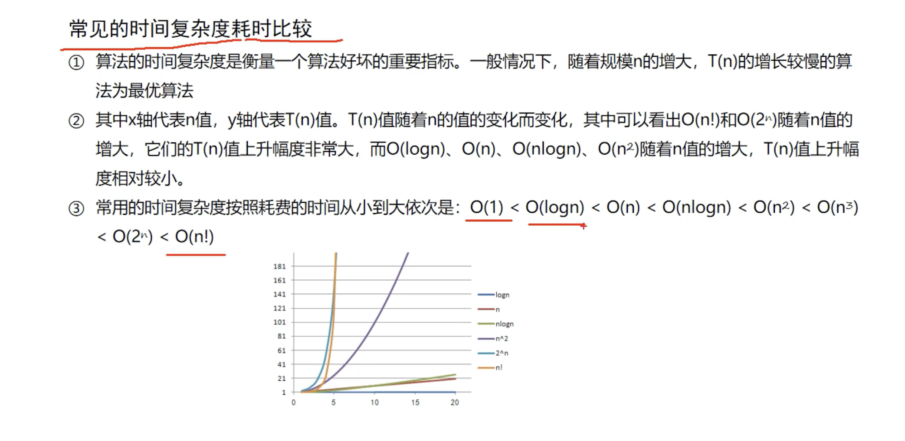

6.  
二维数组的静态初始化  
public class ArrayTest10 {  
    public static void main(String[] args) {  
        //静态初始化二维数组的第一种方式  
        int[][] arr = new int[][]{  
                {1, 2, 3},  
                {4, 5, 6, 7, 8},  
                {9, 10, 11, 12, 13, 14, 15}  
        };  
        System.*out*.println("该二维书中有" + arr.length + "个1维数组！");  
  
        System.*out*.println(arr[0].length);  
        System.*out*.println(arr[1].length);  
        System.*out*.println(arr[2].length);  
  
        int arr00 = arr[0][0];  
        System.*out*.println("二维数组中的第一个一维数组的第一个元素：" + arr00);  
        //最后一个一维数组的最后一个元素  
        int arr02 = arr[arr.length - 1][arr[arr.length - 1].length - 1];  
        System.*out*.println("二维数组中的最后一个一维数组的最后一个元素：" + arr02);  
  
        arr[arr.length - 1][arr[arr.length - 1].length - 1] = 456;  
        System.*out*.println("修改后的二维数组中的最后一个一维数组的最后一个元素：" + arr[arr.length - 1][arr[arr.length - 1].length - 1]);  
        //静态初始化二维数组的第2种方式  
        int[][] arr2 = {  
                {1, 2, 3},  
                {4, 5, 6, 7, 8},  
                {9, 10, 11, 12, 13, 14, 15}  
        };  
    }  
  
}  
  
动态初始化  
import java.util.Arrays;  
  
/*  
* 二维数组的动态初始化  
* 等长  
*   int[][]. arr =new int[3][4];  
* 不等长  
*   int[][] arr = new int[3][];  
*  
* */  
public class ArrayTest11 {  
  
    public static void main(String[] args) {  
       //动态初始化一个二维数组：等长  
        int[][] arr = new int[3][4];  
  
        for (int i = 0; i < arr.length; i++) {  
            // System.out.println(Arrays.toString(arr[i]));  
            //arr[i]是一个一维数组  
            //循环遍历一维数组  
            for (int j = 0; j < arr[i].length; j++) {  
                System.*out*.print(arr[i][j]+" ");  
            }  
  
            System.*out*.println();  
        }  
  
        // 动态初始化一个二维数组：不等长  
        int[][] nums = new int[3][];  
  
        nums[0] = new int[]{1,3,3,4};  
        nums[1] = new int[]{2,3,4};  
        nums[2] = new int[]{1,1,1,1,1,1,1,1,1,1};  
  
        // 遍历  
        for (int i = 0; i < nums.length; i++) {  
            for (int j = 0; j < nums[i].length; j++) {  
                System.*out*.print(nums[i][j] + " ");  
            }  
            System.*out*.println();  
        }  
    }  
}  
  
  
算法  
时间复杂   
  
// ────────────────────────────────  
// O(1) - 常数阶（没循环）  
// ────────────────────────────────  
int x = 5;  
arr[0] = 10;  
  
// ────────────────────────────────  
// O(log n) - 对数阶（循环×2或÷2）  
// ────────────────────────────────  
for (int i = 1; i < n; i *= 2) {}   // ×2  
for (int i = n; i > 0; i /= 2) {}   // ÷2  
  
// ────────────────────────────────  
// O(n) - 线性阶（一层循环）  
// ────────────────────────────────  
for (int i = 0; i < n; i++) {}  
while (i < n) { i++; }  
  
// ────────────────────────────────  
// O(n log n) - 线性对数阶  
// ────────────────────────────────  
for (int i = 0; i < n; i++) {       // 外层O(n)  
    for (int j = 1; j < n; j *= 2) {}  // 内层O(log n)  
}  
  
// ────────────────────────────────  
// O(n²) - 平方阶（两层嵌套）  
// ────────────────────────────────  
for (int i = 0; i < n; i++) {  
    for (int j = 0; j < n; j++) {}  
}  
  
// ────────────────────────────────  
// O(n³) - 立方阶（三层嵌套）  
// ────────────────────────────────  
for (int i = 0; i < n; i++) {  
    for (int j = 0; j < n; j++) {  
        for (int k = 0; k < n; k++) {}  
    }  
}  
  
// ────────────────────────────────  
// O(2ⁿ) - 指数阶（递归分2支）⚠️  
// ────────────────────────────────  
int fib(int n) {  
    if (n <= 1) return n;  
    return fib(n-1) + fib(n-2);     // 每次分2个  
}  
  
// ────────────────────────────────  
// O(n!) - 阶乘阶（全排列）💀  
// ────────────────────────────────  
void permute(int n) {  
    if (n == 0) return;  
    for (int i = 0; i < n; i++) {   // n次  
        permute(n-1);               // 每次都递归  
    }  
}  
  
  
冒泡排序 = 相邻两个比较，大的往后挪，像气泡一样冒上去！  
```
import java.util.Arrays;

/*
* 冒泡排序
*
* 3，2，7，6，1
*
【第1轮循环】共比较4次：
  第1次比较：2，3，7，6，1  ← 3和2比，交换
  第2次比较：2，3，7，6，1  ← 3和7比，不换
  第3次比较：2，3，6，7，1  ← 7和6比，交换
  第4次比较：2，3，6，1，7  ← 7和1比，交换
【第1轮结束】
*
* 第2轮循环
* 参与比较的：2, 3, 6, 1
第1次比较：2 vs 3 → 不换 → [2, 3, 6, 1, |7|]
第2次比较：3 vs 6 → 不换 → [2, 3, 6, 1, |7|]
第3次比较：6 vs 1 → 交换 → [2, 3, 1, 6, |7|]
*
* 第3轮循环
* 参与比较的：2, 3, 1
第1次比较：2 vs 3 → 不换 → [2, 3, 1, |6, 7|]
第2次比较：3 vs 1 → 交换 → [2, 1, 3, |6, 7|]
*
* 第4轮循环
* 参与比较的：2, 1
第1次比较：2 vs 1 → 交换 → [1, 2, |3, 6, 7|]
*
* 1.     4
* 2.     3
* 3.     2
* 4.     1
*
* * */
public class ArrayTest12 {
    public static void main(String[] args) {
        int[] arr = {3,2,7,6,1};
        bubbleSort(arr);
        System.out.println(Arrays.toString(arr));
    }

    private static void bubbleSort(int[] arr) {
        for(int i = 0; i < arr.length - 1; i++){
            for(int j= 0; j < arr.length - 1 - i; j++){
                if(arr[j] > arr[j+1]){
                    int temp = arr[j];
                    arr[j] = arr[j+1];
                    arr[j+1] = temp;
                }
            }
        }

    }

}


```
  
选择排序 = 每次选出最小的*和参与比较的这些数据中最开始的元素交换位置*  
```
import java.util.Arrays;

/**
 * 选择排序：
 * <p>
 * 核心原理：找出参与比较的这些数据中最小的，然后拿着这个最小的数据
 * 和参与比较的这些数据中最开始的元素交换位置。
 * <p>
 * 优点：交换的次数比冒泡排序的少。执行效率比冒泡排序高。
 * （冒泡排序中的元素每一次比较之后就交换，这个交换有时是没有必要的。）
 * <p>
 * 原理：
 * <p>
 * (1) 参与比较的数据：3, 2, 7, 6, 1
 * 第一次循环之后的结果：1, 2, 7, 6, 3
 * <p>
 * <p>
 * (2) 参与比较的数据：x, 2, 7, 6, 3
 * 第二次循环之后的结果：1, 2, 7, 6, 3
 * <p>
 * <p>
 * (3) 参与比较的数据：x, x, 7, 6, 3
 * 第三次循环之后的结果：1, 2, 3, 6, 7
 * <p>
 * <p>
 * (4) 参与比较的数据：x, x, x, 6, 7
 * 第四次循环之后的结果：1, 2, 3, 6, 7
 */

public class ArrayTest13 {
    public static void main(String[] args) {
        int[] arr = {3, 2, 7, 6, 1};
        int[] min = selectSort(arr);
        System.out.println(Arrays.toString(min));

    }

    //数组传的是地址，方法内修改会影响原数组，所以不return也能起作用！
    private static int[] selectSort(int[] arr) {
        for (int i = 0; i < arr.length-1; i++) {           // 第几轮（0,1,2,3）
            int min = i;                         // 假设第i个最小
            for (int j = i + 1; j < arr.length; j++) {
                if (arr[j] < arr[min]) {
                    min = j;
                }
            }
            int t = arr[i];
            arr[i] = arr[min];
            arr[min] = t;  // 交换
        }
        return arr;
    }
}


```
  
线性查找 = 从头到尾一个一个找，找到了就停止！O(n)   
1. 数据量小（<100）  
2. 数组没有排序  
3. 只查找一次  
4. 代码要简单  
  
  
二分法查找  
```
/**
 * 二分法查找/折半查找方法
 * 1. 二分法查找是建立在排序的基础之上的。
 * 2. 二分法查找的原理？
 * 从这里：1,20,50,77,80,99,101,256,666,888 找到 20 的下标？
 * begin = 0;
 * end = 9;
 * mid = 4
 * arr[mid] --> 80
 * 20
 * arr[mid] > 20  (20在左边)
 *
 * begin = 0;
 * end = 3;
 * mid = 1
 * arr[mid] --> 20
 * 20
 * arr[mid] == 20 --> mid
 * 时间复杂度O(log n)
 */

public class ArrayTest14 {
    public static void main(String[] args) {
        int[] arr = {1, 20, 50, 77, 80, 99, 101, 256, 666, 888};
        int num = 101;
        int index = binarySearch(arr, num);
        System.out.println(index >= 0 ? num + "的下标是: " + index : "找不到");
    }

    private static int binarySearch(int[] arr, int num) {
        int begin = 0;
        int end = arr.length - 1;

        while(begin <= end) {
            int mid = (begin + end) / 2;

            if(arr[mid] == num) {
                return mid;
            } else if(num > arr[mid]) {
                begin = mid + 1;
            } else {
                end = mid - 1;
            }
        }

        return -1;
    }
}

```
Sort排序  
```
package ArrayTools;

import org.junit.jupiter.api.Test;

import java.util.Arrays;

public class ArrayTest {

    @Test
    public void testSort(){
         int[] arr = {1,2,32,4,5,6,7,8,9,10,11,12,13,4,5};
         Arrays.sort(arr);
         System.out.println(Arrays.toString(arr));
         String[] names = {"Tom","Jerry","Mike","Mary"};
         Arrays.sort(names);
         System.out.println(Arrays.toString(names));
         //尝试对Person对象排序呢？
         Person p1 = new Person(10,"Tom");
         Person p2 = new Person(10,"Mike");
         Person p3 = new Person(30,"Mike");
        //java.lang.ClassCastException: class ArrayTools.Person cannot be
        // cast to class java.lang.Comparable (ArrayTools.Person is in
        // unnamed module of loader 'app'; java.lang.Comparable is in module
        // java.base of loader 'bootstrap')
        Person[] Person ={p1,p2,p3};

        Arrays.sort(Person);
        System.out.println(Arrays.toString(Person));


    }

    @Test
    public void testArrayEqual(){
        int[] arr1 = {1,2,3,4,5};
        int[] arr2 = {1,2,3,4,5};
        // == 比较的是地址（是否同一个数组对象）
        // 原因：arr1和arr2是两个不同的数组对象，地址不同
        System.out.println(arr1 == arr2);//false
        // Arrays.equals() 比较的是内容（元素是否相同）
        // 原因：两个数组的元素完全相同
        System.out.println(Arrays.equals(arr1, arr2));//true

        String[] names1 = {"Tom","Jerry","Mike","Mary"};
        String[] names2 = {"Tom","Jerry","Mike","Mary"};
        System.out.println(names1 == names2);//false
        System.out.println(Arrays.equals(names1, names2));//true
    }
    @Test
    public void testStringEqual(){
        String str1 = new String("Hello");
        String str2 = new String("Hello");
        String str3 = "Hello";
        String str4 = "Hello";

        System.out.println(str1 == str2);          // false（不同对象）
        System.out.println(str1.equals(str2));    // true（String重写了equals，比较内容）

        System.out.println(str3 == str4);          // true（字符串常量池，同一个对象）
        System.out.println(str3.equals(str4));     // true（内容相同）
    }

    @Test
    public void testdeepEquals(){
        int[][] arr1 = {{1, 2}, {3, 4}};
        int[][] arr2 = {{1, 2}, {3, 4}};
        int[][] arr3 = {{1, 2}, {3, 5}};

       //  Arrays.equals() 不适用二维数组
        System.out.println(Arrays.equals(arr1, arr2));      // false（只比较第一层引用）

        // Arrays.deepEquals() 递归比较所有层
        System.out.println(Arrays.deepEquals(arr1, arr2));  // true（内容完全相同）
        System.out.println(Arrays.deepEquals(arr1, arr3));  // false（最后一个元素不同）
    }


    //Arrays.toString()的作用，将数组对象装潢成字符串形式，格式为 [元素1, 元素2, 元素3, ...]
    @Test
    public void testToString(){
        int[] arr = {1,2,3,4,5};
        System.out.println(arr.toString());//[I@61df66b6
        System.out.println(Arrays.toString(arr));

        String[] names={"Tom","Jerry","Mike","Mary"};
        System.out.println(names);//[Ljava.lang.String;@20ce78ec
        System.out.println(Arrays.toString(names));
    }

    //arrays.deepToString() 适合将多为数组转换成字符串
    //toString看一层，deepToString递归看所有层，多维数组必须用deep
    @Test
    public void testDeepToString(){
        int[][] arr={
                {1,2,3},
                {4,5,6},
                {7,8,9}
        };
        System.out.println(arr);//[[I@5119fb47
        System.out.println(Arrays.toString(arr));//[[I@7193666c, [I@20deea7f, [I@3835c46]
        System.out.println(Arrays.deepToString(arr));//[[1, 2, 3], [4, 5, 6], [7, 8, 9]]
    }
}


```
  
```
package ArrayTools;
//自定义的类型要做比较的话，这个自定义类型必须实现一个接口：Comparable
//并且实现全，在这个方法中编写比较规则
public class Person implements Comparable{
    private int age;
    private String name;
    public Person(int age, String name) {
        this.age = age;
        this.name = name;
    }

    public int getAge() {
        return age;
    }
    public void setAge(int age) {
        this.age = age;
    }

    public String getName() {
        return name;
    }

    public void setName(String name) {
        this.name = name;
    }

    @Override
    public String toString() {
        return "Person{" +
                "age=" + age +
                ", name='" + name + '\'' +
                '}';
    }

    @Override
    public int compareTo(Object o) {
       //p1和p2比较，this 是p1，o是p2
        Person p2 = (Person) o;


        // 先比较年龄
        if (this.age !=p2.age) {
            return this.age - p2.age;
        }
        // 年龄相同，再比较姓名
        return this.name.compareTo(p2.name);

    }
}


```
  
  
  
```
//将数组转换成固定长度的List（不可增删，只能改）
@Test
public void testAsList(){
    List list =Arrays.asList(1,2,3);
    for (int i = 0; i < list.size(); i++){
        System.out.println(list.get(i));
    }
}
@Test
public void testCopyOf(){
    int[] arr = {1,2,3,4,5};
    //[1, 2, 3]
    int[] newArr = Arrays.copyOf(arr, 3);
    System.out.println(Arrays.toString(newArr));

    int[] newArr2 = Arrays.copyOfRange(arr, 2,4);
    //[3, 4]
    System.out.println(Arrays.toString(newArr2));

}
@Test
public void testFill(){
    int[] arr = new int[5];
    Arrays.fill(arr, 5);
    //[5, 5, 5, 5, 5]
    System.out.println(Arrays.toString(arr));
    Arrays.fill(arr,1,3,100);
    //[5, 100, 100, 5, 5]
    System.out.println(Arrays.toString(arr));
}
@Test
public void testBinarySearch(){
    //二分查找 是什么？O(log n)
    //二分查找，要求数组必须是有序的
int[] arr = {1,2,3,4,5,6,7,8,9,10};
    System.out.println(Arrays.binarySearch(arr, 5));

}

```
