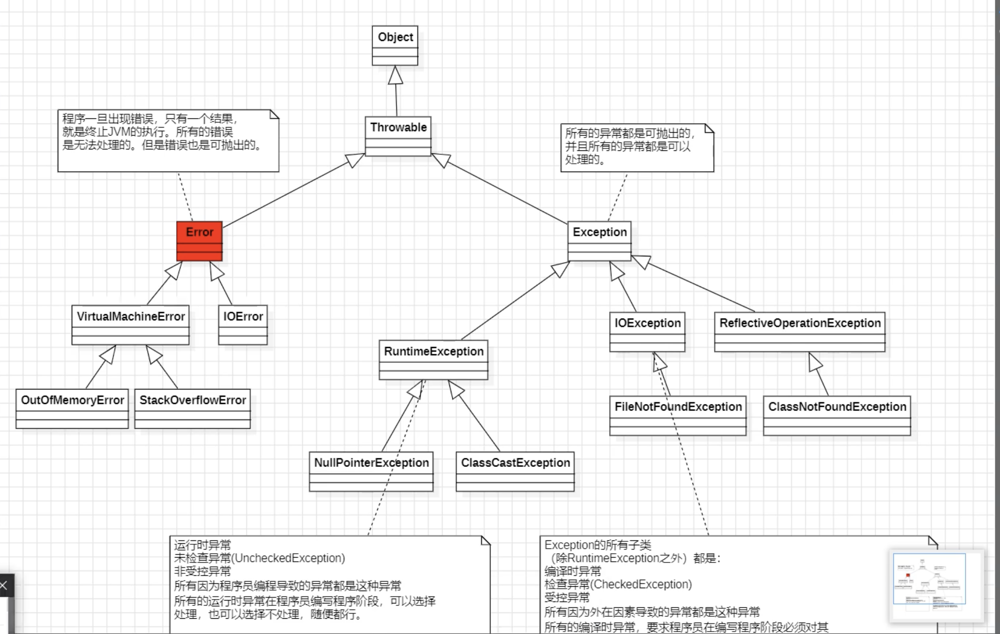

# 7.异常  
  
Error       → JVM崩了，没救了  
RuntimeEx   → 程序员的锅（空指针、类型转换）不强制捕获  
CheckedEx   → 外部因素（文件、网络）编译器强制你处理  
  
Throwable  
  ├── Error（不可恢复）  
  │     └── 内存溢出、栈溢出  
  │  
  └── Exception（可恢复）  
        ├── RuntimeException（非受检，运行时才暴露）  
        │     ├── NullPointerException    → null.xxx()  
        │     ├── ClassCastException      → 类型强转失败  
        │     ├── ArrayIndexOutOfBounds   → 数组越界  
        │     └── NumberFormatException   → "abc"转int  
        │  
        └── CheckedException（受检，编译时就要处理）  
              ├── IOException → 文件操作  
              │     └── FileNotFoundException  
              └── ReflectiveOperationException → 反射  
                    └── ClassNotFoundException  
  
  
**异常继承结构**  
① 所有的异常和错误都是可抛出的。都继承了 Throwable 类。  
② Error 是无法处理的，出现后只有一个结果：JVM终止。  
③ Exception 是可以处理的。  
④ Exception 的分类：  
1. 所有的 RuntimeException 的子类：运行时异常 / 未检查异常（UncheckedException）/ 非受控异常  
2. Exception 的子类（除 RuntimeException 之外）：编译时异常 / 检查异常（CheckedException）/ 受控异常  
⑤ 编译时异常和运行时异常区别：  
1. 编译时异常特点：在编译阶段必须提前处理，如果不处理编译器报错。  
2. 运行时异常特点：在编译阶段可以选择处理，也可以不处理，没有硬性要求。  
3. 编译时异常一般是由外部环境或外在条件引起的，如网络故障、磁盘空间不足、文件找不到等  
4. 运行时异常一般是由程序员的错误引起的，并且不需要强制进行异常处理  
> 注意：编译时异常并不是在编译阶段发生的异常，所有的异常发生都是在运行阶段的，因为每个异常发生都是会 new 异常对象的，new 异常对象只能在运行阶段完成。那为什么叫做编译时异常呢？这是因为这种异常必须在编译阶段提前预处理，如果不处理编译器报错，因此而得名编译时异常。  

| 维度 | Error | RuntimeException（运行时异常） | CheckedException（编译时异常） |
| ------------ | --------- | ---------------------------- | ----------------------- |
| 中文名 | 错误 | 非受检异常 / 未检查异常 | 受检异常 / 检查异常 |
| 父类 | Throwable | Exception → RuntimeException | Exception |
| 发生原因 | JVM自身故障 | 程序员代码不严谨 | 外部环境不可控 |
| 编译器是否检查 | ❌ 不检查 | ❌ 不检查 | ✅ 强制检查 |
| 必须try-catch吗 | ❌ 没意义 | ❌ 不强制 | ✅ 必须，否则编译报错 |
| 能恢复吗 | ❌ 不能 | ✅ 能（代码预防） | ✅ 能（try-catch处理） |
| JVM是否终止 | ✅ 终止 | 看情况（未捕获则终止） | 看情况（未捕获则终止） |
| 典型场景 | 内存不足、栈溢出 | 空指针、越界、类型错误 | 文件、网络、数据库 |
  
  
  
  
/*  
    1.什么是异常：java程序执行过程中的意外，错误，出现的不正常的情况  
    异常机制在java中可以提高程序的健壮性。  
    2.异常时以类和对象的形式存在的。定义异常其实本质上就是定义一个类。  
    异常发生，也需要创建异常对象，并把异常对象传递给调用者。  
  
    异常 = 程序出错，用try-catch捕获处理，  
    异常 = 程序运行时的错误（数组越界、空指针、类型转换等）  
    用途 = 捕获并处理错误，防止程序崩溃  
  
     常见5种：空指针NullPointerException、  
     越界ArrayIndexOutOfBoundsException、  
     类转换ClassCastException、  
     数字格式NumberFormatException	、  
     ArithmeticException除零！  
 */  
/*Throwable（顶级父类）  
        ├── Error（错误，程序无法处理）  
        │   └── OutOfMemoryError（内存溢出）  
        │  
        └── Exception（异常，程序可处理）  
        ├── RuntimeException（运行时异常，不强制处理）  
        │   ├── NullPointerException（空指针）  
        │   ├── ArrayIndexOutOfBoundsException（数组越界）  
        │   └── ClassCastException（类型转换）  
        │  
        └── 其他异常（编译时异常，必须处理）  
        ├── IOException（IO异常）  
        └── SQLException（数据库异常）*/  
  
public class ExceptionTest01 {  
    public static void main(String[] args) {  
        /*  
        * Exception in thread "main" java.lang.ArithmeticException: / by zero  
	at ExceptionTest01.main(ExceptionTest01.java:13)  
        * */  
       int a =10;  
       int b =0;  
       int c = a/b;  
        System.*out*.println( c);  
  
        String s = null;  
        s.toString();// 空指针异常，程序执行到这里JVM会在底层new 一个NullPointerException对象  
    }  
  
}  
  
  
Java语言中对异常的处理包括两种方式：  
  
第一种方式：在方法声明的位置上，使用throws关键字，抛给上一级。 如果希望调用者来处理，选择throws上报。  
    其它情况使用捕捉的方式。  
谁调用我，我就抛给谁。抛给上一级。throws  →  "我不管，你来处理"  →  踢皮球，往上传  
  
第二种方式：使用try..catch语句进行异常的捕捉。  
这件事发生了，谁也不知道，因为我给抓住了。try-catch → "我来处理，到此为止" →  自己接锅，不再往上传  
  
  
  
例子  
第一种方式：在方法声明的位置上，使用throws关键字，抛给上一级。  
谁调用我，我就抛给谁。抛给上一级。throws  →  "我不管，你来处理"  →  踢皮球，往上传  
import exception.IllegalAgeException;  
import exception.IllegalNameException;  
  
import java.util.Scanner;  
  
public class ExceptionTest03 {  
    public static void main(String[] args) throws IllegalNameException, IllegalAgeException {  
        Scanner scanner = new Scanner(System.*in*);  
        System.*out*.println("先注册用户");  
        System.*out*.println("输入用户名:");  
        String name = scanner.next();  
        System.*out*.println("输入年龄:");  
        int age = scanner.nextInt();  
        //注册  
        UserService userService = new UserService();  
        userService.register(name, age);//这里的代码如果出现异常，后面的代码就不执行了  
        System.*out*.println("Main Over");  
  
    }  
}  
  
//业务类  
class UserService {  
    public void register(String name, int age) throws IllegalNameException, IllegalAgeException{  
        System.*out*.println("开始注册用户...");  
        //调用数据库的save方法  
        UserDao userDao = new UserDao();  
        userDao.save(name, age);//这里有可能出现异常，下面的代码就不执行了  
        System.*out*.println("用户注册成功！欢迎["+name+"]");  
    }  
  
}  
  
//操作数据库的类  
class UserDao {  
    /*用户要注册  
     * @param name 用户名  
     * @param age  年龄  
     *  
     * */  
//   throw vs throws  
//   throw  → 方法体内，真正抛出异常的动作（主动出击）  
//            throws → 方法签名上，声明可能抛出（提前打招呼）  
  
    /*    流程：  
       throw→ 关键字，执行"抛出"这个动作  
      → 方法立刻终止，不再往下执行  
     → 异常沿着调用链往上传播  
  
    new IllegalNameException(...)  
     → 创建一个异常对象（就是new一个对象）  
                 → IllegalNameException 是异常的类型（标识是什么问题）  
  
                "用户名长度不合法！要求6-12位，当前：2位"  
                → 错误信息，存在异常对象里  
       → 通过 e.getMessage() 可以取出来  
       → 方便调用者知道到底哪里出了什么问题*/  
    public void save(String name, int age)  throws IllegalNameException, IllegalAgeException{  
        System.*out*.println("开始保存用户["+name + "]信息...");  
        // ====== 校验1：用户名长度必须在6-12位 ======  
        if (name.length() < 6 || name.length() > 12) {  
            // 不满足 → 抛出IllegalNameException  
            throw new IllegalNameException(  
                    "用户名长度不合法！要求6-12位，当前：" + name.length() + "位"  
            );  
            //这里不要写任何代码，因为永远不执行  
            //System.out.println("这里不要写任何代码");  
        }  
  
        // ====== 校验2：年龄必须大于18岁 ======  
        if (age < 18) {  
            // 不满足 → 抛出IllegalAgeException  
            throw new IllegalAgeException(  
                    "年龄不合法！要求大于18岁，当前：" + age + "岁"  
            );  
        }  
  
        // ====== 两个校验都通过 → 注册成功 ======  
        System.*out*.println("用户注册成功！用户名：" + name + "，年龄：" + age);  
    }  
}  
  
  
IllegalNameException.java  
*// 继承Exception → 编译时异常（受检异常）*  
public class IllegalNameException extends Exception {  
    public IllegalNameException() {}  
    public IllegalNameException(String *message*) {  
        super(message);  *// 把错误信息传给父类*  
    }  
}  
  
  
1. 自定义异常  
知识点：  
  ✅ 自定义异常两步：继承 + 两个构造方法  
  ✅ 继承Exception → 编译时异常，调用者必须处理  
  ✅ 继承RuntimeException → 运行时异常，调用者可不处理  
  ✅ super(message) → 调用父类构造方法传递信息  
  
2.throw（抛出异常的动作）  
throw new IllegalNameException("用户名长度不合法！要求6-12位，当前：" + name.length() + "位");  
知识点：  
  ✅ throw 是关键字，在方法体内使用  
  ✅ throw 后方法立刻终止，后面代码不执行  
  ✅ new XxxException() → 创建异常对象  
  ✅ 括号里是错误描述，通过 e.getMessage() 取出  
  ✅ throw 后面不能再写代码（永远不会执行）  
  
**3. throws（声明可能抛出的异常）**  
public void save(String name, int age) throws IllegalNameException, IllegalAgeException {  
public void register(String name, int age) throws IllegalNameException, IllegalAgeException {  
public static void main(String[] args) throws IllegalNameException, IllegalAgeException {  
知识点：  
  ✅ throws 写在方法签名上（方法名后面）  
  ✅ throws 是声明，不是真正抛出  
  ✅ 多个异常用逗号分隔  
  ✅ 调用者必须处理（try-catch 或继续 throws）  
  ✅ main方法也可以throws（抛给JVM）  
4. throw vs throws 区别  
throw                         throws  
─────────────────────────     ─────────────────────────  
写在方法体内                   写在方法签名上  
真正执行抛出动作               只是声明可能会抛  
后面跟异常对象                 后面跟异常类型  
方法立刻终止                   不影响方法执行  
throw new XxxException()      throws XxxException  
  
**5. 异常传播（调用链）**  
UserDao.save()      → throw 抛出  
    ↓ 传播  
UserService.register() → throws 继续往上传  
    ↓ 传播  
main()              → throws 继续往上传（抛给JVM）  
知识点：  
  ✅ 异常沿调用链向上传播  
  ✅ 每层方法遇到异常立刻终止  
  ✅ 直到被catch捕获才停止传播  
  ✅ 没有被catch → 抛给JVM → 程序终止打印堆栈信息  
  
   // 一般不建议在main方法上使用throws，因为这个异常如果真正的发生了，一定会抛给JVM。JVM只有终止。  
    // 异常处理机制的作用就是增强程序的健壮性。怎么能做到，异常发生了也不影响程序的执行。所以  
    // 一般main方法中的异常建议使用try..catch进行捕捉。main就不要继续上抛了。  
  
  
第二种方式：使用try..catch语句进行异常的捕捉。  
这件事发生了，谁也不知道，因为我给抓住了。try-catch → "我来处理，到此为止" →  自己接锅，不再往上传  
  
```
package exception.tryTest;

import exception.IllegalAgeException;
import exception.IllegalNameException;


import java.util.Scanner;
/**
 * 异常处理的第二种方式：捕捉
 * 语法格式：
 *      try {
 *          // 需要尝试执行的程序，这里的程序有可能会出现异常。
 *          ..
 *          ..如果执行到这里出现了异常，则try块后续的代码不再执行。
 *          ..
 *          ..
 *      } catch(异常类型1 变量名) {
 *          // 当捕捉到的异常是"异常类型1"时，走这个分支，进行异常的处理。
 *      } catch(异常类型2 变量名) {
 *          // 当捕捉到的异常是"异常类型2"时，走这个分支，进行异常的处理。
 *      } catch(异常类型3 变量名) {
 *          // 当捕捉到的异常是"异常类型3"时，走这个分支，进行异常的处理。
 *      } ....
 *
 *      // 后续java代码可以执行。
 *
 *      另外注意：
 *          catch语句块可以看做是分支，try catch语句中，最多只有一个catch分支执行。
 *          catch可以写多个，但是必须遵循自上而下，从小到大。
 *
 *    知识点总结
 *             ✅ 1. try块出现异常，后续代码立刻停，跳到对应catch
             * ✅ 2. 最多只有一个catch分支执行（if-else关系）
             * ✅ 3. catch顺序：子类在前，父类在后（从小到大）
             * ✅ 4. catch处理完，后续代码正常继续执行
             * ✅ 5. try块没有异常，所有catch都不执行
             * ✅ 6. e.getMessage() 取出异常的错误信息
             * ✅ 7. catch是分支，不是循环，匹配一个就结束
 *
 */

public class ExceptionTest04 {
   public static void main(String[] args)  {
        Scanner scanner = new Scanner(System.in);
        System.out.println("先注册用户");
        System.out.println("输入用户名:");
        String name = scanner.next();
        System.out.println("输入年龄:");
        int age = scanner.nextInt();
        //注册
        UserService userService = new UserService();
       try {
           //可能出现异常的代码
           userService.register(name, age);
           System.out.println("如果有异常,try这里执行吗");
       } catch (IllegalNameException e) {
           System.out.println(e.getMessage());
       } catch (IllegalAgeException e) {
           System.out.println(e.getMessage());
       }
       System.out.println("Main Over");

    }
}

//业务类
class UserService {
    public void register(String name, int age) throws IllegalNameException, IllegalAgeException {
        System.out.println("开始注册用户...");
        //调用数据库的save方法
        UserDao userDao = new UserDao();
        userDao.save(name, age);//这里有可能出现异常，下面的代码就不执行了
        System.out.println("用户注册成功！欢迎["+name+"]");
    }

}

//操作数据库的类
class UserDao {
    /*用户要注册
     * @param name 用户名
     * @param age  年龄
     *
     * */
    public void save(String name, int age)  throws IllegalNameException, IllegalAgeException{
        System.out.println("开始保存用户["+name + "]信息...");
        // ====== 校验1：用户名长度必须在6-12位 ======
        if (name.length() < 6 || name.length() > 12) {
            // 不满足 → 抛出IllegalNameException
            throw new IllegalNameException(
                    "用户名长度不合法！要求6-12位，当前：" + name.length() + "位"
            );
        }

        // ====== 校验2：年龄必须大于18岁 ======
        if (age < 18) {
            // 不满足 → 抛出IllegalAgeException
            throw new IllegalAgeException(
                    "年龄不合法！要求大于18岁，当前：" + age + "岁"
            );
        }

        // ====== 两个校验都通过 → 注册成功 ======
        System.out.println("用户注册成功！用户名：" + name + "，年龄：" + age);
    }
}


```
如果使用Exception e  
```
try {
    //可能出现异常的代码
    userService.register(name, age);
    System.out.println("如果有异常,try这里执行吗");
} catch (Exception e){
    System.out.println("异常信息：" + e.getMessage());
}
System.out.println("Main Over");

```
  
先用*catch顺序：子类在前，父类在后（从小到大）*  
```
try {
    userService.register(name, age);
} catch (IllegalNameException e) {
    System.out.println("姓名：" + e.getMessage());
} catch (IllegalAgeException e) {
    System.out.println("年龄：" + e.getMessage());
} catch (Exception e) {
    System.out.println("异常信息：" + e.getMessage());
    System.out.println("异常类型：" + e.getClass().getName());
}

```
  
统一处理多个异常：用 | 操作符同时捕获 IllegalNameException 和 IllegalAgeException  
```
//Java的新特性
try {
    userService.register(name, age);
} catch ( IllegalAgeException |IllegalNameException e) {
    System.out.println(e.getMessage());
}


```
  
return  →  悄悄结束，调用者以为成功，逻辑出错（危险！）  
throw   →  大声报错，调用者必须处理，逻辑清晰（正确！）  
  
只要方法执行失败，就用 throw，不用 return！  
  
  
  
  
  
```
package exception.tryTest;
//异常我们哪里使用呢？
public class ExceptionTest05 {
    public static void main(String[] args) {
        User user = new User("张三", 18);
        System.out.println(user);
        try {
            user.setAge(-10);
        } catch (Exception e) {
            // 只返回错误描述字符串
            // 输出：年龄不合法！
            System.out.println("异常信息：" + e.getMessage());
            // 返回异常的完整类名
            // 输出：java.lang.Exception
            System.out.println("异常类型：" + e.getClass().getName());
            e.printStackTrace();
            // 打印完整堆栈信息，包含：
            // - 异常类型
            // - 异常信息
            // - 从哪个类、哪个方法、哪一行抛出
            // 输出：
            // java.lang.Exception: 年龄不合法！
            //     at User.setAge(ExceptionTest05.java:46)
            //     at ExceptionTest05.main(ExceptionTest05.java:10)
        }
        System.out.println(user);
    }

}


class User {
    private String name;
    private int age;

    public User(String name, int age) {
        this.name = name;
        this.age = age;
    }

    public String getName() {
        return name;
    }

    public int getAge() {
        return age;
    }

    public void setName(String name) {
        this.name = name;
    }
    // throws Exception → 声明可能抛出编译时异常
    // 调用者必须处理（try-catch 或 throws）
    public void setAge(int age) throws Exception {
        if (age < 0 || age > 120) {
            // ❌ 不能用：System.out.println + return
            //    原因：调用者不知道失败了，继续执行，逻辑出错

            // ✅ 正确：手动抛出异常，让异常发生
            // throw  → 动作，真正抛出
            // new Exception("年龄不合法！") → 创建异常对象，存入错误信息
//            System.out.println("年龄不合法！");
//            return;
            //手动抛出异常，让异常发生
            throw new Exception("年龄不合法！");
        }
        // 只有age合法（0-120），才会执行到这里
        this.age = age; // 原因：throw不是结束if块，是结束整个方法！
    }

    @Override
    public String toString() {
        return "User{" +
                "name='" + name + '\'' +
                ", age=" + age +
                '}';
    }
}


```
  
关于调用Java自带类  
```
package exception.tryTest;

import java.io.FileInputStream;
import java.io.FileNotFoundException;

public class ExceptionTest06 {
    public static void main(String[] args) {
        try {
            m1();
        } catch (FileNotFoundException e) {
            System.out.println(e.getMessage());
            e.printStackTrace();
        }
    }

    public  static void m1() throws FileNotFoundException {
       m2();
    }

    public static void m2() throws FileNotFoundException {
        m3();
    }

/*    需要手动 throw：
            ✅ 自己写的业务校验（年龄、名字、余额）
            ✅ 自己判断的错误条件
    ✅ 没有任何框架帮你抛异常

    不需要手动 throw：
            ✅ 调用Java自带的类（FileInputStream、数据库驱动等）
            ✅ 这些类内部已经写好了throw
    ✅ 只需要声明 throws，让异常传播上去*/
    public static void m3() throws FileNotFoundException {
        FileInputStream in = new FileInputStream("/Users/1C5402760/spring6/codes/Exception/exception/tryTest/a.txt");
    }
}


```
  
异常的常用方法  
  
获取异常的简单描述信息：  
    exception.getMessage();  
    获取的message是通过构造方法创建异常对象时传递过去的message。  
打印异常堆栈信息：  
    exception.printStackTrace();  
要会看异常的堆栈信息：  
    异常信息的打印是符合栈数据结构的。  
    看异常信息主要看最开始的描述信息。看栈顶信息。  
```
package exception.tryTest;

import exception.IllegalAgeException;
import exception.IllegalNameException;

import java.util.Scanner;

public class ExceptionTest07 {
    public static void main(String[] args) {
        Scanner scanner = new Scanner(System.in);
        System.out.println("先注册用户");
        System.out.println("输入用户名:");
        String name = scanner.next();
        System.out.println("输入年龄:");
        int age = scanner.nextInt();
        UserServiceTest userServiceTest = new UserServiceTest();

        //注册
        try {
            userServiceTest.register(name, age);
        } catch (IllegalNameException | IllegalAgeException e) {
            // ============ 知识点1：多异常合并捕获 ============
            // IllegalNameException | IllegalAgeException
            // 用 | 合并两个异常，代码更简洁
            // 等价于写两个catch块分别处理

            // ============ 知识点2：e.getMessage() ============
            // 获取异常对象里存的错误描述字符串
            // 就是 throw new XxxException("这里的内容") 括号里传的值
            // 例：输出 → 用户名长度不合法！要求6-12位，当前：2位
            System.out.println(e.getMessage());

            // ============ 知识点3：e.printStackTrace() ============
            // 打印完整堆栈信息（排查Bug必用！）
            // 输出格式：
            //   exception.IllegalNameException: 用户名长度不合法！  ← 异常类型+信息
            //       at UserDaoTest.save(ExceptionTest07.java:47)    ← 栈顶（异常真正发生的地方）
            //       at UserServiceTest.register(ExceptionTest07.java:36) ← 调用链
            //       at ExceptionTest07.main(ExceptionTest07.java:20)     ← 调用链
            //
            // ============ 知识点4：如何看堆栈信息 ============
            // 堆栈是"先进后出"结构
            // 最上面（栈顶）= 异常真正发生的地方 → 重点看这里！
            // 下面的 = 调用链（谁调用了谁）
            //
            // 看堆栈三步：
            //   第1步：看第1行 → 是什么异常、什么信息
            //   第2步：看第2行（at...）→ 异常在哪个类哪一行产生
            //   第3步：往下看 → 追踪调用链
            e.printStackTrace();
        }

    }
}


class UserServiceTest {
    public void register(String name, int age) throws IllegalNameException, IllegalAgeException {
        System.out.println("开始注册用户...");
        UserDaoTest userDaoTest = new UserDaoTest();
        userDaoTest.save(name, age);//这里有可能出现异常，下面的代码就不执行了
        System.out.println("用户注册成功！欢迎[" + name + "]");
    }

}

class UserDaoTest {
    public void save(String name, int age) throws IllegalNameException, IllegalAgeException {
        System.out.println("开始保存用户[" + name + "]信息...");
        if (name.length() < 6 || name.length() > 12) {
            throw new IllegalNameException(
                    "用户名长度不合法！要求6-12位，当前：" + name.length() + "位"
            );
        }
        if (age < 18) {
            throw new IllegalAgeException(
                    "年龄不合法！要求大于18岁，当前：" + age + "岁"
            );
        }
        System.out.println("用户注册成功！用户名：" + name + "，年龄：" + age);
    }
}

```
finally  
  
```
package exception.tryTest;

import exception.IllegalRealNameException;

import java.io.FileInputStream;
import java.io.FileNotFoundException;
import java.io.IOException;

/*
 * 放在finally语句块当中的代码时一定会执行的，在finally语句块中完成资源的释放
 * 因为资源的释放时必须要执行的，为了保证资源一定能释放，所以放在finally语句块中
 * */
public class ExceptionTest08 {
    public static void main(String[] args) {
   /*     try {
            String s = null;
            s.toString();
        } catch (NullPointerException e) {
            System.out.println(e.getMessage());
            e.printStackTrace();
        } finally {
            System.out.println("finally");
            System.out.println("释放资源");
        }*/
        // IO流 - 以硬盘为基准理解
        // IO输入：以硬盘为基准读取数据
        //这段代码就是在读取硬盘上的一个Java文件，然后把文件内容打印到屏幕上。
        FileInputStream in = null;
        try {
            // 创建文件输入流对象
            in = new FileInputStream("/Users/C5402760/spring6/codes/Exception/exception/tryTest/a.txt");

            // 开始读
            byte[] bytes = new byte[1024];  // 一次读取1KB
            int readCount = 0;
            while((readCount = in.read(bytes)) != -1) {
                System.out.println(new String(bytes,0,readCount));
            }

            // 关闭输入流对象
            //in.close();
        } catch (FileNotFoundException e) {
            e.printStackTrace();
        } catch(IOException e){
            e.printStackTrace();
        } finally {
            // 关闭
            if (in != null) {
                try {
                    in.close();
                } catch (IOException e) {
                    e.printStackTrace();
                }
            }
        }

        System.out.println("main over");
    }
}


```
  
  
```
package exception.tryTest;

public class ExceptionTest09 {
    public static void main(String[] args) {
//        m1();
//        m2();
//        m3();
       int i = m4();
        System.out.println( i);
    }

    // 1 usage
    public static void m1() {
        try {
            System.out.println("try....");
            return;
        } finally {
            System.out.println("finally...");
        }
    }

    // no usages
    public static void m2() {
        try {
            System.out.println("try....");
            return;
        } finally {
            System.out.println("finally...");
        }
        // 这里就不能写代码。
        //System.out.println("m1 over!");
    }

    public static void m3() {
        try {
            System.out.println("try....");
            //exit JVM
            System.exit(0);
            return;
        } finally {
            System.out.println("finally...");
        }

    }

    public static int m4() {
        int i = 100;
        try {
            return i;
        } finally {
            i++;
        }
    }
}


```
