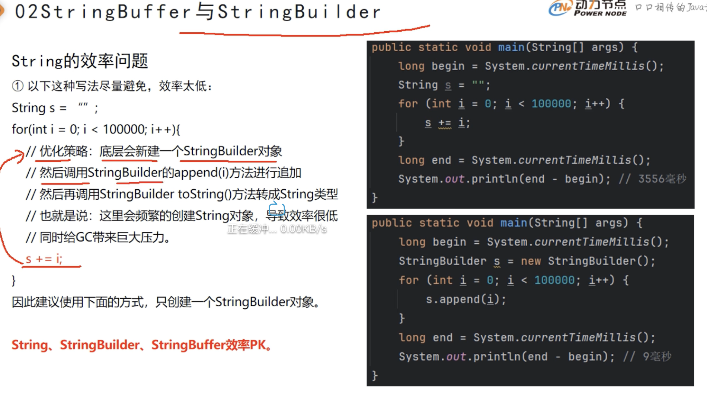

# String 完整笔记

---

## 一、String 基础概念

1. `String` 表示字符串类型，属于**引用数据类型**，不属于基本数据类型。
2. 在 Java 中随便使用双引号括起来的都是 `String` 对象。例如：`"abc"`、`"def"`、`"hello world!"`，这是 3 个 `String` 对象。
3. Java 规定，双引号括起来的字符串是**不可变的**，`"abc"` 自出生到最终死亡不可变，不能变成 `"abcd"`，也不能变成 `"ab"`。
4. 在 JDK 当中双引号括起来的字符串，例如 `"abc"`、`"def"` 都是直接存储在**方法区**的**字符串常量池**当中的。

---

## 二、字符串常量池

**为什么要把字符串存储在常量池中？**

因为字符串在实际开发中使用太频繁，为了执行效率，所以把字符串放到了方法区的字符串常量池当中。

**完整流程：**

- 在 Java 程序当中，凡是带有双引号的字符串，在编译阶段就已经完全确定了；这些字符串字面量将来会放在字符串常量池中。
- 在 JVM 启动的时候，会进行一系列的初始化，其中就包括字符串常量池的初始化，在初始化字符串常量池的时候，会将所有的字符串字面量全部提前创建好，放到字符串常量池中。
- 在执行 Java 程序的过程中，如果需要这个字符串字面量对象，直接从字符串常量池中获取，提高执行效率。
- **Java 8 之后**：字符串常量池在**堆内存**当中。
- 字符串常量池是一种**缓存技术**，提前创建好对象放进去，用的时候直接拿（字符串字面量在 JVM 启动的时候就会创建好）。

**常量池是什么？**

JVM 内存中一块特殊区域，专门存放字符串字面量对象，同内容只存一份，所有变量共享同一个对象。作用：避免重复创建相同内容的字符串，节省内存，提升性能。

---

## 三、String 为什么不可变

`String` 底层源码：

```java
public final class String {
    private final byte[] value;  // "abc" 存成 [a, b, c] 在这里
}
```

① `private`  → 外部根本访问不到 `value` 数组  
② `final`    → `value` 引用不能指向新数组  
③ 没有提供任何修改方法 → 没有 `set`、没有 `replace` 原地修改

---

## 四、字面量 vs new 创建（`==` 与 `equals`）

**字面量方式 `"hello"` 的完整过程：**

```
① 编译期（javac 编译 .java → .class）
   编译器看到 "hello" → 把它记录进 .class 文件的常量表里
   （此时还没有对象，只是一个记录）

② JVM启动/类加载期
   JVM 扫描 .class 常量表 → 在常量池里提前创建 "hello" 对象
   （此时对象已经存在于常量池中，等待使用）

③ 运行期
   执行 String a = "hello"
   → JVM 查常量池，已有 "hello" → 把它的地址给 a
   执行 String b = "hello"
   → JVM 查常量池，已有 "hello" → 把同一个地址给 b

   a 和 b 存的地址一模一样，指向同一个对象，所以 a == b → true（地址相同）
```

> `==` 比地址，`equals()` 比内容，**比字符串永远用 `equals()`**。

> 同样是字符串，同样在堆里，区别只在于：
> **常量池复用已有对象，普通堆每次新建对象。**
> 这就是为什么字面量 `==` 是 `true`，`new` 出来的 `==` 是 `false`。

```java
public class StringTest01 {

    public static void main(String[] args) {

        String a = "hello";
        String b = "hello";
        System.out.println(a == b);      // true  → 同一个常量池对象，地址相同

        String c = new String("hello");
        String d = new String("hello");
        System.out.println(c == d);       // false → 堆上两个不同对象，地址不同
        //比较两个字符串相等，还是用equals()方法
        System.out.println(c.equals(d)); // true  → 内容都是"hello"，内容相同

        //x是可以变的，因为x只是一个普通的变量。
        //谁不能变呢？字符串字面量一旦创建不可变，在字符串常量池中。
        //"helloworld"不能改变.
        //"其他字符串"不能改变了.
        String x = "helloworld";
        x = "其他字符串";
    }
}
```

---

## 五、字符串拼接与 intern()

使用 `+` 进行拼接生成的新的字符串不会被放到字符串常量池中。

**规则：**

- 字面量 + 字面量 → 编译期合并 → 常量池 → `==` 可能为 `true`
- 变量 + 变量 → 运行期拼接 → 堆上 `new` → `==` 为 `false`
- 只要有变量参与 `+` 拼接，结果就在堆上，不在常量池，`==` 必然 `false`，比较内容永远用 `equals()`。

```java
public class StringTest02 {
    public static void main(String[] args) {
        String s1 = "abc";
        String s2 = "def";
        // s3 在堆上，不在常量池
        String s3 = s1 + s2;
        String s4 = "abcdef";

        // s3 指向的对象，没有在字符串常量池中。在堆中。
        // 底层实际上在进行 +（两边至少有一个是变量）的时候，会创建一个StringBuilder对象，进行字符串的拼接。
        // 最后的时候会自动调用StringBuilder对象的toString()方法，再将StringBuilder
        // 转换成String对象。
        System.out.println(s3 == s4); // false

        //以下程序中+两边都是字符串字面量。这样的情况java对其优化：
        //在编译的时候就完成了字符串的拼接.
        String x = "java" + "test";// 等同于 String x = "javatest";
        String y = "javatest";
        System.out.println(x == y);//true

        //s3指向了堆中的一个字符串对象，并没有在常量池中。
        //如果这个字符串使用比较频繁，希望将其加入到字符串常量池中，怎么办？
        // intern()：手动把 s3 的内容放入常量池，返回常量池中的对象地址
        String s5 = s3.intern();
        System.out.println(s5 == s4);//true

        /**
         * 第①步：拿到 f 的内容 → "me"
         * 第②步：去常量池查找，有没有内容等于 "me" 的对象？
         *     情况A：常量池没有 "me"
         *     → 把 "me" 放入常量池（创建一个常量池对象）
         *     → 返回常量池中 "me" 的地址
         *     情况B：常量池已有 "me"
         *     → 直接返回常量池中已有的 "me" 的地址
         *     → 不重复创建
         * 第③步：str 接收返回的地址
         *     → str 指向常量池中的 "me"
         */
        String m = "m";
        String f = m + "e";
        String str = f.intern();//将"me"放到字符串常量池中，并且将"me"的对象的地址返回
        System.out.println(str == "me");//true
        // f 还是堆上那个对象，intern() 没有改变 f
        // intern() 只是返回了常量池地址，赋给了 str
        System.out.println(f == str);   // false
    }
}
```

---

## 六、String 的构造方法

| 构造方法 | 说明 |
| --- | --- |
| `String(char[] value)` | 根据字符数组创建一个新的字符串对象 |
| `String(char[] value, int offset, int count)` | 根据字符数组的指定部分创建一个新的字符串对象 |
| `String(byte[] bytes)` | 根据字节数组创建一个新的字符串对象，默认使用平台默认的字符集进行解码 |
| `String(byte[] bytes, int offset, int length)` | 根据字节数组的指定部分创建一个新的字符串对象，默认使用平台默认的字符集进行解码 |
| `String(byte[] bytes, Charset charset)` | 根据字节数组和指定的字符集创建一个新的字符串对象 |
| `String(byte[] bytes, String charsetName)` | 根据字节数组和指定的字符集名称创建一个新的字符串对象（解码过程，编解码字符集必须一致） |
| `String(String original)` | 通过复制现有字符串创建一个新的字符串对象（`@IntrinsicCandidate` 标注，**不建议使用**） |

> `new String("hello")`：常量池中有一个 `"hello"`，堆中也有一个 `String` 对象，浪费内存，不推荐。推荐直接写 `String s = "hello";`。

```java
import java.io.UnsupportedEncodingException;
import java.nio.charset.Charset;
import java.nio.charset.StandardCharsets;

public class StringTest03 {
    public static void main(String[] args) throws UnsupportedEncodingException {
        // 有一个char[]数组，可以将char[]数组转换成字符串
        char[] chars = new char[]{'动', '力', '节', '点'};
        String s1 = new String(chars);
        System.out.println(s1);   // 动力节点

        // 将char[]数组的一部分转换成字符串
        String s2 = new String(chars, 0, 2);
        System.out.println(s2);   // 动力

        // byte[]  存的是：原始字节（数字 -128~127），是机器语言
        // char[]  存的是：字符（'A'、'你'、'好'），是人类语言
        byte[] bytes = {97, 98, 99, 100};
        // 将byte[]数组转换成字符串String，是一个解码的过程。（采用的是平台默认的字符编码方式进行的解码。）
        String s3 = new String(bytes);
        System.out.println(s3);   // abcd

        // 将byte[]数组的一部分转换成字符串（解码的过程，也是采用平台默认的字符集。）
        String s4 = new String(bytes, 0, 2);
        System.out.println(s4);   // ab

        //乱码的本质：在进行编码和解码的时候没有使用同一个字符编码方法。
        byte[] bs = "动力节点是培训机构".getBytes(StandardCharsets.UTF_8);
        String s5 = new String(bs, StandardCharsets.UTF_8);
        System.out.println(s5);

        //在不知道字符编码方式的时候。可以动态获取平台的编码方式.
        byte[] bs2 = "学习英文是好习惯".getBytes(Charset.defaultCharset());
        String s6 = new String(bs2, Charset.defaultCharset());
        System.out.println(s6);

        // ① char[] → String：处理字符数组输入（如密码字段，用完可清零，比String安全）
        char[] password = {'1', '2', '3', '4', '5', '6'};
        String pwd = new String(password);
        System.out.println(pwd); // 123456

        // ② char[] 部分 → String：截取字符数组中的一段（offset=起始位, count=个数）
        char[] charsTest = {'J', 'a', 'v', 'a', '2', '6'};
        String version = new String(charsTest, 0, 4);
        System.out.println(version); // Java

        // ③ byte[] → String：网络/文件读取的字节流转字符串（平台默认编码解码）
        byte[] data = {72, 101, 108, 108, 111}; // ASCII: Hello
        String msg = new String(data);
        System.out.println(msg); // Hello

        // ④ byte[] 部分 → String：只取报文中有效数据段（offset=起始位, length=长度）
        byte[] packet = {0, 0, 72, 101, 108, 108, 111}; // 前2字节是协议头
        String body = new String(packet, 2, 5);
        System.out.println(body); // Hello

        // ⑤ byte[] + Charset → String：接口返回 UTF-8 字节流，明确指定字符集解码
        // byte[] → String 是解码，String → byte[] 是编码，编解码字符集必须一致，否则乱码。
        byte[] utf8Bytes = "你好世界".getBytes(StandardCharsets.UTF_8);
        String result = new String(utf8Bytes, StandardCharsets.UTF_8);
        System.out.println(result); // 你好世界

        // ⑥ byte[] + charsetName → String：读取GBK编码的老系统文件，必须匹配编码
        byte[] gbkBytes = "动力节点".getBytes("GBK");
        String correct = new String(gbkBytes, "GBK");   // 正确：动力节点
        String wrong = new String(gbkBytes, "UTF-8"); // 错误：乱码！编解码不一致
        System.out.println(correct);
        System.out.println(wrong);
    }
}
```

---

## 七、编码与解码

计算机底层只能存 `0` 和 `1`（二进制），不认识 "你好"、"A"、"Java"，所以必须把文字转成数字才能存储和传输。

| 操作 | 说明 | 方向 | 方法 |
| --- | --- | --- | --- |
| 编码 | 把文字按照规则转成数字（给计算机看） | `String → byte[]` | `str.getBytes("UTF-8")` |
| 解码 | 把数字按照同样规则转回文字（给人看） | `byte[] → String` | `new String(bytes, "UTF-8")` |

**为什么必须编解码？**

- **场景1：发送 HTTP 请求** — 输入 "你好" → 编码成字节 → 通过网络传输 → 对方收到字节 → 解码成 "你好"（网络只能传输字节，不能直接传文字）
- **场景2：读取文件** — 文件存的是字节 → 读进来是 `byte[]` → 解码 → 变成 `String` 显示给你看
- **场景3：数据库存储** — 中文存入数据库 → 编码存储 → 读取时解码 → 显示中文（编解码字符集不一致 → 乱码）

---

## 八、char[] 打印特例

`println` 对 `char[]` 有专属重载方法，会逐个打印字符：

```java
char[]   chars = {'h', 'e', 'l', 'l', 'o'};
int[]    ints  = {1, 2, 3};
byte[]   bytes = {97, 98, 99};
String[] strs  = {"a", "b", "c"};

System.out.println(chars);  // hello                          ← char[] 特例，直接输出
System.out.println(ints);   // [I@1b6d3586                   ← 地址
System.out.println(bytes);  // [B@4554617c                   ← 地址
System.out.println(strs);   // [Ljava.lang.String;@74a14482  ← 地址
```

> 只有 `char[]` 是特例，`println` 直接输出字符内容。其他所有数组 `println` 输出地址，要看内容必须用 `Arrays.toString()`。

---

## 九、常用方法速查

| 方法 | 说明 |
| --- | --- |
| `char charAt(int index)` | 返回索引处的 char 值 |
| `int length()` | 获取字符串长度 |
| `boolean isEmpty()` | 判断字符串是否为空字符串（`length() == 0`） |
| `boolean equals(Object anObject)` | 判断两个字符串是否相等 |
| `boolean equalsIgnoreCase(String anotherString)` | 判断两个字符串是否相等，忽略大小写 |
| `boolean contains(CharSequence s)` | 判断当前字符串中是否包含某个子字符串 |
| `boolean startsWith(String prefix)` | 判断当前字符串是否以某个字符串开头 |
| `boolean endsWith(String suffix)` | 判断当前字符串是否以某个字符串结尾 |
| `int compareTo(String anotherString)` | 两个字符串按照字典顺序比较大小 |
| `int compareToIgnoreCase(String str)` | 两个字符串按照字典顺序比较大小，比较时忽略大小写 |
| `int indexOf(String str)` | 获取当前字符串中 str 字符串第一次出现处的下标 |
| `int indexOf(String str, int fromIndex)` | 从 fromIndex 下标开始往右搜索，获取 str 第一次出现处的下标 |
| `int lastIndexOf(String str)` | 获取当前字符串中 str 字符串最后一次出现处的下标 |
| `int lastIndexOf(String str, int fromIndex)` | 从 fromIndex 下标开始往左搜索，获取 str 最后一次出现处的下标 |
| `String substring(int beginIndex)` | 从指定下标截取到末尾 |
| `String substring(int beginIndex, int endIndex)` | 截取指定范围，含头不含尾 |
| `String concat(String str)` | 字符串拼接 |
| `char[] toCharArray()` | 将字符串转换成字符数组 |
| `String trim()` | 去除前后 ASCII 空白（空格、Tab） |
| `String strip()` | 去除前后所有空白，含全角空格（Java 11+，推荐） |
| `String stripLeading()` | 只去除前面的空白，保留后面 |
| `String stripTrailing()` | 只去除后面的空白，保留前面 |
| `String intern()` | 手动将字符串放入常量池，返回常量池对象地址 |
| `String toString()` | 返回字符串本身（String 已重写） |
| `static String valueOf(Object obj)` | 将任意类型转为 String，`null` 安全，推荐优先使用 |
| `static String join(CharSequence delimiter, ...)` | 用分隔符将多个字符串拼接成一个 |

---

## 十、方法详解与示例

### 10.1 intern()

```java
@Test
public void testIntern() {
    // byte[] → String，结果在堆上，不在常量池
    byte[] bytes = {97, 98, 99, 100};
    String s = new String(bytes);          // 堆上对象，内容 "abcd"

    // intern()：将堆上字符串手动放入常量池，返回常量池地址
    String s1 = s.intern();

    // 字面量 "abcd" 直接去常量池取（此时常量池已有，直接返回）
    String s2 = "abcd";

    System.out.println(s1 == s2); // true：s1 和 s2 都指向常量池同一个对象
}
```

### 10.2 toString()

```java
@Test
public void testToString() {
    // String 类已重写 toString()，直接返回字符串内容本身
    // 普通对象不重写 toString() 输出的是：类名@哈希地址
    String s1 = new String("abc");
    System.out.println(s1); // abc（不是地址，因为 String 重写了 toString）
}
```

### 10.3 valueOf()

```java
@Test
public void testValueOf() {
    /*静态方法，将任意非字符串类型 → String，企业中极常用
      valueOf(null)  → 返回 "null" 字符串，安全  ✅
      null.toString() → NullPointerException     ❌
      所以：对象转字符串，优先用 String.valueOf()，更安全！*/

    // int → String
    String s1 = String.valueOf(1000);
    System.out.println(s1);                      // "1000"
    System.out.println(s1 instanceof String);    // true，确实是 String 类型

    // int → String 的另一种写法（底层也是 valueOf，但可读性差，不推荐）
    int a = 1000;
    String s2 = a + "";
    System.out.println(s2); // "1000"

    // Object → String（调用对象的 toString() 方法）
    Object obj = new Object();
    String s3 = String.valueOf(obj);
    System.out.println(s3); // java.lang.Object@十六进制地址（没重写toString）

    // 自定义对象 → String（User 重写了 toString 则输出字段内容）
    User user = new User("jack", new Address("北京", "北京"));
    String s4 = String.valueOf(user);
    System.out.println(s4); // User{name='jack', addr=Address{city='北京', street='北京'}}

    // null → String：valueOf(null) 安全返回 "null" 字符串，不抛异常
   /* User user1 = null;
    String s5 = String.valueOf(user1);
    System.out.println(s5);               // "null"（字符串，不是空指针）
    System.out.println(user1.toString());*/ // ❌ NullPointerException！null调方法直接崩
}
```

### 10.4 join()

```java
@Test
public void testJoin() {
    // 静态方法，用分隔符将多个字符串拼接成一个，比 + 拼接更清晰

    // 直接拼接多个字符串
    String str = String.join("-", "java", "C++", "oracle", "mysql");
    System.out.println(str); // java-C++-oracle-mysql

    // 拼接日期（企业中常用于格式化输出）
    String year  = "1970";
    String month = "10";
    String day   = "11";
    System.out.println(String.join("/", year, month, day)); // 1970/10/11

    // 拼接集合（List → 用逗号连成一个字符串，接口返回数据常用）
    List list = new ArrayList();
    list.add("abc");
    list.add("def");
    // String.join(",", list) → "abc,def"
}
```

### 10.5 trim() / strip()

```java
@Test
public void testTrim() {
    // trim()：只能去除 ASCII 空白（空格\u0020、Tab\t）
    // strip()：Java 11+，基于 Unicode，能去除全角空格\u3000等所有空白，推荐用这个
    String s1 = "         abc    def         ";
    String s2 = s1.strip();
    System.out.println("===>" + s2 + "<====");
    // 输出：===>abc    def<====（中间空格保留，只去前后）

    // \u3000 = 全角空格（中文输入法下的空格），trim() 无法去除，strip() 可以
    String s3 = "\u3000\u3000\u3000\u3000a    b    c\u3000\u3000\u3000";

    // strip()：去除前后所有空白（含全角）
    String s4 = s3.strip();
    System.out.println("===>" + s4 + "<====");
    // 输出：===>a    b    c<====

    // stripLeading()：只去除前面的空白，保留后面
    String s5 = s3.stripLeading();
    System.out.println("===>" + s5 + "<====");
    // 输出：===>a    b    c　　　<====（后面全角空格还在）

    // stripTrailing()：只去除后面的空白，保留前面
    String s6 = s3.stripTrailing();
    System.out.println("===>" + s6 + "<====");
    // 输出：===>　　　a    b    c<====（前面全角空格还在）
}
```

### 10.6 substring()

```java
@Test
public void testSubstring() {
    // substring(beginIndex)：从指定下标截取到末尾
    System.out.println("http://www.baidu.com".substring(7));
    // 输出：www.baidu.com

    // 等价写法：用 length() 动态计算前缀长度，更灵活
    System.out.println("http://www.baidu.com".substring("http://".length()));
    // 输出：www.baidu.com

    // substring(beginIndex, endIndex)：截取指定范围，含头不含尾
    System.out.println("http://127.0.0.1:8080/login?name=admin&password=123".substring(17, 21));
    // 下标：                                 17              21
    // 输出：logi
}
```

### 10.7 concat()

```java
@Test
public void testConcat() {
    /**
     1. concat方法完成字符串的拼接操作。
     2. + 和 concat() 都可以完成字符串的拼接。
     3. +：既可以求和，又可以进行字符串的拼接。底层拼接时会创建一个StringBuilder对象，最终调用toString()方法获取到拼接之后的字符串。
        + 拼接null时不会出现空指针异常。
     4. concat()方法：只能拼接String字符串，拼接null时会出现空指针异常。这种方式底层不会创建StringBuilder对象，直接concat()拼接完
        之后返回一个新的字符串对象。
     5. + 使用居多，但是如果进行大量的字符串拼接操作，这两种方式都不推荐。（大量字符串拼接操作建议使用StringBuilder）
     */
    // 日常用 +，循环大量拼接用 StringBuilder，concat() 基本不用。
    String s1 = "test";
    String s2 = null;
    // 底层：new StringBuilder().append("a").append("b").toString()
    // 特点：null 不报错，自动转成字符串 "null"
    String s3 = s1 + s2;
    System.out.println(s3);  // testnull

    // concat() 拼接
    //String s = "a".concat("b");
    // 底层：直接创建新 String 对象，不走 StringBuilder
    // 特点：拼接 null 直接抛 NullPointerException
}
```

### 10.8 toCharArray()

```java
@Test
public void testToCharArray() {
    // toCharArray()：将字符串转换成字符数组
    String s = "hello world";
    char[] chars = s.toCharArray();
    for (char c : chars) {
        System.out.println(c);
    }
    System.out.println(chars);
}
```

### 10.9 lastIndexOf()

```java
@Test
public void testLastIndexOf() {
    System.out.println("javamysqlc++oraclec++#".lastIndexOf("c++")); // 18
    System.out.println("javamysqlc++oraclec++#".lastIndexOf("c++", 17)); // 18
}
```

### 10.10 indexOf()

```java
@Test
public void testIndexOf() {
    System.out.println("oraclec++javac#phppythongolangjavamysqloracle".indexOf("java")); // 9
    System.out.println("oraclec++javac#phppythongolangjavamysqloracle".indexOf("java", 10)); // 30
}
```

### 10.11 compareTo() / compareToIgnoreCase()

```java
// compareTo：按字典顺序比较，返回 Unicode 差值
@Test
public void testCompareTo() {
    System.out.println("a".compareTo("b")); // -1
    System.out.println("a".compareTo("c")); // -2
    System.out.println("b".compareTo("a")); // 1
    System.out.println("a".compareTo("a")); // 0
}
```

### 10.12 startsWith() / endsWith()

```java
@Test
public void testStartsWithAndEndsWith() {
    System.out.println("http://www.baidu.com".startsWith("http://"));  // true
    System.out.println("http://www.baidu.com".endsWith(".com"));       // true
    System.out.println("http://www.baidu.com".startsWith("https://")); // false
    System.out.println("http://www.baidu.com".endsWith(".cn"));        // false
}
```

### 10.13 contains()

```java
@Test
public void testContains() {
    System.out.println("HelloWorld.java".contains(".java")); // true
    System.out.println("HelloWorld.java".contains(".txt"));  // false
}
```

### 10.14 equals() / equalsIgnoreCase()

```java
@Test
public void testEquals() {
    String s1 = "abc";
    String s2 = new String("abc");
    System.out.println(s1.equals(s2));             // true

    String s3 = "Java";
    String s4 = "java";
    System.out.println(s3.equals(s4));             // false（区分大小写）
    System.out.println(s3.equalsIgnoreCase(s4));   // true（忽略大小写）
}
```

### 10.15 isEmpty()

```java
@Test
public void testIsEmpty() {
    String s = "";
    System.out.println(s.isEmpty()); // true

    s = "hello";
    System.out.println(s.isEmpty()); // false

    s = " ";                         // 空格不是空字符串！
    System.out.println(s.isEmpty()); // false
}
```

### 10.16 charAt()

```java
@Test
public void testCharAt() {
    char c = "动力节点".charAt(3); // 下标0=动 1=力 2=节 3=点
    System.out.println(c);         // 点
}
```

### 10.17 length()

```java
@Test
public void testLength() {
    // 注意：数组是 length 属性（无括号），字符串是 length() 方法（有括号）
    System.out.println("动力节点".length()); // 4
}
```

---

## 十一、对象创建数量练习

> 核心考点：常量池对象 vs 堆上对象，搞清每行代码产生了哪些对象。

### 11.1 字面量 vs new（test1）

```java
@Test
public void test1() {
    // 字面量 → 常量池，s1 拿到常量池地址
    String s1 = "abc";
    // new → 强制在堆上创建新对象，s2 拿到堆地址
    String s2 = new String("abc");

    System.out.println(s1 == s2);       // false：一个常量池，一个堆，地址不同
    System.out.println(s1.equals(s2));  // true ：内容都是 "abc"

    // 实战：永远用 equals() 比较字符串内容，== 只比地址
}
```

### 11.2 字面量拼接：编译期折叠（test2）

```java
@Test
public void test2() {
    // 全部是字面量拼接，编译器在编译期直接优化合并为 "abc"
    // 等价于 String s1 = "abc"，直接进常量池
    String s1 = "a" + "b" + "c";
    String s2 = "abc";

    System.out.println(s1 == s2); // true：编译期折叠，s1 和 s2 指向同一个常量池对象

    // 实战：编译期能确定的字面量拼接，编译器自动优化，无性能损耗
}
```

### 11.3 变量参与拼接：运行期在堆上（test3）

```java
@Test
public void test3() {
    String s1 = "abc";
    String s2 = "ab";
    // 有变量参与拼接，运行期才能确定值
    // 底层：new StringBuilder().append(s2).append("c").toString() → 堆上新对象
    String s3 = s2 + "c";

    System.out.println(s1 == s3);      // false：s1 在常量池，s3 在堆，地址不同
    System.out.println(s1.equals(s3)); // true ：内容相同

    // 实战：只要有变量参与 +，结果就在堆上，不在常量池，== 必为 false
}
```

### 11.4 创建了几个对象？（test4）

```java
@Test
public void test4() {
    // 创建了几个对象？答：共 5 个

    String s1 = "a";
    // ① 常量池 "a" → 1个

    String s2 = new String("b");
    // ② 常量池 "b" → 1个
    // ③ 堆上 String 对象 → 1个

    String s3 = s1 + s2;
    // s2 是变量 → 运行期拼接 → 走 StringBuilder
    // ④ 堆上 StringBuilder 对象 → 1个
    // ⑤ StringBuilder.toString() → 堆上新 String 对象 → 1个
    // 共：常量池2 + 堆3 = 5个

    // 实战：循环中用 + 拼接字符串，每次都产生 StringBuilder + String，性能差
    //       大量拼接务必直接用 StringBuilder
}
```

### 11.5 创建了几个对象？（test5）

```java
@Test
public void test5() {
    // 创建了几个对象？答：共 6 个
    // + 拼接变量时，结果 String 对象在堆的普通区域，不在常量池，
    // 所以两个变量拼接的结果用 == 比较永远是 false，必须用 equals()。
    String s = new String("a") + new String("b");
    // ① 常量池 "a"              → 1个
    // ② 堆上 String("a")        → 1个
    // ③ 常量池 "b"              → 1个
    // ④ 堆上 String("b")        → 1个
    // ⑤ 拼接产生 StringBuilder  → 1个（堆）
    // ⑥ StringBuilder.toString() 产生新 String → 1个（堆）
    // 合计：常量池 2 + 堆 4 = 6 个
}
```

### 11.6 null 拼接（test6）

```java
@Test
public void test6() {
    // 这个程序会出现异常吗？如果没有异常，结果是什么？
    // 不会出现异常，结果是：nullnull
    String s1 = null;
    String s2 = s1 + null;
    System.out.println(s2); // nullnull
}
```

### 11.7 final 变量：编译期常量（test7）

```java
@Test
public void test7() {
    String s1 = "ab";

    final String s2 = "b";
    String s3 = "a" + s2; // 编译期直接优化成 "a" + "b" → "ab"
    /**
     *  普通变量：String s2 = "b"
     *  → 运行期才知道值，走 StringBuilder → new String → 堆上 → == false
     *
     *  final变量：final String s2 = "b"  // final 修饰，编译期常量，值固定不变
     *  → 编译期就知道值是 "b"，等价于字面量
     *  → "a" + "b" 编译期直接折叠成 "ab" → 常量池 → == true
     */
    System.out.println(s1 == s3); // true
}
```

### 11.8 final + 方法返回值：运行期才确定（test8）

```java
/**
 * s1 = "ab"  → 常量池对象
 * s3 = "a" + getB() 的结果
 * getB() 是方法调用，返回值在运行期才知道
 * 即使 s2 有 final 修饰，编译器也无法在编译期确定 s2 的值
 * → "a" + s2 无法在编译期折叠
 * → 运行期通过 StringBuilder 拼接
 * → toString() → new String() → 堆上新对象
 *
 * s1（常量池） ≠ s3（堆上）→ 地址不同 → == 为 false
 * final 不等于编译期常量。只有 final + 直接赋字面量，编译器才会做常量折叠优化。
 * 方法返回值哪怕有 final，也是运行期才确定，结果落在堆上。
 */
@Test
public void test8() {
    String s1 = "ab";
    final String s2 = getB();
    String s3 = "a" + s2;
    System.out.println(s1 == s3); // false
}

public String getB() {
    return "b";
}
```

### 11.9 字面量 + 整型字面量（test9）

```java
@Test
public void test9() {
    String s1 = "a1";        // 存入字符串常量池
    String s2 = "a" + 1;     // 编译器优化 → 也变成 "a1" → 同一个常量池地址
    System.out.println(s1 == s2); // true  两个变量指向常量池同一个地址
}
```

### 11.10 String.equals() 与 StringBuilder：类型不同不相等（test10）

```java
@Test
public void test10() {
    String s1 = new String("abc"); // String 类型
    StringBuilder s2 = new StringBuilder("abc"); // StringBuilder 类型
    // 比较字符串内容永远用 equals，类型不同时也返回 false
    // == 只用于基本类型（int/boolean 等）
    s1.equals(s2); // false
    // String 的 equals 方法只认 String 类型
    // s2 是 StringBuilder，类型不同 → 直接返回 false
    // 哪怕内容都是 "abc" 也不行
}
```

---

## 十二、StringBuilder 与 StringBuffer

### 12.1 三者对比

```
String      → 不可变，少量拼接用它，代码简洁
StringBuilder → 可变，大量/循环拼接用它，性能好，不考虑线程安全时首选
StringBuffer  → 可变+线程安全，多线程才用
```

**选择决策树：**

```
能改吗？
  ├── 不能改 → String（安全、简单，少量用）
  └── 能改 → 多线程？
              ├── 是 → StringBuffer（加锁，慢但安全）
              └── 否 → StringBuilder（不加锁，快）← 90%情况用这个
```

| 对比 | String | StringBuilder | StringBuffer |
| --- | --- | --- | --- |
| 可变性 | 不可变 | 可变 | 可变 |
| 线程安全 | 安全 | 不安全 | 安全 |
| 速度 | 最慢 | 最快 | 较快 |
| 适合场景 | 少量拼接 | 单线程大量拼接 | 多线程大量拼接 |

**底层原理：**

- `StringBuilder/StringBuffer` 底层是 `byte[]` 数组，且**没有**被 `final` 修饰，所以 `byte[]` 数组满了可以创建更大的新数组来扩容，然后重新指向这个新数组对象。
- `StringBuilder` 默认初始化容量：**16**
- 扩容策略：每次扩容为**原来的 2 倍再加 2**（源码中用位移：`(value.length << 1) + 2`）

> **优化策略**：创建 `StringBuilder` 对象时，预估计字符串的长度，给定一个合适的初始化容量，减少底层数组的扩容。

### 12.2 StringBuilder 常用方法

```java
public class StringBuilderTest {

    @Test
    public void testAppend() {
        StringBuilder s = new StringBuilder();
        s.append(10);
        s.append("abc");
        s.append(new Object());
        s.append(false);
        s.append(3.14);
        System.out.println(s.toString());
        /**
         * 唯一区别：null 的情况
         * StringBuilder s = null;
         * System.out.println(s.toString()); // ❌ NullPointerException！
         * System.out.println(s);            // ✅ 正常打印：null（println用String.valueOf处理了null）
         */
    }

    @Test
    public void testInsert() {
        StringBuilder s = new StringBuilder();
        s.append(10);
        s.append("abc");
        s.insert(3, "-");
        System.out.println(s); // 10a-bc
    }

    @Test
    public void testDelete() {
        StringBuilder s = new StringBuilder();
        s.append(10);
        s.append("abc");
        s.append(new Object());
        s.append(false);
        s.append(3.14);
        System.out.println(s);
        // [3,5) 位置的字符被删除了
        s.delete(3, 5);
        System.out.println(s);
    }

    @Test
    public void testReplace() {
        StringBuilder s = new StringBuilder();
        s.append(10);
        s.append("abcde");
        // [3,5) 位置的字符被替代
        s.replace(3, 5, "-");
        System.out.println(s);
    }
}
```

### 12.3 效率对比

```java
@Test
public void testStringPerformance() {
    long start = System.currentTimeMillis();
    String s = "";
    for (int i = 0; i < 100000; i++) {
        s += i;
    }
    long end = System.currentTimeMillis();
    System.out.println("String拼接耗时：" + (end - start) + "ms");
}

@Test
public void testStringBuilderPerformance() {
    long start = System.currentTimeMillis();
    StringBuilder s = new StringBuilder(1000000000);
    for (int i = 0; i < 100000000; i++) {
        s.append(i);
    }
    long end = System.currentTimeMillis();
    System.out.println("StringBuilder拼接耗时：" + (end - start) + "ms");
}

@Test
public void testStringBufferPerformance() {
    long start = System.currentTimeMillis();
    StringBuffer s = new StringBuffer(100000000);
    for (int i = 0; i < 100000000; i++) {
        s.append(i);
    }
    long end = System.currentTimeMillis();
    System.out.println("StringBuffer拼接耗时：" + (end - start) + "ms");
}
```

**速度排名：**

```
String +=        🐢 最慢（慢几百倍甚至几千倍）
StringBuffer     🐇 快
StringBuilder    🐇 最快（比StringBuffer略快一点点）
```

**使用建议：**

- `StringBuilder`：单线程 / 循环拼接 / 性能要求高 → **日常开发首选**
- `StringBuffer`：多线程环境（多个线程同时操作同一个对象）
- `String`（直接写死的）：不在循环里 / 拼接次数很少（3~5次以内）/ 代码更简洁时

### 12.4 源码中的位移运算（扩容用到）

```
<<  左移  →  乘以 2 的 n 次方
>>  右移  →  除以 2 的 n 次方

<< 1  = × 2
<< 2  = × 4
>> 1  = ÷ 2
>> 2  = ÷ 4
```

> 记忆方法：`<<` 箭头向左，数字变大 → 乘法；`>>` 箭头向右，数字变小 → 除法


