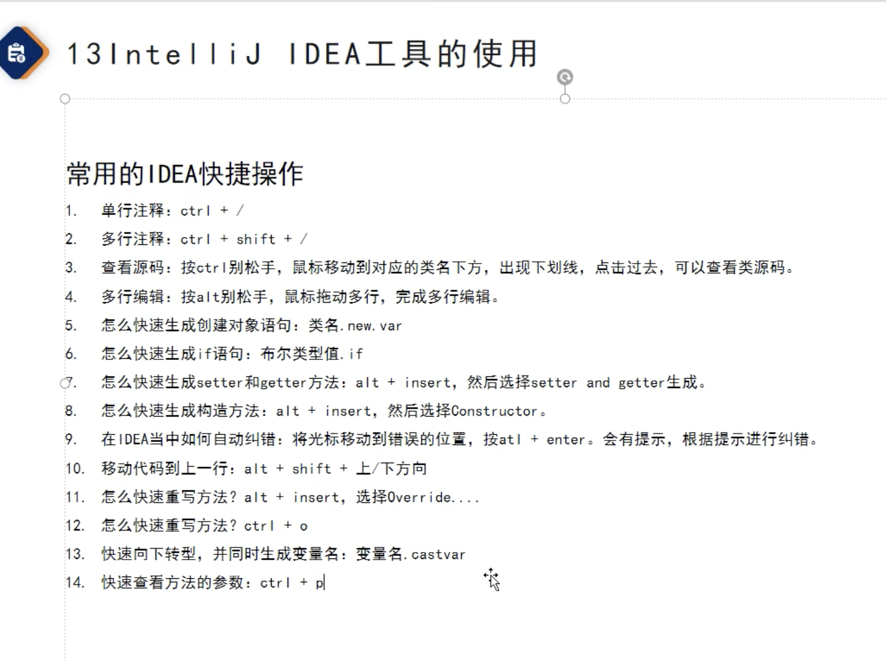
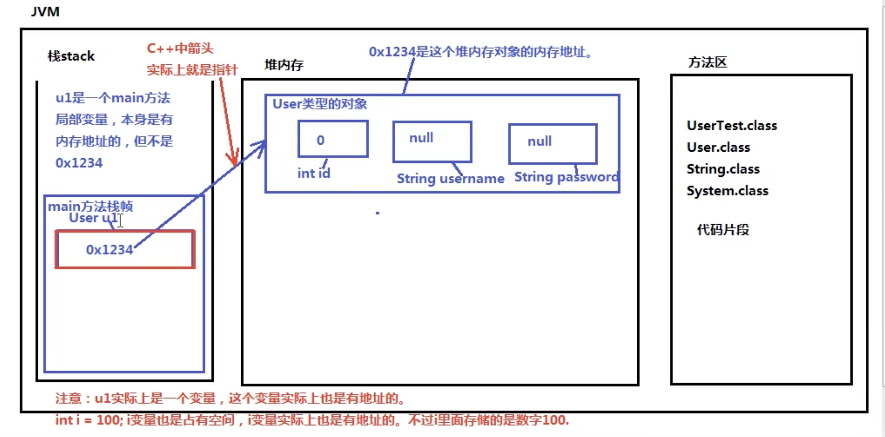
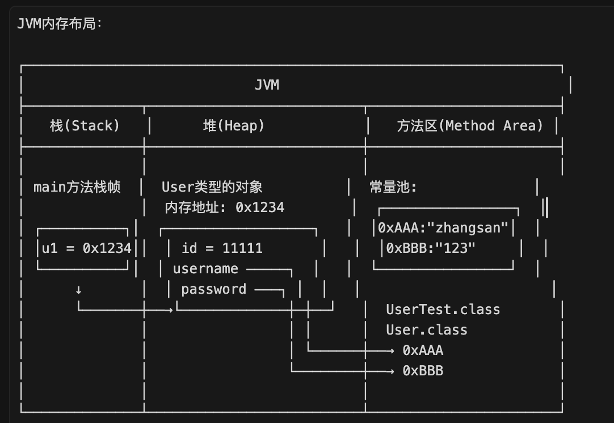
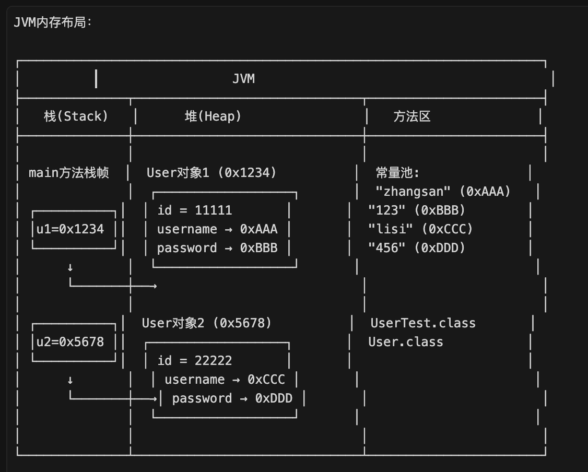
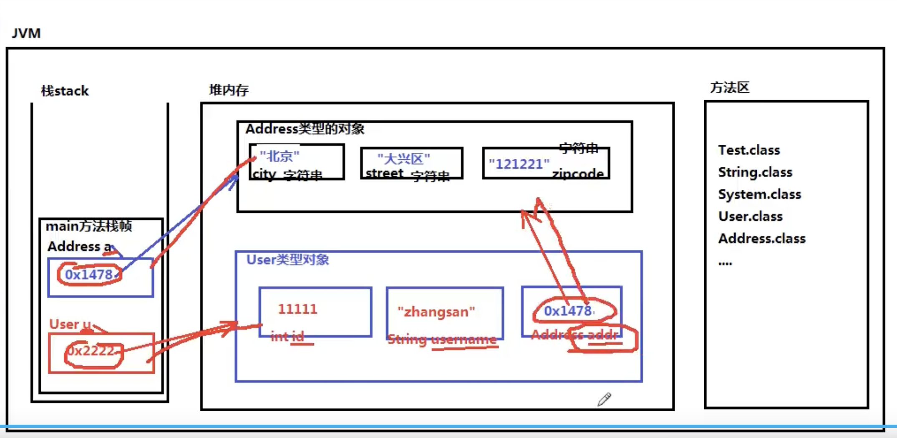
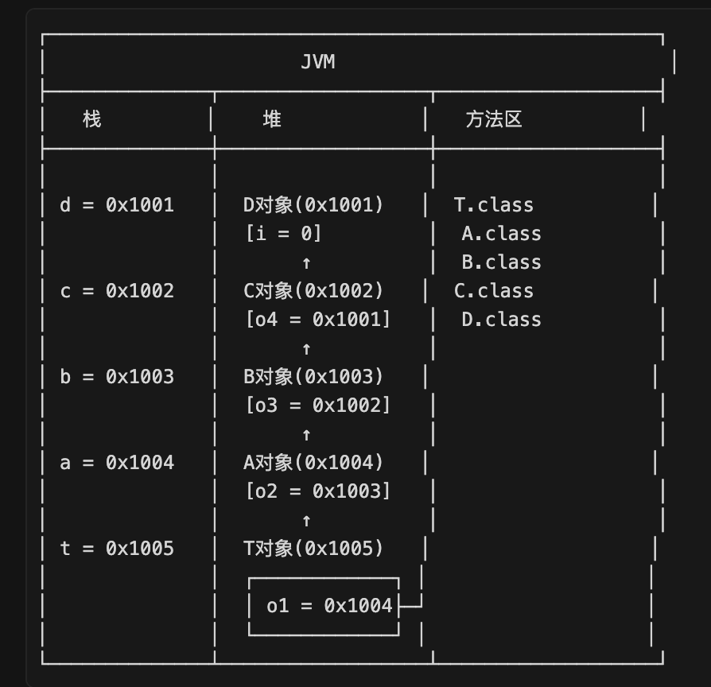
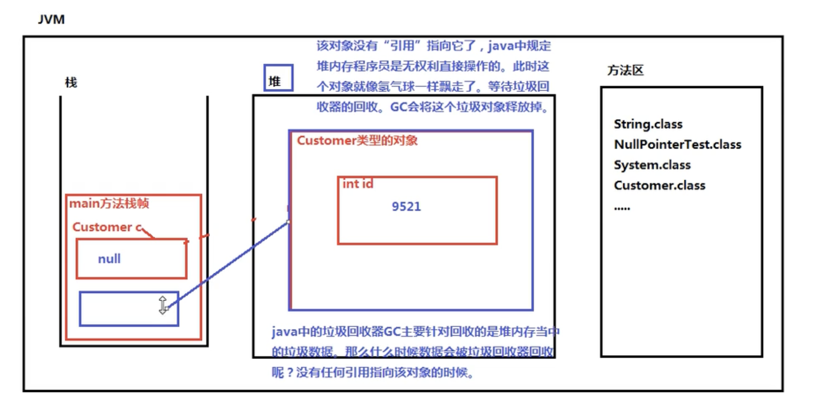
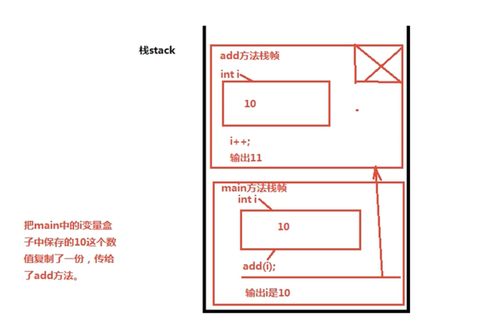

###   
###   
### 🔷 1.JVM (Java Virtual Machine)  
###   
### 定义：运行Java字节码的虚拟机  
###   
### 核心特点：  
### • 跨平台：Windows/Mac/Linux各有专属JVM实现  
### • 多语言：Java/Kotlin/Groovy/Scala等都能运行  
### • 关键作用："一次编译，随处运行"的基础  
###   
###   
**Ctrl/Cmd + F12** - 查看类结构  
**Ctrl/Cmd + Alt + B** - 查看接口实现  
**Ctrl/Cmd + Alt + L** - 格式化代码  

| 重写方法 | Ctrl + O | Ctrl + O | 重写父类方法 |
| ---- | -------- | -------- | ------ |
| 实现方法 | Ctrl + I | Ctrl + I | 实现接口方法 |
  

| 查看类结构/方法列表 | Ctrl + F12 | Cmd + F12 | 快速查看当前类的所有方法和字段 |
| ---------- | ---------- | --------- | --------------- |
| 查看类的继承关系   | Ctrl + H   | Ctrl + H  | 查看类的继承树         |
  
  
###   
### 执行流程：  
### 源代码 (.java/.kt/.groovy)   
###     ↓ 编译器  
### 字节码 (.class)  
###     ↓ JVM  
### 机器码 → 运行  
  
###   
### 常见JVM实现：  
### • HotSpot VM (Oracle官方，最常用)  
### • OpenJ9 (IBM)  
### • GraalVM (高性能)  
### • Azul Zulu  
###   
###   
### 🔷 JRE (Java Runtime Environment)  
###   
### 定义：Java运行时环境  
###   
### 组成：JRE = JVM + 核心类库  
###   
### 用途：只运行Java程序（不能开发）  
###   
###   
### 🔷 JDK (Java Development Kit)    
### 定义：Java开发工具包  
###   
### 组成：JDK = JRE + 开发工具(javac/javadoc/jar等)  
###   
### 用途：开发 + 运行Java程序  
###   
### JDK = 开发+运行 (给开发者用)  
### JRE = 只能运行 (给用户用)  
###   
### 🔷 三者关系  
###   
###   
###   
### JDK > JRE > JVM  
###   
###   
### 🔷 选择建议  
### • 开发Java程序 → 安装JDK  
### • 只运行Java程序 → 安装JRE  
### • JDK 9+ 已不再单独提供JRE  
###   
###   
###   
### 🔷 JVM内存区域速记  
###   
### 栈(Stack)：局部变量、方法调用  
### 堆(Heap)：new的对象、实例变量、GC回收  
### 方法区：类信息、静态变量、常量池  
###   
### 口诀：静态→方法区，new的→堆，局部→栈  
###   
###   

| 区域       | 存什么          | 口诀     |
| -------- | ------------ | ------ |
| 栈(Stack) | 局部变量、方法调用    | 局部→栈   |
| 堆(Heap)  | new的对象、实例变量  | new的→堆 |
| 方法区      | 类信息、静态变量、常量池 | 静态→方法区 |
  
#   
#   
#   
**User类（被使用的类）**  
package com.powernode;  
  
  
/*  
 * User类：用户类  
 */  
public class User {  
    // 用户id  
    // 访问id不能这样：User.id （这是错误的，实例变量不能用类名访问。）  
    // id的访问必须先造对象，然后对象有了，才能访问对象的id  
    int id; // 成员变量，实例变量（对象变量，一个对象一份。）  
  
    // 用户名  
    String username; // 成员变量可以不手动赋值，系统赋默认值。  
  
    // 密码  
    String password;  
}  
  
/*  
 * 人类  
 */  
class 人类 {  
    // 成员变量，实例变量，对象级别变量，先造对象才能访问。  
    double 身高;  
}  
  
// byte short int long float double boolean char : 这些默认值偏向0，false也是0  
// 引用类型：null  
  
📝** 默认值对比表**  

| 类型分类 | 具体类型    | 默认值       | 说明         |
| ---- | ------- | --------- | ---------- |
| 整数   | byte    | 0         | 8位         |
|      | short   | 0         | 16位        |
|      | int     | 0         | 32位        |
|      | long    | 0L        | 64位        |
| 浮点   | float   | 0.0f      | 32位        |
|      | double  | 0.0       | 64位        |
| 字符   | char    | '\\u0000' | 16位Unicode |
| 布尔   | boolean | false     | 相当于0       |
| 引用   | String  | null      | 所有对象       |
|      | 数组      | null      | 数组也是对象     |
|      | 任何类     | null      | 引用为空       |
  
  
**UserTest类（测试类）**  
public class UserTest {  
      
    public static void main(String[] args) {  
        // ==================== 第一部分：创建u1对象 ====================  
          
        // 方法体当中声明的变量叫做局部变量  
        // User u1; // 成员变量（实例变量）  
          
        User u1 = new User();  
          
        // 实例变量怎么访问（属性怎么访问）？  
        // 语法是："引用.属性名"  
        System.out.println(u1.id);        // 0  
        System.out.println(u1.username);  // null  
        System.out.println(u1.password);  // null  
          
        System.out.println("==================");  
          
        // 给对象的属性赋值  
        u1.id = 11111;  
        u1.username = "zhangsan";  
        u1.password = "123";  
          
        // 再次访问属性  
        System.out.println(u1.id);        // 11111  
        System.out.println(u1.username);  // zhangsan  
        System.out.println(u1.password);  // 123  
          
        System.out.println("==================");  
          
        // ==================== 第二部分：创建u2对象 ====================  
          
        User u2 = new User();  
        u2.id = 22222;  
        u2.username = "lisi";  
        u2.password = "456";  
          
        System.out.println(u2.id);        // 22222  
        System.out.println(u2.username);  // lisi  
        System.out.println(u2.password);  // 456  
          
        System.out.println("==================");  
          
        // ==================== 第三部分：演示引用的本质 ====================  
          
        // u1本质上是一个变量，这个变量实际上也是有内存地址的，  
        // 但不是0x1234（对象在堆中的地址）  
        // int i = 100; 这个i变量也是占有空间的，i变量实际上也是有地址的，  
        // 不过里面存储的是数字100  
          
        // 注意：u1实际上是一个变量，这个变量实际上也是有地址的  
        System.out.println(u1);  // 会输出类似：User@15db9742  
        System.out.println(u2);  // 会输出类似：User@6d06d69c  
          
        // 通过输出可以看到，u1和u2存储的是不同的地址  
    }  
}  
  
****阶段1：执行 User u1 = new User();****  
JVM内存布局：  
  
说明：  
1. 栈中：u1是一个局部变量，存储的是对象的地址0x1234  
2. 堆中：真正的User对象，包含三个属性，都是默认值  
3. 方法区：存储类的信息（字节码）  
  
****阶段2：执行赋值操作后****  
u1.id = 11111;  
u1.username = "zhangsan";  
u1.password = "123";  
  
说明：  
1. id是基本类型，直接存储数值11111在堆中对象内  
2. username和password是引用类型（String），对象中存储的是指向  
   方法区常量池的地址  
3. "zhangsan"和"123"字符串实际存储在方法区的常量池中  
  
****阶段3：创建第二个对象 User u2 = new User();****  
  
  
关键理解：  
1. u1和u2是两个独立的引用变量，在栈中  
2. 它们指向堆中的两个不同的User对象  
3. 每个对象都有自己独立的属性空间  
4. 字符串常量在方法区的常量池中，可以被多个对象共享  
  
# 1. 局部变量 vs 成员变量  
##   
```
public class User {
    int id;  // ✅ 成员变量（属性），在堆中，随对象创建
}

public class UserTest {
    public static void main(String[] args) {
        User u1;  // ✅ 局部变量，在栈中，随方法调用创建
    }
}

```
##   
**2. 变量的本质理解**  
```

// 基本类型变量
int i = 100;
// i是变量，占用栈空间，存储的是数值100

// 引用类型变量
User u1 = new User();
// u1是变量，占用栈空间，存储的是地址0x1234（示例）
// u1本身也有地址，但存储的内容是对象的地址


```
##   
**3. 打印对象引用**  
##   
```
System.out.println(u1);  // 输出: User@15db9742

```
## 解释：  
* User - 类名  
* @ - 分隔符  
* 15db9742 - 对象的哈希码（hashCode）的16进制表示  
* 这不是真实的内存地址，而是JVM内部的对象标识  
**4. 完整的内存分配流程**  
##   
##   
```
User u1 = new User();

```
##   
## 执行步骤：  
1. **加载类**：JVM检查User类是否已加载，如未加载则加载到方法区  
2. **分配堆内存**：在堆中为User对象分配内存空间  
3. **初始化默认值**：属性赋予默认值（int→0, String→null）  
4. **执行构造器**：调用User的构造方法  
5. **返回地址**：将对象的内存地址赋给栈中的变量u1  
##   
💡** 面试常考点**  
**Q1：u1存储在哪里？存储的是什么？**  
## 答：  
* u1是局部变量，存储在****栈****中的main方法栈帧里  
* u1存储的是****对象的引用地址****（指向堆中对象的指针）  
* u1本身也有内存地址，但我们关心的是它存储的内容  
**Q2：u1和对象的区别？**  
## 答：  
##   
```
u1（引用变量）          User对象（实际对象）
├─ 位置：栈中           ├─ 位置：堆中
├─ 内容：地址值         ├─ 内容：属性数据
├─ 生命周期：方法结束    ├─ 生命周期：被GC回收
└─ 类比：遥控器         └─ 类比：电视机

```
##   
##   
##   
**Q3：为什么String类型属性指向常量池？**  
## 答：  
* String是不可变对象，JVM对其做了优化  
* 字符串字面量（如"zhangsan"）存储在方法区的****字符串常量池****中  
* 对象的String属性存储的是指向常量池的引用  
* 这样可以节省内存，多个对象可以共享相同的字符串  
##   
🎯** 运行结果**  
##   
```
0
null
null
==================
11111
zhangsan
123
==================
22222
lisi
456
==================
User@15db9742
User@6d06d69c

```
##   
  
  
package com.powernode;  
  
//所有的实例变量（属性）都是通过引用.的方式来访问的  
  
//引用是是存储对象内存呢地址的一个变量  
//对象是堆里new出来的  
//只要这个变量中保存的是一个对象的内存地址，这个变量就叫做引用  
//引用不一定是局部变量  
public class Test {  
    public static void main(String[] args) {  
      //报错了，，id是实例变量，必须先造对象，“引用.”的方式访问  
       // System.out.println(User.id);  
  
        /*  
        int i = 100;  
        int j = i; // 原理: 会将i中保存的100复制一份，传给j变量。  
        */  
  
        // 家庭住址对象  
        Address a = new Address();  
        a.city = "北京";  
        a.street = "大兴区";  
        a.zipcode = "121221";  
  
        // 用户对象  
        User u = new User();  
        System.*out*.println(u.id);       // 0  
        System.*out*.println(u.username); // null  
        System.*out*.println(u.addr);     // null  
  
        u.id = 11111;  
        u.username = "zhangsan";  
        u.addr = a;  // ⚠️ 引用赋值：将地址a赋给u.addr  
  
        // 思考一个问题:  
        // 我想直到zhangsan他是哪个城市的，代码应该怎么写？  
        System.*out*.println(u.username + "是" + u.addr.city + "城市的！");  
  
        // 访问路径：  
        // u → User对象 → addr属性 → Address对象 → city属性  
        // ---------------------- 是否理解以下代码 -----------------------  
        int x = 100;  
        // = 代表赋值运算，"赋值"中有一个"值"  
        // x变量中的值是100。将100复制一份给y  
        // 表示：将x变量中保存的值100复制一份给y  
        int y = x;  
  
// ---------------------- 是否理解以下代码 -----------------------  
        Address k = new Address(); // Address k = 0x1111;  
        Address m = k; // 这里表示将k变量中保存的0x1111复制了一份传给了m变量。  
    }  
}  
  
  
package com.powernode;  
  
public class Address {  
    String city;  
    String street;  
    String zipcode;  
  
  
}  
  
package com.powernode;  
  
/*  
 * User类：用户类  
 */  
public class User {  
    //类 = 属性+方法  
    //3个都是属性  
    // 用户id ，int是一种基本数据类型  
    // 访问id不能这样：User.id （这是错误的，实例变量不能用类名访问。）  
    // id的访问必须先造对象，然后对象有了，才能访问对象的id  
    int id; // 成员变量，实例变量（对象变量，一个对象一份。）  
  
    // 用户名  
    //String事一种引用数据类型  
    String username; // 成员变量可以不手动赋值，系统赋默认值。  
  
    // 密码  
    String password;  
  
    //Address事一种引用数据类型  
    //addr是成员变量，还是一个实例变量  
    //addr是一个引用  
    Address addr; *///*实例变量  
}  
//实例变量都存储在哪里？  
//实例变量都在对内存的对象的内部  
//方法提外，类题内定义的变量叫做：成员变量  
  
/*  
 * 人类  
 */  
//class 人类 {  
//    // 成员变量，实例变量，对象级别变量，先造对象才能访问。  
//    double 身高;  
//}  
  
// byte short int long float double boolean char : 这些默认值偏向0，false也是0  
// 引用类型：null  
##   
## ========================================================================  
  
  
**// 把这个内存图画出来。一定要按照程序的执行顺序一步一步画。**  
  
public class T {  
    A o1; // 成员变量中的实例变量。必须先创建对象，通过"引用"来访问。  
      
    public static void main(String[] args) {  
        D d = new D();  
        C c = new C();  
        B b = new B();  
        A a = new A();  
        T t = new T();  
          
        //这里不写代码会出现NullPointerException异常。（空指针异常。）  
        c.o4 = d;  
        b.o3 = c;  
        a.o2 = b;  
        t.o1 = a;  
          
        // 编写代码通过t来访问d中的i  
        //System.out.println(T.a); //错误的。  
        System.out.println(t.o1.o2.o3.o4.i);  
    }  
}  
  
class A {  
    B o2;  
}  
  
class B {  
    C o3;  
}  
  
class C {  
    D o4;  
}  
  
class D {  
    int i;  // 假设有这个属性，默认值为0  
}  
##   
##   
##   
  
package com.powernode;  
  
/*  
 * 空指针异常（NullPointerException）  
 *  
 * 关于垃圾回收器：GC  
 *     在Java语言中，垃圾回收器主要针对的是堆内存。  
 *     当一个Java对象没有任何引用指向该对象的时候，  
 *     GC会考虑将该垃圾数据释放回收掉。  
 *  
 * 出现空指针异常的前提条件是？  
 *     "空引用"访问实例【对象相关】相关的数据时，都会出现空指针异常。  
 */  
public class NullPointerTest {  
    public static void main(String[] args) {  
        // 创建客户对象  
        Customer c = new Customer();  
  
        // 访问这个客户的id  
        System.*out*.println(c.id); // 输出: 0  
  
        // 重新给id赋值  
        c.id = 9521; // 终身代号  
        System.*out*.println("客户的id是=" + c.id); // 输出: 客户的id是=9521  
  
        // 将引用设置为null  
        c = null;  
  
        // NullPointerException  
        // 编译器没问题，因为编译器只检查语法，编译器发现c是Customer类型。  
        // Customer类型中有id属性，所以可以：c.id。语法过了。  
        // 但是运行的时候需要对象的存在，但是对象没了，尴尬了，就只能出现一个异常。  
        System.*out*.println(c.id); // 这里会抛出 NullPointerException  
    }  
}  
  
class Customer {  
    int id;  
}  
##   
##   
  
```
package com.powernode;
//参数传递的时候，和类型无关，不管是基本数据类型还是引用数据类型
//统一都是将盒子中保存的那个“值”赋值一份 传下去

public class Test1 {
    public static void main(String[] args) {
        // 创建对象
        int x = 100;
        int y = x; //x赋值给y,是讲x变量中保存的100这个值复制一份传给了y

       //局部变量，区域是main
        int i =10;
        //将i变量中保存的10复制一份，传给add方法。
        add(i);
        System.out.println("main----->"+i);
    }

    public static void add(int i) {
       i++;
        System.out.println("add----->"+i);
    }
}

```
**JVM三大内存区域详解**  
  
**1. 栈内存 (Stack)**  
  
┌─────────────────────────────────────────────────┐  
│              栈内存 (Stack)                      │  
├─────────────────────────────────────────────────┤  
│                                                 │  
│  作用：存储方法调用和局部变量                    │  
│                                                 │  
│  特点：                                          │  
│  ✅ 线程私有（每个线程都有自己的栈）              │  
│  ✅ 自动管理（方法结束自动回收）                  │  
│  ✅ 速度快（LIFO先进后出结构）                   │  
│  ✅ 空间小（通常1-2MB）                          │  
│                                                 │  
│  存储内容：                                      │  
│  ┌────────────────────────────┐                │  
│  │ 1. 局部变量                 │                │  
│  │    - 基本类型：存储值本身    │                │  
│  │    - 引用类型：存储对象地址  │                │  
│  │                             │                │  
│  │ 2. 方法参数                 │                │  
│  │    - 传递进来的参数值        │                │  
│  │                             │                │  
│  │ 3. 方法调用信息              │                │  
│  │    - 返回地址               │                │  
│  │    - 操作数栈               │                │  
│  └────────────────────────────┘                │  
│                                                 │  
│  栈帧结构：                                      │  
│  ┌───────────────┐                             │  
│  │  方法3栈帧    │  ← 栈顶（当前执行）           │  
│  ├───────────────┤                             │  
│  │  方法2栈帧    │                              │  
│  ├───────────────┤                             │  
│  │  方法1栈帧    │                              │  
│  ├───────────────┤                             │  
│  │  main栈帧     │  ← 栈底                      │  
│  └───────────────┘                             │  
│                                                 │  
│  本例中的栈：                                    │  
│  ┌───────────────┐                             │  
│  │  add栈帧      │                             │  
│  │  局部变量：i=11│                             │  
│  ├───────────────┤                             │  
│  │  main栈帧     │                             │  
│  │  局部变量：    │                             │  
│  │  x=100        │                             │  
│  │  y=100        │                             │  
│  │  i=10         │                             │  
│  └───────────────┘                             │  
│                                                 │  
└─────────────────────────────────────────────────┘  
  
**2. 堆内存 (Heap)**  
  
┌─────────────────────────────────────────────────┐  
│              堆内存 (Heap)                       │  
├─────────────────────────────────────────────────┤  
│                                                 │  
│  作用：存储对象实例和数组                        │  
│                                                 │  
│  特点：                                          │  
│  ✅ 线程共享（所有线程共用一个堆）                │  
│  ✅ 垃圾回收管理（GC自动回收）                   │  
│  ✅ 速度较慢（需要垃圾回收）                     │  
│  ✅ 空间大（可以很大，取决于JVM设置）            │  
│                                                 │  
│  存储内容：                                      │  
│  ┌────────────────────────────┐                │  
│  │ 1. 所有new出来的对象         │                │  
│  │    Customer c = new Customer(); │           │  
│  │    ↑存在栈中      ↑存在堆中  │                │  
│  │                             │                │  
│  │ 2. 数组对象                  │                │  
│  │    int[] arr = new int[10]; │                │  
│  │    ↑存在栈中      ↑存在堆中  │                │  
│  │                             │                │  
│  │ 3. 对象的实例变量            │                │  
│  │    (属性)                   │                │  
│  └────────────────────────────┘                │  
│                                                 │  
│  内存布局示例：                                  │  
│  ┌─────────────────────────┐                   │  
│  │ Customer对象1 (0x1000)  │                   │  
│  │ ├─ id = 100             │                   │  
│  │ └─ name → "张三"        │                   │  
│  ├─────────────────────────┤                   │  
│  │ Customer对象2 (0x2000)  │                   │  
│  │ ├─ id = 200             │                   │  
│  │ └─ name → "李四"        │                   │  
│  ├─────────────────────────┤                   │  
│  │ int数组对象 (0x3000)    │                   │  
│  │ [10, 20, 30, 40, 50]    │                   │  
│  └─────────────────────────┘                   │  
│                                                 │  
│  本例说明：                                      │  
│  ⚠️ 本程序只使用了基本数据类型(int)              │  
│  ⚠️ 没有创建任何对象                            │  
│  ⚠️ 所以堆内存为空                              │  
│  ⚠️ 所有数据都在栈中                            │  
│                                                 │  
└─────────────────────────────────────────────────┘  
  
**3. 方法区 (Method Area)**  
  
┌─────────────────────────────────────────────────┐  
│           方法区 (Method Area)                   │  
│     (也叫元空间 Metaspace，JDK8+)                │  
├─────────────────────────────────────────────────┤  
│                                                 │  
│  作用：存储类的信息                              │  
│                                                 │  
│  特点：                                          │  
│  ✅ 线程共享（所有线程共用）                      │  
│  ✅ JVM启动时加载                                │  
│  ✅ 存储静态数据                                 │  
│  ✅ 包含常量池                                   │  
│                                                 │  
│  存储内容：                                      │  
│  ┌────────────────────────────┐                │  
│  │ 1. 类的字节码(.class)        │                │  
│  │    - 类的结构信息            │                │  
│  │    - 方法的字节码指令        │                │  
│  │    - 字段信息               │                │  
│  │                             │                │  
│  │ 2. 静态变量(static)          │                │  
│  │    - 类变量                 │                │  
│  │    - 静态方法               │                │  
│  │                             │                │  
│  │ 3. 常量池                   │                │  
│  │    - 字符串常量池            │                │  
│  │    - 符号引用               │                │  
│  │    - 字面量                 │                │  
│  │                             │                │  
│  │ 4. 运行时常量池              │                │  
│  │    - 类加载后生成            │                │  
│  └────────────────────────────┘                │  
│                                                 │  
│  本例中的方法区：                                │  
│  ┌─────────────────────────┐                   │  
│  │ Test1.class             │                   │  
│  │ ┌─────────────────────┐ │                   │  
│  │ │ main()方法字节码    │ │                   │  
│  │ │ - 指令1: int x=100  │ │                   │  
│  │ │ - 指令2: int y=x    │ │                   │  
│  │ │ - 指令3: int i=10   │ │                   │  
│  │ │ - 指令4: add(i)     │ │                   │  
│  │ │ - 指令5: println... │ │                   │  
│  │ └─────────────────────┘ │                   │  
│  │ ┌─────────────────────┐ │                   │  
│  │ │ add()方法字节码     │ │                   │  
│  │ │ - 指令1: i++        │ │                   │  
│  │ │ - 指令2: println... │ │                   │  
│  │ └─────────────────────┘ │                   │  
│  └─────────────────────────┘                   │  
│                                                 │  
│  ┌─────────────────────────┐                   │  
│  │ System.class            │                   │  
│  │ - out字段               │                   │  
│  │ - println()方法          │                   │  
│  └─────────────────────────┘                   │  
│                                                 │  
│  ┌─────────────────────────┐                   │  
│  │ String.class            │                   │  
│  │ - 字符串相关方法         │                   │  
│  └─────────────────────────┘                   │  
│                                                 │  
│  ┌─────────────────────────┐                   │  
│  │ 常量池                   │                   │  
│  │ - "main----->"          │                   │  
│  │ - "add----->"           │                   │  
│  └─────────────────────────┘                   │  
│                                                 │  
└─────────────────────────────────────────────────┘  
  
  
  
package com.powernode;  
*/**  
*    java中关于方法调用时参数传递实际上只有一个规则：*  
*    不管你是基本数据类型，还是引用数据类型，实际上在传递的时候都是*  
*    将变量中保存的那个"值"复制一份，传过去。*  
  
*    int x = 1;*  
*    int y = x; 把x中保存1复制一份传给y*  
*    x和y都是两个局部变量。*  
  
*    Person p1 = 0x1234;*  
*    Person p2 = 0x1234; 把p1中保存的0x1234复制一份传给p2*  
*    p1和p2都是两个局部变量。*  
  
*    你和你媳妇，都有你家大门上的钥匙，钥匙是两把。*  
*    但是都可以打开你家的大门。*  
**/*  
public class Test2 {  
    public static void main(String[] *args*) {  
        Person p = new Person();  
        p.age = 10;  
        add(p);  
        System.out.println("main--->" + p.age);  
    }  
  
    *// 方法的参数可以是基本数据类型，也可以是引用数据类型，只要是合法的数据类型就行*  
    public static void add(Person *p*) {  
        p.age++;  
        System.out.println("add--->" + p.age);  
    }  
}  
              
  
class Person {  
    *// 年龄属性，成员变量中的实例变量。*  
    int age;  
}  
  
  
关于以上  
**1、画内存图注意事项：**  
**第一：大家在内存图上不要体现出代码。内存上应该主要体现"数据"。**  
**第二：大家画图的时候，图上的图形应该有先后顺序，先画什么，再画什么，必须是有顺序的，而不是想起来这个画这个，想起来那个画那个。程序代码是有执行顺序的，程序执行到哪里你就画哪里就行了。**  
  
**2、为什么要画内存图（非常重要）？**  
**第一：有了内存图，程序不运行，我也知道结果。（可以推算出结果）**  
**第二：有了内存图，有助于你调试程序。**  
**画内存图是对Java运行机制的一种理解。不知道运行机制，以后复杂的程序出现错误之后你是不会调试的，调不明白。**  
  
**3、程序在什么情况下会出现空指针异常呢？**  
**空引用 访问 "对象相关"的数据时，会出现空指针异常。**  
**垃圾回收器主要针对堆内存。**  
  
**4、方法在调用的时候参数是如何传递的？**  
**实际上，在java语言中，方法调用时参数传递，和类型无关，都是将变量中保存的那个"值"传过去，这个"值"可能是一个数字100，也可能是一个java对象的内存地址：0x1234**  
============================================================================================================================================  
  
```

  

```
  
